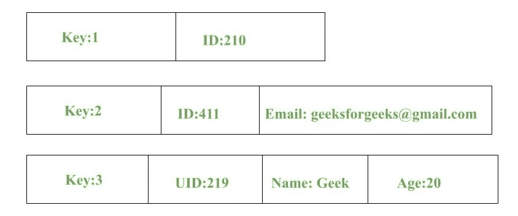
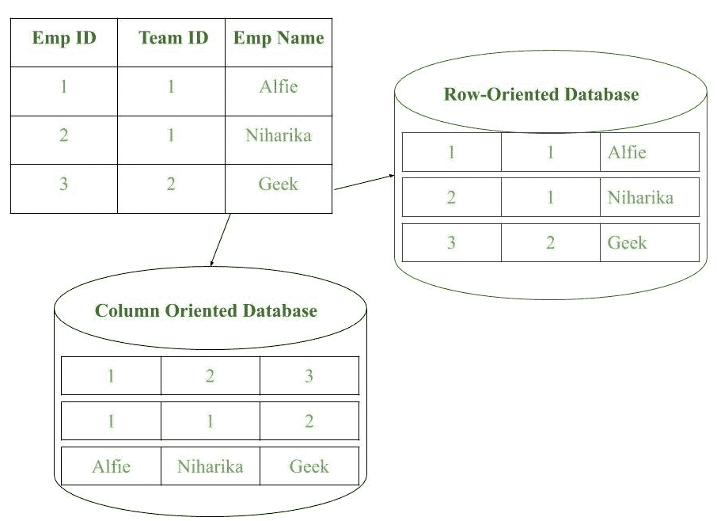
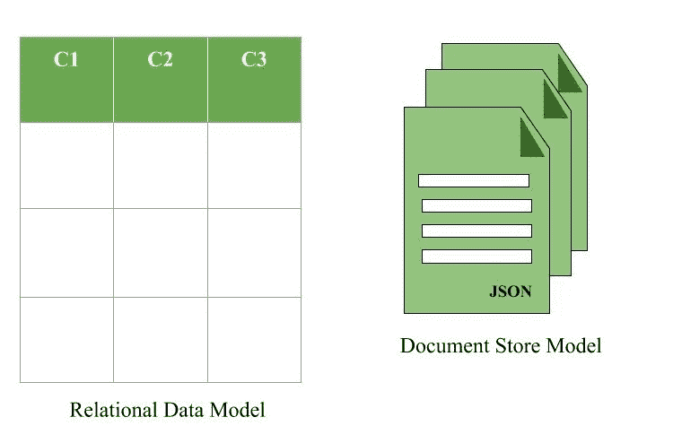
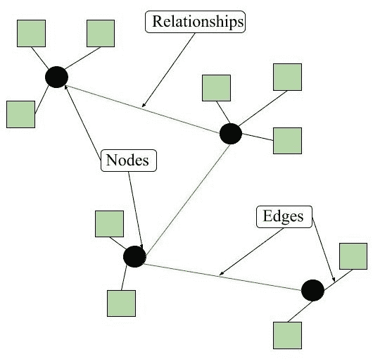

# NoSQL 数据架构模式

> 原文:[https://www . geesforgeks . org/no SQL-data-architecture-patterns/](https://www.geeksforgeeks.org/nosql-data-architecture-patterns/)

**架构模式**是一种将存储在数据库中的数据进行分类的逻辑方式。 [NoSQL](https://www.geeksforgeeks.org/introduction-to-nosql/) 是一种有助于对大数据执行操作并以有效格式存储的数据库。由于其灵活性和广泛的服务种类，它被广泛使用。

**NoSQL 的架构模式:**
数据以以下四种数据架构模式中的任何一种存储在 NoSQL。

```
1. Key-Value Store Database
2. Column Store Database
3. Document Database
4. Graph Database 
```

这些解释如下。

**1。键值存储数据库:**
这个模型是 NoSQL 数据库最基本的模型之一。顾名思义，数据以键值对的形式存储。密钥通常是字符串、整数或字符的序列，但也可以是更高级的数据类型。该值通常与键相关联。键值对存储数据库通常将数据存储为哈希表，其中每个键都是唯一的。该值可以是任何类型(JSON、BLOB(二进制大对象)、字符串等)。这种模式通常用于购物网站或电子商务应用程序。

<u>优势:</u>

*   可以处理大量数据和繁重的负载，
*   通过按键轻松检索数据。

<u>限制:</u>

*   复杂的查询可能试图涉及多个键值对，这可能会延迟性能。
*   数据可能涉及可能发生冲突的多对多关系。

<u>示例:</u>

*   DynamoDB(动态模式)
*   伯克利数据库



**2。列存储数据库:**
数据不是存储在关系元组中，而是存储在单独的单元格中，这些单元格进一步分组为列。面向列的数据库只对列起作用。它们将大量数据一起存储到列中。各列的格式和标题可能会因行而异。每一列都单独处理。但是，像传统数据库一样，每个单独的列可能包含多个其他列。
基本上，列是这种类型的存储方式。

<u>优势:</u>

*   数据很容易获得
*   像 SUM、AVERAGE、COUNT 这样的查询可以很容易地在列上执行。

<u>示例:</u>

*   巴什
*   谷歌的 Bigtable
*   卡桑德拉



**3。文档数据库:**
文档数据库以键值对的形式获取和积累数据，但是在这里，这些值被称为文档。文档可以被描述为一个复杂的数据结构。这里的文档可以是文本、数组、字符串、JSON、XML 或任何这样的格式。嵌套文档的使用也非常普遍。这是非常有效的，因为创建的大多数数据通常是 JSONs 形式的，并且是非结构化的。

<u>优势:</u>

*   这种格式对于半结构化数据非常有用。
*   文档的存储、检索和管理很容易。

<u>限制:</u>

*   处理多个文档具有挑战性
*   聚合操作可能无法准确工作。

<u>示例:</u>

*   MongoDB
*   CouchDB



**Figure –** Document Store Model in form of JSON documents

**4。图形数据库:**
显然，这种架构模式处理图形中数据的存储和管理。图形基本上是描述某些数据中两个或多个对象之间联系的结构。对象或实体被称为节点，并通过称为边的关系连接在一起。每个边都有唯一的标识符。每个节点都是图形的接触点。这种模式在社交网络中非常常用，在社交网络中有大量实体，每个实体都有一个或多个由边连接的特征。关系数据库模式具有松散连接的表，而图在本质上通常非常强大和严格。

<u>优势:</u>

*   因为有连接，所以遍历速度最快。
*   空间数据很容易处理。

<u>限制:</u>
错误的连接可能导致无限循环。

<u>示例:</u>

*   Neo4J
*   微博数据库(推特使用)



**Figure –** Graph model format of NoSQL Databases