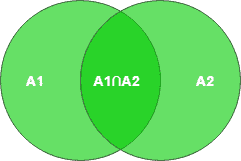
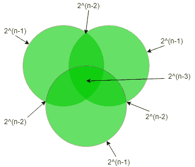

# 数据库管理系统中可能的超级键数量

> 原文:[https://www . geeksforgeeks . org/可能的超级密钥数量-in-dbms/](https://www.geeksforgeeks.org/number-of-possible-superkeys-in-dbms/)

先决条件–[关系模型介绍和 Codd 规则](https://www.geeksforgeeks.org/dbms-relational-model-introduction-and-codd-rules/)

能够唯一识别一个表中所有元组的属性子集被称为**超级键**。它不同于主键和候选键，因为只有最小的超键才是候选/主键。

这意味着从一个超级键中，当我们**移除**所有因其唯一性而不需要**的属性**时，它**才成为主/候选**键。因此，本质上，所有主/候选键都是超级键，但不是所有超级键都是主/候选键。通过关系(表)的形式定义，我们知道关系的元组都是唯一的。所以，所有属性的集合本身就是一个超级键。

计算一个表的超级键的可能数量是 **GATE** 的常见问题。下面的例子将演示关于这个主题的所有可能的问题类型。

*   **Example-1 :** Let a Relation R have attributes {a1,a2,a3} and a1 is the candidate key. Then how many super keys are possible? 

    这里，a1 的任何超集都是超级密钥。
    超级键为= {a1，a1 a2，a1 a3，a1 a2 a3}
    由此可见，在这种情况下 4 个超级键是可能的。

    一般来说，如果我们有一个候选键的‘N’属性，那么可能的超键的数量是 2(N–1)。

*   **Example-2 :** Let a Relation R have attributes {a1, a2, a3,…,an}. Find Super key of R. 
    Maximum Super keys = 2n – 1. 
    If each attribute of relation is candidate key. 
*   **Example-3:** Let a Relation R have attributes {a1, a2, a3,…, an} and the candidate key is “a1 a2 a3” then the possible number of super keys? 

    按照前面的公式，我们有 3 个属性，而不是一个。所以，这里可能的超级按键数量是 2 (N-3) 。

*   **Example-4:** Let a Relation R have attributes {a1, a2, a3,…, an} and the candidate keys are “a1”, “a2” then the possible number of super keys? 

    这个问题现在略有不同，因为我们现在有两个不同的候选键，而不是只有一个。下图显示了解决类似问题的方法:

*   → |A1 ∪ A2| = |A1| + |A2| – |A1 ∩ A2| 

    =(候选键 A1 可能有超级键)+(候选键 A2 可能有超级键)–(来自 A1 和 A2 的公共超级键)

    = 2(n-1)+2(n-1)–2(n-2)

*   **Example-5:** Let a Relation R have attributes {a1, a2, a3,…, an} and the candidate keys are “a1”, “a2 a3” then the possible number of super keys? 

    (a1)的超级按键+(a2 a3)的超级按键–2(n–1)+2(n–2)–2(n–3)的超级按键

*   **Example-6:** Let a Relation R have attributes {a1, a2, a3,…, an} and the candidate keys are “a1 a2”, “a3 a4” then the possible number of super keys? 

    (a1 a2 a3 a4 的超级按键–2(n–2)+2(n–2)–2(n–4)的超级按键

*   **Example-7:** Let a Relation R have attributes {a1, a2, a3,…, an} and the candidate keys are “a1 a2”, “a1 a3” then the possible number of super keys? 

    (a1 a2)的超级按键+(a1 a3)的超级按键–2(n–2)+2(n–2)–2(n–3)的超级按键

*   **Example-8 :** Let a Relation R have attributes {a1, a2, a3,…,an} and the candidate keys are “a1”, “a2”, “a3” then the possible number of super keys? 

    在这个问题中，我们有 3 个不同的候选键。下图显示了解决这些问题的方法。

*   → |A1 ∪ A2 ∪ A3| = |A1| + |A2| + |A3| – |A1 ∩ A2| – |A1 ∩ A3| – |A2 ∩ A3| + |A1 ∩ A2 ∩ A3| 

    =(候选键 A1 可能有超级键)+(候选键 A2 可能有超级键)+(候选键 A3 可能有超级键)–(来自 A1 和 A2 的公共超级键)–(来自 A1 和 A3 的公共超级键)–(来自 A2 和 A3 的公共超级键)+(来自 A1、A2 和 A3 的公共超级键)

    = 2(n-1)+2(n-1)+2(n-1)–2(n-2)–2(n-2)–2(n-2)+2(n-3)

*   **Example-9:** A relation R (A, B, C, D, E, F, G, H)and set of functional dependencies are 
    CH → G, 
    A → BC, 
    B → CFH, 
    E → A, 
    F → EG 
    Then how many possible super keys are present? 

    **第一步:-** 首先，我们必须找到候选键是什么:-
    正如我们在给定的函数依赖中看到的，D 是缺失的，但是在关系中，D 是给定的，所以 D 必须是候选键的一个主要属性。

    a+= E+= B+= F+=除 D
    之外的关系的所有属性所以，候选键为= AD、BD、ED、FD

    **第二步:-** 找到超级键由于只有一个候选键
    属性有两种可能性要么我们选择要么不选择因此会有两次机会所以，
    A _ _ D _ _ _ _ = _ B _ D _ _ _ _ = _ _ _ DE _ _ = _ _ _ D _ F _ _ = 26

    **步骤 3:-** 由于两个候选键的组合，找到超键。
    所以，n(AD∪BD)= n(AD∪ED)= n(AD∪FD)= n(BD∪ED)= n(BD∪FD)= n(ED∪FD)= 25

    **步骤 4:-** 由于 3 个候选键的组合
    所以找到超级键，
    n(AD∪BD∪ED)= n(AD∪ED∪FD)= n(ED∪BD∪FD)= n(BD∪FD)= n(BD∪FD∪AD)= 24

    **第五步:-** 因全求超键，
    所以，n(AD∪BD∪ED∪FD)= AB _ DEF _ _ = 23

    所以，根据包含-排除原理:-
    | W∪X∪Y∪Z | = | W |+| X |+| Y |+| Z |–| W∪X |–| W∪Y |–| W∪Z |–| X∪Y |–| X∪Z |–| Y∪Z |+| W∪X∪Y |+| W∪X∪Z |+Z |+| X∪Y∪Z |–| W∪X∪Y∪Z |

    #超级按键= 4 * 26–6 * 25+4 * 24–23= 120

    所以超级键的数量是 120。这个解释是由 YaduvanshiRishi 贡献的。

*   **例 10 :** 让一个关系 R 有属性{a1，a2，a3______ an}和{ a1a2a3 _ _ _ _ ak }作为候选键，其中 k < =n，那么可以有多少个超级键？
    超级钥匙的可能数量是 2 (n-k) 。