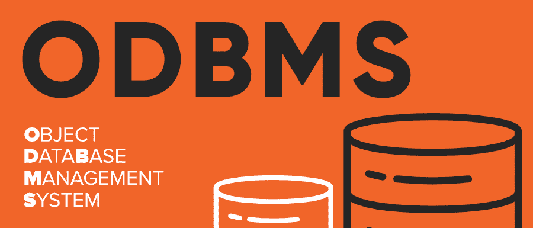

# ODBMS 完整表格

> 原文:[https://www.geeksforgeeks.org/odbms-full-form/](https://www.geeksforgeeks.org/odbms-full-form/)

**ODBMS** 代表**对象数据库管理系统**。在 ODBMS 中，数据被封装并以对象的形式表示。它将面向对象编程的概念与数据库系统联系起来。ODBMS 产生于 20 世纪 70 年代早期的研究，作为对图结构对象的数据库支持。与将数据存储在具有行和列的表中的关系数据库管理系统相比，关系数据库管理系统将信息存储为对象。

#### 特征

*   **易于与编程语言链接:**编程语言和数据库模式使用相同的类型定义，因此开发人员可能不需要学习新的数据库查询语言。
*   **不需要用户定义的键:**对象数据库管理系统具有与每个对象相关联的自动生成的 OID。
*   **简单建模:** ODBMS 可以很容易地对现实世界的对象进行建模，因此适用于具有复杂数据的应用程序。
*   **可以存储非文本数据** ODBMS 还可以存储音频、视频和图像数据。

#### 优势

*   **速度:**对数据的访问可以更快，因为可以通过跟随指针直接检索对象，而无需搜索。
*   **性能提升:**这些系统最适合使用面向对象编程的应用。
*   **可扩展性:**与传统的基本数据类型被硬编码的关系数据库管理系统不同，当使用关系数据库管理系统时，用户可以编码任何类型的数据结构来保存数据。
*   **数据一致性:**当 ODBMS 与基于对象的应用程序集成时，数据库和编程语言之间有更大的一致性，因为两者都使用相同的数据表示模型。这有助于避免阻抗不匹配。
*   **处理各种数据的能力:**与其他数据库管理系统不同，ODBMS 还可以存储 nn 文本数据，如:图像、视频和音频

#### 不足之处

*   **没有通用的标准:**操作 ODBMS 没有普遍认可的标准这是最显著的缺点，因为用户可以随心所欲地操作数据模型，这在处理海量数据时可能是个问题。
*   **无安全功能:**由于 ODBMS 的使用非常有限，因此没有足够的安全功能来存储生产级数据。
*   **复杂度指数级增加:** ODBMS 变得非常复杂非常快。当有大量数据和数据之间的大量关系时，管理和优化 ODBMS 就变得困难了。
*   **可扩展性:**无法支持大系统。
*   **查询优化具有挑战性:**优化 ODBMS 查询需要关于数据的完整信息，如:—数据的类型和大小。这损害了 ODBMS 必须提供的数据封装特性。