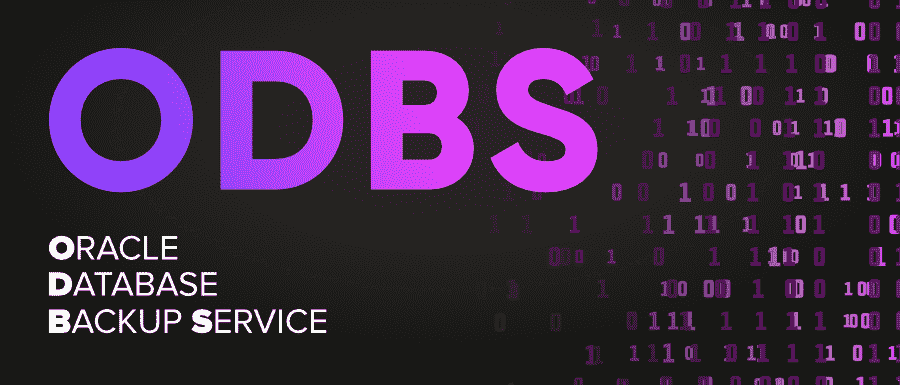

# ODBS 完整表格

> 原文:[https://www.geeksforgeeks.org/odbs-full-form/](https://www.geeksforgeeks.org/odbs-full-form/)

**ODBS** 代表 **Oracle 数据库备份服务**
Oracle 数据库备份优势可能是一种安全、适应性强、可靠和按需的 Oracle 公共云容量安排，用于存放 Oracle 数据库备份。企业可以通过零设备风险在几分钟内获得额外的容量。Oracle 数据库备份服务可以从任何地方、任何时间和与互联网相关联的任何 Oracle 数据库服务器获得。ODBS 为 Oracle 数据库备份提供了一个高执行、超额和非常可用的云容量安排。该计划具有适应性和通用性，使用 ODBS 的企业将保证其增强能力资源将持续协调其开发商业数据的需求。

#### 特征

*   存储无限量的 Oracle 数据库备份
*   使用 Oracle 数据库云备份模块的透明备份
*   强制加密的安全备份
*   限制数据可用性的访问控制
*   跟踪和监控关键存储指标

#### 优势

*   **简单**
    Oracle 数据库备份服务提供了一个简单且有用的选项，可以将数据库增强信息存储在可通过互联网打开的云中。
*   **异地存储**
    通过将数据库备份放在云中，可以确保信息不受本地失望的影响，并在需要时可以及时访问以进行恢复。
*   **经济高效的**
    基本和 moo 提取的云备份，无需额外许可，使用该优势需要付费。
*   **更快的部署**
    下载客户端备份模块，并与恢复主管(RMAN)协调，通过合理设计 Oracle 云的目标，在几分钟内开始利用可识别的 RMAN 命令执行基于云的增强和恢复操作。
*   **端到端安全性**
    备份数据在源位置进行加扰，密钥保存在本地，可选地进行压缩，安全地传输到云中，从而实现端到端安全性、稳定的质量和信息保证
*   **高可靠性**
    无论信息在哪个点被合成到甲骨文数据库备份服务，它都会在同一区域内的多个容量集线器上被复制。这种复制策略确保了信息不受设备故障和信息降级的影响。
*   **连续可访问性**
    Oracle 数据库备份优势中的备份总是可以访问的，就像附近的磁盘增强一样。与必须从异地容量区恢复磁带的情况相比，重建速度更快，停机时间从几天缩短到几小时/几分钟

#### 不足之处

*   万一数据库系统变得不可访问，备份也不可访问。
*   数据保护是一个问题
*   克隆数据库可能是一项常见的任务，但它的速度和灵巧程度会影响这项任务的成本。