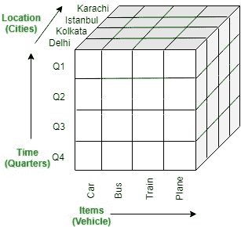
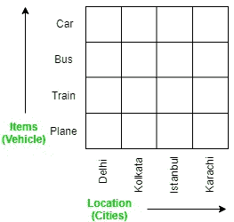

# 数据库管理系统中的 OLAP 操作

> 原文:[https://www.geeksforgeeks.org/olap-operations-in-dbms/](https://www.geeksforgeeks.org/olap-operations-in-dbms/)

**OLAP** 代表 ***在线分析处理*** 服务器。它是一种软件技术，允许用户同时分析来自多个数据库系统的信息。它基于多维数据模型，允许用户查询多维数据(如德里- > 2018 - >销售数据)。OLAP 数据库被分成一个或多个立方体，这些立方体被称为*超立方体*。

### OLAP 业务:

在 OLAP 立方体上可以执行五种基本的分析操作:

1.  **Drill down:** In drill-down operation, the less detailed data is converted into highly detailed data. It can be done by:
    *   在概念层次结构中下移
    *   添加新维度

    在概述部分给出的立方体中，通过在*时间*维度(季度- >月)的概念层次中向下移动来执行向下钻取操作。
    T3】

2.  **Roll up:** It is just opposite of the drill-down operation. It performs aggregation on the OLAP cube. It can be done by:
    *   在概念层级中向上攀升
    *   缩小尺寸

    在概述部分给出的立方体中，通过在*位置*维度(城市- >国家)的概念层次中向上爬来执行上卷操作。
    T3】

3.  **Dice:** It selects a sub-cube from the OLAP cube by selecting two or more dimensions. In the cube given in the overview section, a sub-cube is selected by selecting following dimensions with criteria:
    *   位置=“德里”或“加尔各答”
    *   time =“Q1”或“Q2”
    *   项目=“汽车”或“公共汽车”

    

4.  **切片:**它从 OLAP 立方体中选择一个维度，从而创建一个新的子立方体。在概述部分给出的多维数据集中，切片是在时间=“Q1”维度上执行的。
    T3】
5.  **枢轴:**也称为*旋转*操作，因为它旋转当前视图以获得表示的新视图。在切片操作后获得的子立方体中，执行透视操作会给出它的新视图。
    