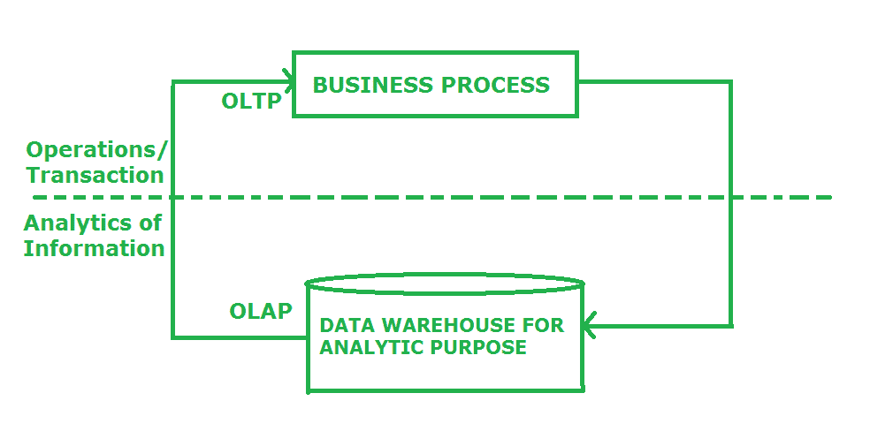
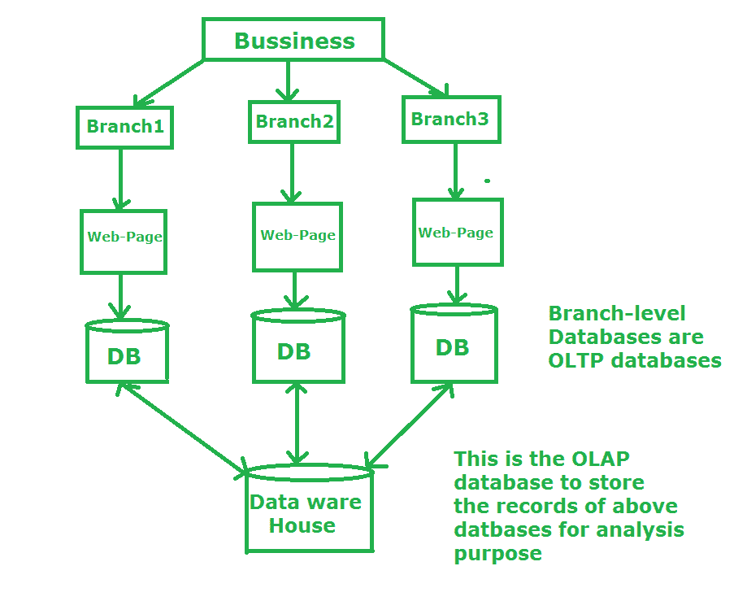

# 在线事务处理(OLTP)和在线分析处理(OLAP)

> 原文:[https://www . geesforgeks . org/online-transaction-processing-OLTP-and-online-analytic-processing-OLAP/](https://www.geeksforgeeks.org/online-transaction-processing-oltp-and-online-analytic-processing-olap/)

**[【在线事务处理(OLTP)】](https://www.geeksforgeeks.org/on-line-transaction-processing-oltp-system-in-dbms/):**
OLTP 数据库是用来做许多小事务的，通常充当“单一存储源”。OLTP 系统的一个例子是在线电影票预订网站。假设两个人同时想为同一部电影预定同一时间的同一座位，那么在这种情况下，谁先完成交易谁就能得到票。这里需要注意的关键是，OLTP 系统是为事务优先级而不是数据分析而设计的。

**Figure –** Pictorial Representation of OLTP

**使用 OLTP 服务的好处:-**

*   使用 OLTP 服务的主要好处是它可以立即响应用户的操作，因为它可以非常快速地处理查询。
*   OLTP 服务允许其用户快速执行读取、写入和删除数据等操作。

**OLTP 服务的缺点:-**

*   OLAP 服务的主要问题是它不是自动防故障的。如果出现硬件故障，那么在线交易就会受到影响。
*   OLTP 允许用户同时访问和更改数据，这造成了前所未有的局面。

**[【在线分析处理(OLAP)】](https://www.geeksforgeeks.org/types-of-olap-systems-in-dbms/):**
另一方面，OLAP 数据库更适合分析、数据挖掘、较少的查询，但它们通常更大(它们对更多数据进行操作)。我们可以说任何数据仓库系统都是 OLAP 系统。许多公司将当月的销售额与上月进行比较，以保持业务的连续性。在这里，公司比较销售额，并将结果保存在另一个位置，这是一个单独的数据库。这里公司使用 OLAP 数据库。

**Figure –** Pictorial Representation of OLAP

**使用 OLAP 服务的优势:-**

*   使用 OLAP 服务的主要好处是它有助于保持跟踪的一致性和计算。
*   OLAP 构建了一个单一平台，我们可以在其中存储业务分析的规划、分析和预算。
*   有了 OLAP 即服务，我们可以轻松应用安全限制来保护数据

**OLAP 服务的缺点:-**

*   OLAP 服务的主要问题是它总是需要 it 专业人员来处理数据，因为 OLAP 工具需要复杂的建模过程。
*   如使用 OLAP 服务的好处中所述，我们可以将 OLAP 作为一个单一的平台，在这里我们可以存储业务分析的规划、分析和预算，但在这里我们同时需要不同部门的帮助，即 OLAP 工具需要各部门人员之间的合作，这导致了依赖性问题。

【OLTP 和 OLAP 数据库之间的关键[差异:](https://www.geeksforgeeks.org/difference-between-olap-and-oltp-in-dbms/)

| 联机事务处理 | OLAP |
| --- | --- |
| OLTP 的特点是大量的短期在线事务(插入、更新、删除)。 | OLAP 的特点是交易量相对较低。 |
| OLTP 查询简单易懂。 | OLAP 查询通常非常复杂，并且涉及聚合。 |
| OLTP 广泛用于小型事务。 | 数据挖掘技术广泛使用 OLAP 应用程序。 |
| OLTP 是高度规范化的。 | OLAP 通常是不正常的。 |
| OLTP 在宗教上用于备份。 | OLAP 用于常规备份。 |
| OLTP 通常使用的用于存储跨国数据库的模式是实体模型(通常为 3NF)。 | OLAP 使用星型模型来存储数据。 |
| 与 OLAP 相比，OLTP 的性能相对较快。 | 与 OLTP 相比，OLAP 的性能相对较低。 |

OLTP 和 OLAP 服务互不相同，因此，明智的做法是研究差异，并根据您的应用/需求需求明智地使用它们。