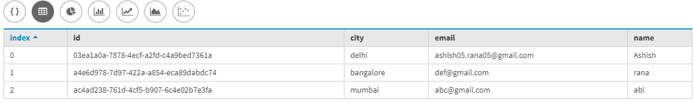
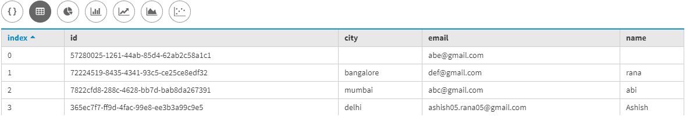
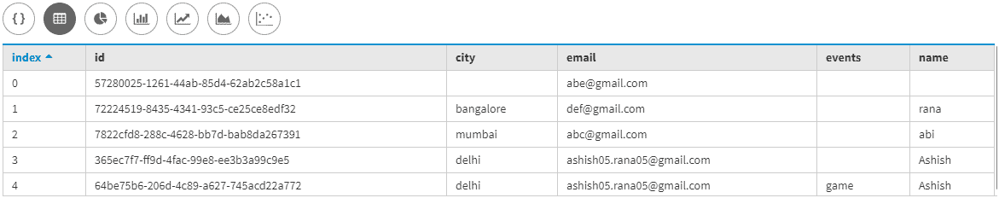

# 卡珊德拉的桌面操作

> 原文:[https://www . geesforgeks . org/operations-on-table-in-Cassandra/](https://www.geeksforgeeks.org/operations-on-table-in-cassandra/)

在本文中，我们将通过一些示例练习来讨论像在 [Cassandra](https://www.geeksforgeeks.org/introduction-to-apache-cassandra/) 中创建插入截断拖放这样的表操作。让我们看看。

**创建表格–注册:**
首先，我们要创建一个表格，即注册，其中我们有身份证，姓名，电子邮件，城市是字段。让我们看看。

```
Create table Register
 (
  id uuid primary key,
  name text,
  email text,
  city text
 );
```

**在 Register 表中插入数据:**
现在创建一个表之后，我们要在 Register 表中插入一些数据。让我们看看。

```
Insert into Register (id, name, email, city) 
values(uuid(), 'Ashish', 'ashish05.rana05@gmail.com', 'delhi');

Insert into Register (id, name, email, city) 
values(uuid(), 'abi', 'abc@gmail.com', 'mumbai');

Insert into Register (id, name, email, city) 
values(uuid(), 'rana', 'def@gmail.com', 'bangalore'); 
```

**验证结果:**
使用下面给出的 CQL 查询来验证结果。让我们看看。

```
select * 
from Register; 
```



**描述表格模式:**

```
describe table Register; 

CREATE TABLE cluster1.register (
    id uuid,
    city text,
    email text,
    name text,
    PRIMARY KEY (id)
) WITH read_repair_chance = 0.0
    AND dclocal_read_repair_chance = 0.0
    AND gc_grace_seconds = 864000
    AND bloom_filter_fp_chance = 0.01
    AND caching = { 'keys' : 'ALL', 'rows_per_partition' : 'NONE' }
    AND comment = ''
    AND compaction = { 'class' : 'org.apache.cassandra.db.compaction.SizeTieredCompactionStrategy', 
                       'max_threshold' : 32, 'min_threshold' : 4 }
    AND compression = { 'chunk_length_in_kb' : 64, 
                        'class' : 'org.apache.cassandra.io.compress.LZ4Compressor' }
    AND default_time_to_live = 0
    AND speculative_retry = '99PERCENTILE'
    AND min_index_interval = 128
    AND max_index_interval = 2048
    AND crc_check_chance = 1.0
    AND cdc = false
    AND memtable_flush_period_in_ms = 0; 
```

**更新表格:**
要更新表格，请使用下面给出的 CQL 查询。

```
update Register set 
email = 'abe@gmail.com' 
where id = 57280025-1261-44ab-85d4-62ab2c58a1c1; 
```

**更新表后验证:**
我们使用下面给出的 CQL 查询来验证结果。

```
select * 
from Register; 
```

**输出:**



**对表的更改操作:**
要更改表，请使用下面给出的 CQL 查询。

```
ALTER table Register 
add events text; 
```

要查看更新，请使用下面给出的 CQL 查询。

```
describe table Register; 
```

**输出:**

```
CREATE TABLE cluster1.register (
    id uuid,
    city text,
    email text,
    events text,
    name text,
    PRIMARY KEY (id)
) WITH read_repair_chance = 0.0
    AND dclocal_read_repair_chance = 0.0
    AND gc_grace_seconds = 864000
    AND bloom_filter_fp_chance = 0.01
    AND caching = { 'keys' : 'ALL', 'rows_per_partition' : 'NONE' }
    AND comment = ''
    AND compaction = { 'class' : 'org.apache.cassandra.db.compaction.SizeTieredCompactionStrategy', 
                       'max_threshold' : 32, 'min_threshold' : 4 }
    AND compression = { 'chunk_length_in_kb' : 64, 
                        'class' : 'org.apache.cassandra.io.compress.LZ4Compressor' }
    AND default_time_to_live = 0
    AND speculative_retry = '99PERCENTILE'
    AND min_index_interval = 128
    AND max_index_interval = 2048
    AND crc_check_chance = 1.0
    AND cdc = false
    AND memtable_flush_period_in_ms = 0; 
```

**验证新添加的列:**
为了验证新添加的列，使用了下面给出的 CQL 查询。

```
select * 
from Register; 
```

**输出:**


**在新增加的列中插入数据:**

```
Insert into Register (id, name, email, city, events) 
values(uuid(), 'Ashish', 'ashish05.rana05@gmail.com', 'delhi', 'game'); 
```

为了验证插入到新添加的列中的数据，使用了下面给出的 CQL 查询。

```
select * 
from Register; 
```

**输出:**



**从表寄存器中删除数据:**
要从表寄存器中删除数据，请使用以下 CQL 查询。让我们看看。

```
truncate Register; 
```

**删除表:**
要从表中删除表模式和数据，Register 使用了以下 CQL 查询。让我们看看。

```
drop table Register; 
```