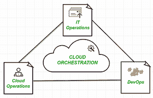

# 云计算中的流程编排

> 原文:[https://www . geesforgeks . org/云计算中的编排/](https://www.geeksforgeeks.org/orchestration-in-cloud-computing/)

**概述:**
根据许多技术和研究组织的观察，如今云计算系统正在处理跨多个云组织的海量数据。这增加了组织为执行特定任务而部署、运送和维护各种版本的容器所提供的云服务的难度。通过云计算跨多个系统处理的大量数据导致了可变性，这使得管理、一致性和安全性成为一个主要挑战。牢记这一问题，组织实施了一种更新的方法，该方法旨在促进基于云的结构(称为云协调)的一致性和管理。

**云编排** :
云编排可以定义为基于云的环境中服务部署的协调、安排或端到端自动化。它为各种流程的自动化活动引入并实施工作流，以向其客户交付所需的服务。云编排工具充分利用 [IaaS](https://www.geeksforgeeks.org/difference-between-iaas-paas-and-saas/) 服务提供商来实现全自动部署，删除了被认为耗时的手动流程。一些编排工具有 Terraform、 [Ansible](https://www.geeksforgeeks.org/ansible-introduction-and-installation-in-linux/) [AWS](https://www.geeksforgeeks.org/aws-types-of-databases/) 云形成等。

**基于云的** ***基础设施***

**重要事实:**

*   它使用程序化技术来管理已部署工作流之间的整体互连和交互，无论是基于公共云还是基于私有云的基础架构。
*   通过云管理器协调的解决方案可以与自助服务资源的配置一起考虑，以提供比基于个人请求的手动配置服务的旧方法更快的服务周期。
*   这个平台可以集成权限检查和安全性。它将模板标准化并实施安全实践，使管理员能够审查和改进已经存在的自动化脚本。
*   最好用于部署或启动服务器、通过客户服务网络进行管理、创建 VMware 以及获取云模型上特定软件的访问密钥。

**优势:**

*   编排提供了一种系统化的方法，可以增加敏捷性的自动化优势并降低成本。
*   它允许企业通过一致性和适当的可管理性来加速高级应用程序和服务的部署。它还利用统一的门户和受云启发的信息技术服务模型，以及全栈自动化和监控。
*   这提供了灵活性，并提高了由不同系统提供的各种微服务的创建、部署和操作的整体速度。

**结论:**
云编排现在正成为许多萌芽甚至富裕组织的兴趣所在，因为每个企业都在向更好、更快、更安全的方向转变，通过正确的审查和自助配置向其客户交付微服务。这将额外释放企业的个人参与。整体编排消除了在资源调配、扩展和各种其他云用途中引入错误的可能性。人们可以认为编排技术是基于软件云技术的成熟未来。