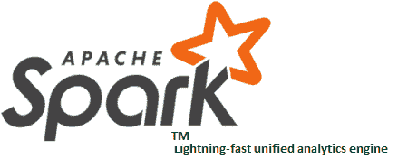
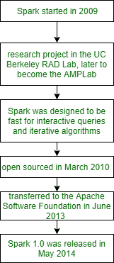

# 阿帕奇火花概述

> 原文:[https://www.geeksforgeeks.org/overview-of-apache-spark/](https://www.geeksforgeeks.org/overview-of-apache-spark/)

在本文中，我们将讨论 Apache spark 的入门部分，以及 Spark 的历史，以及为什么 Spark 很重要。我们一个一个来讨论。

根据 Databrick 的定义，“Apache Spark 是一个针对大数据和机器学习的闪电般快速的统一分析引擎。它最初于 2009 年在加州大学伯克利分校开发。”

Databricks 是 Spark 的主要贡献者之一，包括雅虎！英特尔等。Apache spark 是最大的数据处理开源项目之一。它是一个快速的内存数据处理引擎。

**火花的历史:**
火花始于 2009 年的加州大学伯克利分校 R & D 实验室，现在被称为 AMPLab。然后在 2010 年，spark 成为了 BSD 许可下的开源软件。在那之后，火花于 2013 年 6 月转移到 ASF(阿帕奇软件基金会)。Spark 研究人员之前致力于 Hadoop 地图缩减。在加州大学伯克利分校& D 实验室，他们观察到迭代和交互式计算工作效率低下。在 Spark 中，为了支持内存存储和高效的故障恢复，Spark 被设计为能够快速进行交互式查询和迭代算法。在下面给出的图表中，我们将描述 Spark 的历史。让我们看看。

**火花特征:**

*   Apache spark 可以用来执行批处理。
*   Apache spark 也可以用来执行流处理。对于流处理，我们使用了 Apache Storm / S4。
*   它可以用于交互处理。以前我们使用 Apache Impala 或 Apache Tez 进行交互处理。
*   Spark 对于执行图形处理也很有用。Neo4j / Apache Graph 用于图形处理。
*   Spark 可以实时和批量处理数据。

所以，我们可以说 Spark 是一个强大的开源数据处理引擎。

**参考文献:**
[阿帕奇火花参考文献](https://spark.apache.org/)