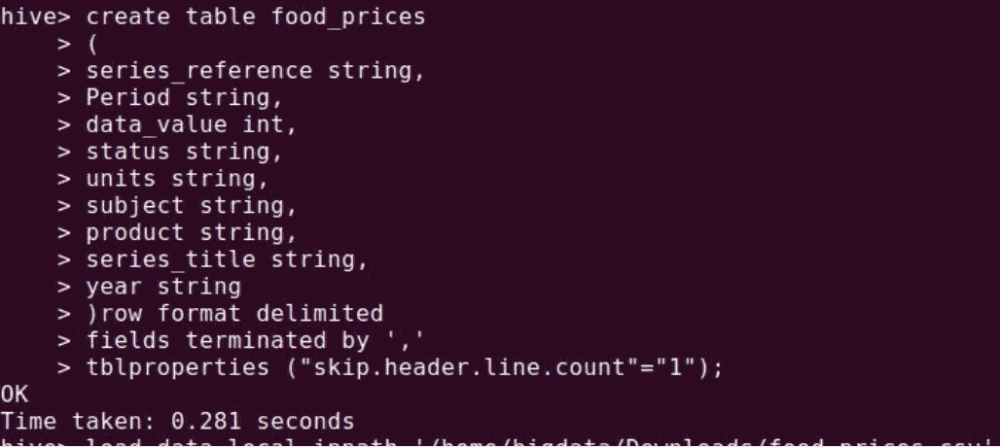
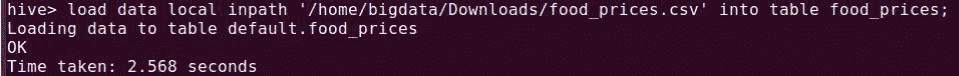
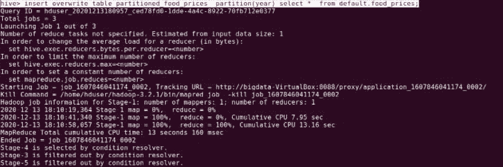
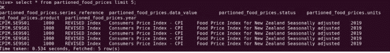

# 蜂巢动态分区概述

> 原文:[https://www . geeksforgeeks . org/hive 中动态分区概述/](https://www.geeksforgeeks.org/overview-of-dynamic-partition-in-hive/)

在本文中，我们将讨论 Hive 的概述，并将重点放在动态分区上，最后，我们将总结 Hive 中动态分区的操作。我们一个一个来讨论。

**概述:**
Hive 是脸书开发的一个存储系统，它基本上是一个对结构化数据进行操作的数据仓库系统。它主要用于执行分析和 MapReduce 作业等操作，还提供读取、写入和管理大型数据集的功能。Hive 之所以受欢迎，主要是因为它可以替代传统的数据库操作方法。Hive 使用索引，这有助于在内部提高查询效率，它还可以对存储在 Hadoop 生态系统中的压缩数据进行操作。

**分区类型:**
有两种分区类型如下。

1.  [静态分区](https://www.geeksforgeeks.org/apache-hive-static-partitioning-with-examples/)
2.  动态分区

**动态分区:**
动态分区是从非分区表加载数据的策略方法，其中对分区表的单次插入称为动态分区。在动态分区中，分区表的值默认存在，因此不需要手动传递这些列的值。

**动态分区的特点:**
动态分区的一些特点如下。

*   要处理存储在分布式存储中的大量数据，动态分区是最佳选择。
*   可以对配置单元外部表和托管表执行动态分区。
*   在动态分区中，不需要 where 子句。
*   如果您想在不知道列数的情况下对表执行分区，那么您可以使用动态分区。

**动态分区的操作:**
现在让我们来执行一些动态分区的操作你可以选择 ubuntu，它的操作速度会很快，如下所示。

**步骤-1 :**
首先，我们需要创建一个数据库，在其中执行创建表的操作。

```
hive>Create database dynamic_Demo;
hive>use dynamic_demo //here we have selected the above created database.
```

**步骤 2 :**
从可用列表中选择数据库后。现在我们将使用如下命令启用动态分区。

```
hive> set hive.exec.dynamic.partition=true;    
hive> set hive.exec.dynamic.partition.mode=nonstrict;  
```

**步骤-3 :**
用合适的表名创建任何表来存储数据。

```
hive>CREATE TABLE food_prices (
series_reference string,
Period string,
data_value int,
status string,
units string,
subject string,
product string,
series_title string,
year string
)ROW FORMAT DELIMITED  
fields terminated by ','
TBLPROPERTIES ("skip.header.line.count"="1");
```



**步骤-4 :**
现在，在下一步，让我们加载由以下命令创建的数据。

```
hive>load data local inpath '/home/bigdata/Downloads/food_prices.csv' 
     into table food_prices;
```



**第 5 步:**
要创建分区表，我们必须遵循下面的命令。

```
create table partitioned_food_prices
 (
 series_reference string,
 Period string,
 data_value int,
 status string,
 units string,
 subject string,
 product string,
 series_title string
 )partitioned by (year string);
```

**步骤-6 :**
现在我们将使用以下命令将数据加载到分区表中。

```
hive> insert overwrite table partitioned_food_prices  partition(year) 
select *  from default.food_prices;
```



**第 7 步:**
我们来执行一些查询操作。

```
hive>select * partitioned_food_prices limit 5
```



**Step-8 :**
最后一步是删除动态分区列。

```
hive>alter table partioned_food_prices drop partition (year = '2019')
```

