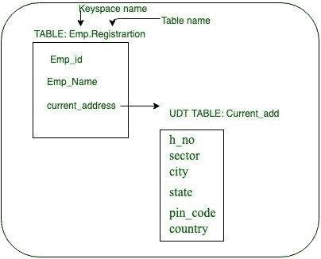
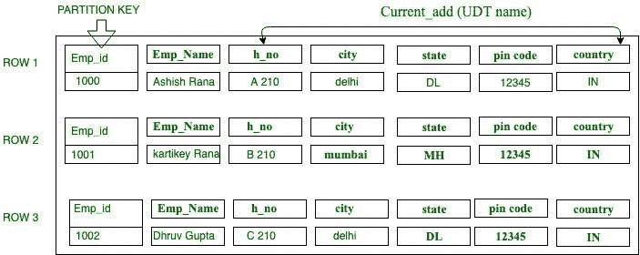
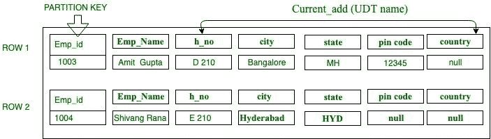

# 卡珊德拉用户定义类型(UDT)概述

> 原文:[https://www . geesforgeks . org/overview-of-user-defined-type-udt-in-Cassandra/](https://www.geeksforgeeks.org/overview-of-user-defined-type-udt-in-cassandra/)

**用户定义数据类型:**
用户定义数据(UDT)的一个优点是将多个数据字段附加到一列。在 Cassandra 中，udt 发挥着至关重要的作用，它允许组相关字段(如字段 1、字段 2 等)。)可以是一起的数据，并且是命名的和类型的。

在 Cassandra 中，udt 的优势之一是有助于增加表和数据模型的灵活性。我们可以构造卡珊德拉提供的 UDT:UDT，代表用户定义类型。正如我们在示例中可以看到的，用户定义类型(UDTs)可以附加多个数据字段，其中每个命名和类型都可以映射到单个列。

要构造用户定义类型(UDT)，任何有效的数据类型都可以用于卡珊德拉中的字段类型，包括集合(集合、列表、映射)或任何其他用户定义类型。一旦在 Cassandra 中创建了一个 UDT，那么它就可以用来定义主表中的一列。

```
Syntax to define UDT:
CREATE TYPE UDT_name 
(
  field_name 1 Data_Type 1,
  field_name 2 Data_Type 2,
  field_name 3 Data_Type 3,
  field_name 4 Data_Type 4,
  field_name 5 Data Type 5,
);

```

**创建 udt 的简单步骤:**

**步骤 1:** 创建一个密钥空间，如果不存在的话。语法:

```
create_keyspace_statement ::=  
      CREATE KEYSPACE [ IF NOT EXISTS ] keyspace_name 
       WITH options 
```

**步骤 2:** 要创建键空间，请使用以下 CQL 查询。

```
CREATE KEYSPACE Emp
    WITH replication = {'class': 'SimpleStrategy', 
                        'replication_factor' : 1};  
```

**为了检查键空间，Schema 使用了以下 CQl 查询。**

```
DESCRIBE KEYSPACE Emp;
```

**步骤 3:** 使用以下 CQL 查询为当前地址创建员工用户数据类型。例如，当前地址的用户数据类型

```
CREATE TYPE Emp.Current_add
(
Emp_id int,
h_no text,
city text,
state text,
pin_code int,
country text 
); 
```

这里 Current_add 是一个 Cassandra 用户定义的数据类型。


**图–**用户自定义类型(UDTs)

**步骤-4:** 创建将 current_address UDT 作为列之一的表注册，例如:

```
CREATE TABLE Registration
( 
Emp_id int PRIMARY KEY, 
Emp_Name text, 
current_address FROZEN<Current_add>
); 

```

**步骤-5:** 要在 Cassandra 中使用 UDT 插入数据，请使用以下 CQL 查询。

**格式-1:使用 JSON (JavaScript 对象符号)格式。**
在 Cassandra 中，我们还可以插入 JSON (JavaScript 对象符号)格式的数据。例如:CQL 查询采用 JSON 格式。

```
INSERT INTO Registration JSON'
{
"Emp_id"            : 2000, 
"current_address"   :  { "h_no" : "A 210", "city" : 
                        "delhi", "state" : "DL",
                        "pin_code" :"201307", 
                        "country" :"india"},
"Emp_Name"          : "Ashish Rana"}' ;

```

**格式-2:简单插入**

```
INSERT INTO Registration (Emp_id, Emp_Name, current_address ) 
            values (1000, 'Ashish', { h_no :'A 210', city : 'delhi', state : 'DL', pin_code 
                                    :12345, country :'IN'});

INSERT INTO Registration(Emp_id, Emp_Name, current_address ) 
            values (1001, 'kartikey Rana', { h_no : 'B 210 ',  city 
                                    : 'mumbai', state : 'MH', pin_code 
                                    :12345, country :'IN'});

INSERT INTO Registration(Emp_id, Emp_Name, current_address ) 
            values (1002, 'Dhruv Gupta', { h_no : 'C 210', city 
                                    : 'delhi', state : 'DL', pin_code 
                                    :12345, country :'IN'}); 

```

**输出:**


**【图】**【udt 表插入】

在这种情况下，我们将看到如何在不插入一个或多个字段的值的情况下插入命令。
例如，我们在这里不传递字段的值。卡珊德拉会如何处理？
嗯，它会将这个值作为一个正常值插入，但是它会将字段值取为空。每个字段值，除了我们在插入时没有传递的主键，Cassandra 都将其视为 null。

CQL 查询没有插入一个字段或多个字段值的 UDT:

```
INSERT INTO Registration(Emp_id, Emp_Name, current_address ) 
                 values (1003, 'Amit Gupta', { h_no : 'D 210',  city 
                               : 'Bangalore', state : 'MH', pin_code :12345}
                               );

INSERT INTO Registration(Emp_id, Emp_Name, current_address ) 
                 values (1004, 'Shivang Rana', { h_no : 'E 210', city 
                               : 'Hyderabad', state : 'HYD'});

```

**输出:**


**图–**UDT 表中没有插入一个或多个字段值