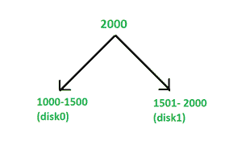
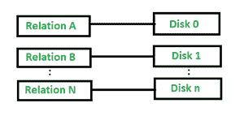

# 数据库管理系统中查询的并行性

> 原文:[https://www.geeksforgeeks.org/parallelism-in-query-in-dbms/](https://www.geeksforgeeks.org/parallelism-in-query-in-dbms/)

查询中的并行性允许我们通过将多个查询分解成并行工作的部分来并行执行它们。这可以通过无共享架构来实现。随着越来越多的资源(如处理器和磁盘)被提供，并行性也被用于加快查询执行的进程。我们可以通过以下方法在查询中实现并行:

1.  输入输出并行性
2.  查询内并行性
3.  查询间并行性
4.  操作内并行
5.  操作间并行性

**1。输入/输出并行性:**
这是一种并行形式，其中关系被划分在多个磁盘上，目的是减少从磁盘检索关系的时间。在中，输入的数据被分区，然后与每个分区并行处理。处理完所有分区数据后，合并结果。它也被称为**数据分区**。哈希分区的优势在于，它提供了数据在磁盘上的均匀分布，并且最适合基于分区属性的点查询。需要注意的是，分区对于放置在磁盘数量为“ *n* 的整个表的顺序扫描是有用的，并且扫描该关系所花费的时间大约是扫描单个磁盘系统上的表所需时间的 *1/n* 。在输入/输出并行性方面，我们有四种类型的分区:

*   **哈希分区–**
    正如我们已经知道的，哈希函数是一个快速的数学函数。原始关系的每一行都在分区属性上进行哈希运算。例如，假设有 *n 个*磁盘*磁盘 1、磁盘 2、磁盘 3、*和*磁盘 4* ，数据将通过它们进行分区。现在，如果函数返回 3，则该行被放置在*盘 3* 上。

*   **范围分区–**
    在范围分区中，它向每个磁盘发出连续的属性值范围。例如，我们在范围分区中有编号为 0、1 和 2 的 3 个磁盘，并且可以将小于 5 的值分配给 disk0，将 5-40 之间的值分配给 disk1，将大于 40 的值分配给 disk2。它有一些优点，比如它涉及到在磁盘上放置包含一定范围内属性值的洗牌。见图 1: *区间划分给定*如下:

*   **循环划分–**
    在循环划分中，以任意顺序研究关系。第 I 个元组被发送到磁盘号(di % n)。因此，磁盘轮流接收新的数据行。这种技术确保了元组在磁盘上的均匀分布，非常适合希望为每个查询顺序读取整个关系的应用程序。

*   **模式分区–**
    在模式分区中，数据库中的不同表被放置在不同的磁盘上。见下图 2:

图 2

**2。查询内并行性:**
查询内并行性是指使用无共享并行架构技术，在不同的 CPU 上并行执行单个查询。这使用两种方法:

*   **第一种方法–**
    在这种方法中，每个 CPU 可以针对某个数据部分执行重复的任务。
*   **第二种方法–**
    在这种方法中，任务可以分成不同的扇区，每个 CPU 执行不同的子任务。

**3。查询间并行性:**
在查询间并行性中，每个 CPU 执行多个事务。这被称为并行事务处理。数据库管理系统使用事务调度来承载查询间的并行性。我们也可以使用一些不同的方法，比如高效的锁管理。在这种方法中，每个查询都是按顺序运行的，这导致长查询的运行速度变慢。在这种情况下，数据库管理系统必须了解运行在不同进程上的不同事务持有的锁。当并行执行的事务不接受相同的数据时，共享磁盘架构上的查询间并行性能最佳。此外，它是数据库管理系统中最简单的并行形式，并且提高了事务吞吐量。

**4。操作内并行性:**
操作内并行性是一种并行性，在这种并行性中，我们并行执行任务的每个单独操作，如排序、连接、投影等。在操作内并行中，并行度非常高。这种类型的并行在数据库系统中是很自然的。让我们以一个 SQL 查询为例:

> *从按车型订购的车辆中选择*号；*

在上面的查询中，关系操作是排序，由于关系中可能有大量记录，因此可以在多个处理器中对关系的不同子集执行该操作，这减少了排序数据所需的时间。

**5。操作间并行:**
当一个查询表达式中的不同操作并行执行时，则称之为操作间并行。它们有两种类型–

*   **流水线并行–**
    **在流水线并行中，一个操作的输出行甚至在第一个操作在其输出中产生整组行之前就被第二个操作消耗掉了。此外，可以在不同的 CPU 上同时运行这两个操作，这样一个操作与另一个操作并行消耗元组，从而减少元组。它对少量的 CPU 很有用，避免了将中间结果写入磁盘。**
*   ****独立并行–**
    在这种并行中，查询表达式中相互不依赖的操作可以并行执行。这种并行性在并行度较低的情况下非常有用。**