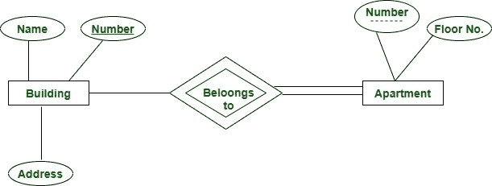

# 数据库管理系统中的部分、唯一、辅助、复合和代理键

> 原文:[https://www . geeksforgeeks . org/partial-unique-secondary-composite-and-substitute-key-in-DBMS/](https://www.geeksforgeeks.org/partial-unique-secondary-composite-and-surrogate-keys-in-dbms/)

***   部分密钥:**

它只是密钥的一部分，因为使用它只能识别属性的子集。它是部分唯一的，并且可以与其他强实体集组合来唯一标识元组。

部分钥匙公寓号用虚线表示。

这里，我们将公寓作为弱实体，将建筑作为强实体类型，通过“属于”关系集进行连接。公寓号不是全球唯一的，即多个公寓在全球范围内可能有相同的号码，但对于特定的建筑来说是唯一的，因为建筑可能没有相同的公寓号。因此，单元号不能是实体单元的主键，但它是用虚线显示的部分键。

6.  **唯一键:**
    它唯一标识关系中的元组。与主键不同，一个表中可以有多个唯一键。它只能接受一个空值。它不能有重复的值，并且是不可更新的，即一旦被赋值就不能被更新。

**示例–**
唯一密钥的最佳示例是选民 ID。
选民身份证对所有公民都是唯一的。如果它丢失了，并且发出了另一个副本，则副本的编号始终与以前相同。因此，它是不可更新的。很少有公民可能没有他们的选民身份证，所以对他们来说，它的值是空的。

10.  **辅键:**
    是不选为主键的候选键。例如，我们有一个模式:此关系的学生(身份证，电子邮件，注册号，姓名)候选关键字是:身份证，电子邮件，注册号
    如果我们选择身份证作为主键，那么电子邮件和注册号将成为关系的辅助关键字。
11.  **Composite key :**

    最初使用 sqlplus 早期版本时，最多可以将 16 列组合成一个复合索引键。然而，极限被扩展了，我们可以组合任意数量的列(实际上没有用)

12.  **代理键:
    代理键是内部生成的。
    示例:系统日期/时间戳、计数器**