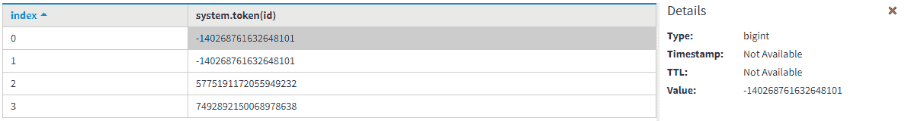

# 卡珊德拉中具有 TOKEN 功能的分割器

> 原文:[https://www . geesforgeks . org/partitioners-with-token-function-in-Cassandra/](https://www.geeksforgeeks.org/partitioners-with-the-token-function-in-cassandra/)

在本文中，我们将使用分割器讨论 TOKEN 函数如何在 [Cassandra](https://www.geeksforgeeks.org/introduction-to-apache-cassandra/) 中工作。卡珊德拉查询语言支持 3 种不同类型的分区器。

**CQL 的分割器:**

```
1. Murmur3partitioner 
2. RandomPartitioner
3. ByteOrderedPartitioner 
```

我们一个一个来讨论。

1.  **mur 3 分区器:**
    是 Cassandra 3.0 中默认的分区器。如果我们使用 TOKEN 函数，那么它会基于 murHash 哈希值在集群上分发数据。提供良好的性能和快速散列也很有用。

*   **随机分区器:**
    是 Cassandra 1.2 之前的默认分区器。它通过使用 MD5 哈希值在整个集群中分发数据。*   **ByteOrderedPartitioner :**
    In Cassandra Query Language Byte Ordered partitioner data distribute over cluster based on data lexically by key bytes.It is used for ordered partitioning in Cassandra Query Language. It is also useful for backward compatibility.

    下面给出的表格有助于理解，让我们来看看。

    <center>

    | 分区器名称 | 数据类型 | 基于在集群上分发数据 |
    | --- | --- | --- |
    | mur mur 3 分区器 | 比吉斯本 | MurmurHash 哈希值 |
    | 随机分组器 | varint | MD5 哈希值 |
    | ByteOrderedPartitioner | 一滴 | 按关键字节排列的数据 |

    </center>

    让我们使用分区键来理解 Token 函数，并基于 TOKEN 分区键返回查询。首先我们创建表格。

    ```
    CREATE TABLE User_info
    (
    Id int,
    Name text,
    Address text,
    PRIMARY KEY(Id, Name)
    ); 
    ```

    要将数据插入表用户信息，请使用以下 CQL 查询:

    ```
    INSERT INTO User_info (Id, Name, Address) 
           VALUES (301, 'Ashish', 'Delhi');
    INSERT INTO User_info (Id, Name, Address) 
           VALUES (302, 'Rana', 'Mumbai');
    INSERT INTO User_info (Id, Name, Address) 
           VALUES (303, 'Abi', 'Noida');
    INSERT INTO User_info (Id, Name, Address) 
           VALUES (302, 'me', 'Noida'); 
    ```

    让我们看看。

    ```
    SELECT * 
    FROM User_info; 
    ```

    <center>

    | 身份 | 名字 | 地址 |
    | --- | --- | --- |
    | Three hundred and one | Ashish | 德里 |
    | Three hundred and two | 我 | 无聊死了 |
    | Three hundred and two | 中国林蛙 | 孟买 |
    | Three hundred and three | Abi | 无聊死了 |

    </center>

    通过使用 **TOKEN 函数。**

    ```
    SELECT TOKEN(Id) 
    FROM User_info; 
    ```

    

    [从业者参考](https://docs.datastax.com/en/cassandra/3.0/cassandra/architecture/archPartitionerAbout.html)，【TOKEN 功能参考。