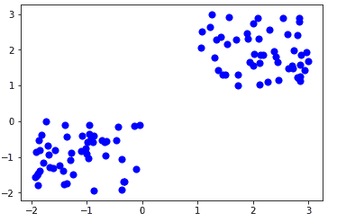

# 数据挖掘中的划分方法(K 均值)

> 原文:[https://www . geeksforgeeks . org/partitioning-method-k-mean-in-data-mining/](https://www.geeksforgeeks.org/partitioning-method-k-mean-in-data-mining/)

**划分方法:**
该聚类方法根据数据的特征和相似性将信息分为多个组。由数据分析师来指定必须为聚类方法生成的聚类数。

在分区方法中，当数据库(D)包含多个(N)对象时，分区方法构造用户指定的(K)数据分区，其中每个分区代表一个集群和一个特定区域。划分方法下有很多算法，其中比较流行的有 K-Mean、PAM(K-Mediods)、CLARA(聚类大应用)等。

在本文中，我们将详细了解 K 均值算法的工作原理。

**K-Mean(一种基于质心的技术):**
K-Mean 算法从用户处获取输入参数 K，并将包含 N 个对象的数据集划分为 K 个聚类，使得组内(聚类内)的数据对象之间的结果相似度较高，但与聚类外的数据对象的相似度较低(聚类间)。聚类的相似性是相对于聚类的平均值来确定的。

这是一种平方误差算法。开始时，从数据集中随机选择 k 个对象，其中每个对象代表一个聚类平均值(中心)。对于其余的数据对象，根据它们与聚类平均值的距离将它们分配到最近的聚类。然后用添加的数据对象计算每个聚类的新平均值。

**算法:K 均值:**

```
Input:
K: The number of clusters in which the dataset has to be divided
D: A dataset containing N number of objects

Output: 
A dataset of K clusters 
```

**方法:**

1.  从数据集中随机分配 K 个对象作为聚类中心
2.  (重新)根据平均值将每个对象分配给最相似的对象。
3.  更新聚类意味着，即使用更新的值重新计算每个聚类的平均值。
4.  重复步骤 4，直到没有变化。



<center>**Figure –** K-mean Clustering</center>

**流程图:**


<center>**Figure –** K-mean Clustering</center>

**示例:**假设我们希望仅使用访问者的年龄对他们进行分组，如下所示:

```
16, 16, 17, 20, 20, 21, 21, 22, 23, 29, 36, 41, 42, 43, 44, 45, 61, 62, 66 
```

**初始集群:**

```
K=2
Centroid(C1) = 16 [16] 
Centroid(C2) = 22 [22] 
```

**注意:**这两点是从数据集中随机选取的。

**迭代-1:**

```
C1 = 16.33 [16, 16, 17]
C2 = 37.25 [20, 20, 21, 21, 22, 23, 29, 36, 41, 42, 43, 44, 45, 61, 62, 66] 
```

**迭代-2:**

```
C1 = 19.55 [16, 16, 17, 20, 20, 21, 21, 22, 23]
C2 = 46.90 [29, 36, 41, 42, 43, 44, 45, 61, 62, 66] 
```

**迭代-3:**

```
C1 = 20.50 [16, 16, 17, 20, 20, 21, 21, 22, 23, 29]
C2 = 48.89 [36, 41, 42, 43, 44, 45, 61, 62, 66] 
```

**迭代-4:**

```
C1 = 20.50 [16, 16, 17, 20, 20, 21, 21, 22, 23, 29]
C2 = 48.89 [36, 41, 42, 43, 44, 45, 61, 62, 66] 
```

迭代 3 和迭代 4 之间没有变化，所以我们停止。因此，我们使用 K 均值算法将聚类 **(16-29)** 和 **(36-66)** 获得为 2 个聚类。