# 在 XAMPP 执行数据库操作

> 原文:[https://www . geesforgeks . org/performing-database-operations-in-xampp/](https://www.geeksforgeeks.org/performing-database-operations-in-xampp/)

XAMPP 是一个跨平台的网络服务器，用于在本地服务器上开发和测试程序。它由 Apache Friends 开发和管理，是开源的。它有一个 Apache HTTP 服务器、MariaDB 和解释器 T2，适用于 11 种不同的编程语言，比如 T4 和 PHP。 XAMPP 代表跨平台、Apache、MySQL、PHP、Perl。

*   它允许您在计算机的本地网络服务器上建立网站。
*   本地存储数据

在本文中，我们将执行数据库操作，如从在 XAMPP 本地主机服务器上创建的数据库中创建、插入、更新、删除数据。我们还将创建一个表，然后开始执行数据库操作。以下是数据库操作列表及其各自的语法:

### 选择指令

它用于显示表格中的所有详细信息。

```
Syntax: SELECT * FROM 'table_name'
```

### **插入**语句

它用于向表中插入数据。

```
Syntax: INSERT INTO `table_name`(`col`, `col2`, `col3`,.. `coln`) VALUES ([value-1],[value-2],
    [value-3],....,[value-n)
```

### **更新**语句

它用于更改/更新表中的任何数据。

```
Syntax: UPDATE `table_name` SET `col1`=[value-1],
 `col2`=[value-2],
 `col3`=[value-3],
 `coln`=[value-n] WHERE 1
```

### **删除**语句

它用于从表中删除数据。

```
Syntax: DELETE FROM table_name where col="value"
```

### **程序:**

按照以下步骤在 XAMPP 上执行数据库操作:

*   启动 XAMPP 服务器
*   创建数据库和创建表
*   执行数据库操作
*   验证结果表

### **创建数据库的步骤:**

1.启动 XAMPP 服务器

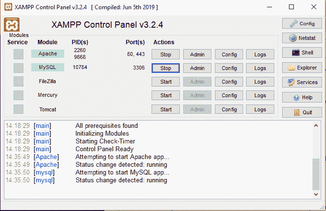

2.转到浏览器，键入“http://localhost/phpmyadmin”，并通过选择“新建”创建一个名为“Vignan”的数据库

 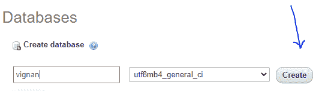

3.之后，创建表名“部门”，给出列数(我创建了 4 列)，然后点击开始

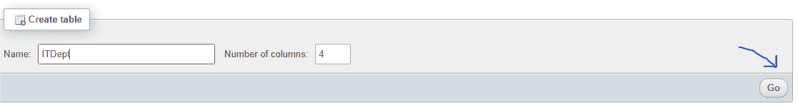

给出列名，如“rollino”(Varchar)、“Name”(Varchar)、“Gender”(Char)、“Address”(Varchar)和“Save”。

**注意:**单击“保存”选项很重要，否则不会创建表格。

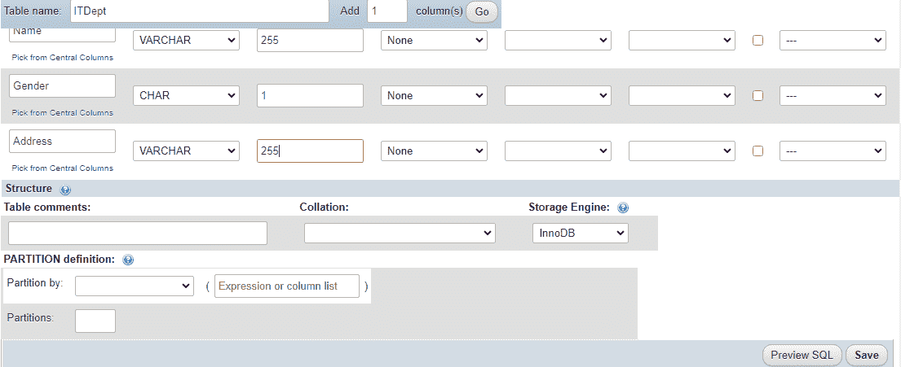

然后我们得到如下输出:

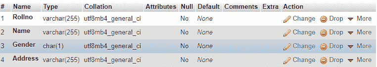

### **执行 SQL 操作:**

**插入操作:**

*   点击 SQL

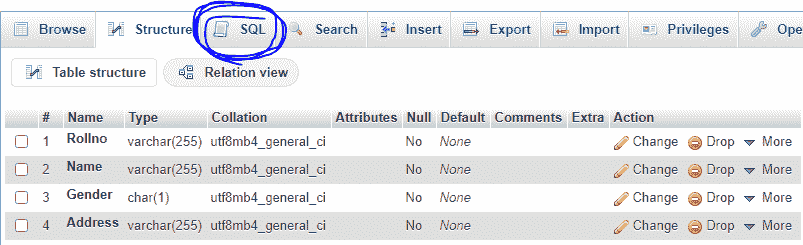

*   单击插入选项

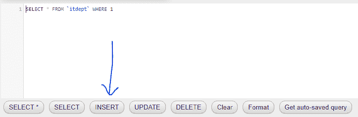

默认情况下，代码如下所示:

```
*INSERT INTO `itdept`(`Rollno`, `Name`, `Gender`, `Address`)*
*VALUES ([value-1],[value-2],[value-3],[value-4])*
```

*   我们想修改如下值，并点击“开始”

```
INSERT INTO `itdept`(`Rollno`, `Name`, `Gender`, `Address`)
 VALUES ("171FA07058","Sravan Kumar Gottumukkala", "m", "HYD" )
```

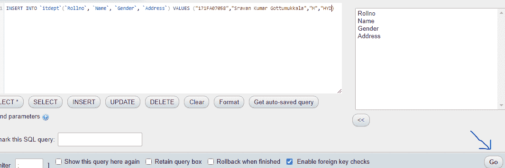

**输出:**

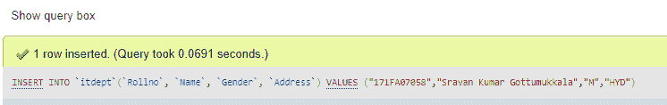

*   现在插入 5 条记录。数据库中的数据如下:

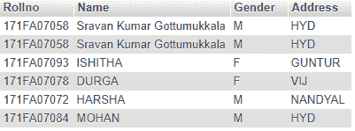

**更新操作:**

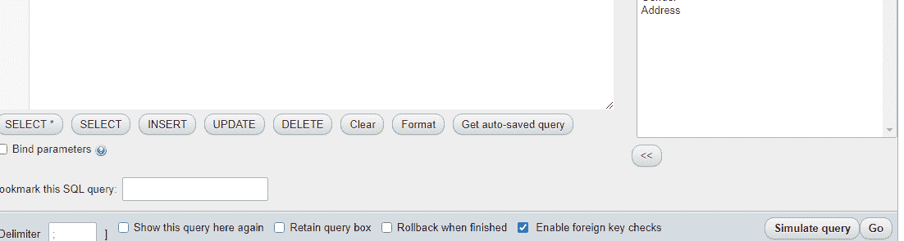

更新中的默认代码是:

```
*UPDATE `itdept` SET `Rollno`=[value-1],*
*`Name`=[value-2],*
*`Gender`=[value-3],*
*`Address`=[value-4] WHERE 1*
```

*   现在将名称更改为苏雅塔，其中罗诺是 171FA07078，如下所示:

```
UPDATE `itdept` SET NAME="Sujitha" WHERE `Rollno`="171FA07078"
```

**输出:**

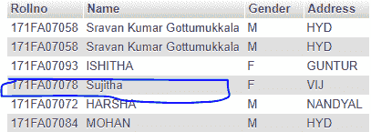

**选择操作:**

Select 语句用于显示或查询数据库中的数据。请按照以下步骤操作:

*   单击选择*选项

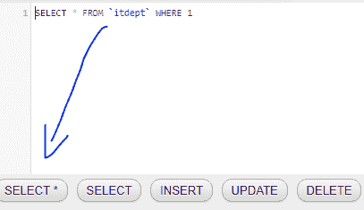

这将导致以下代码生成:

```
SELECT * FROM `itdept` 
```

**输出:**

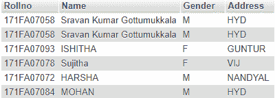

要选择特定数据，请遵循以下示例查询:

```
Select Rollno, Name from itept
```

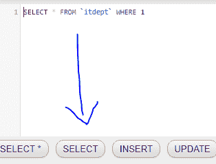 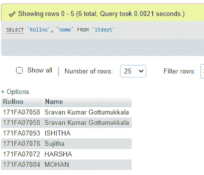

**删除操作:**

*   点击删除按钮删除数据，如下所示:

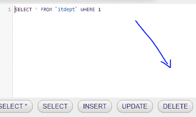

生成的代码如下所示:

```
DELETE FROM itdept where Rollno="171FA07058"
```

*   单击是确认删除

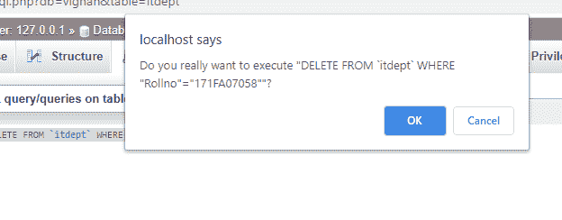

**输出:**

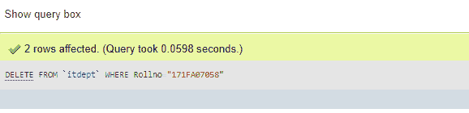

表中的最终数据是:

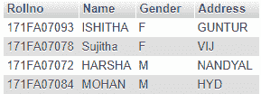