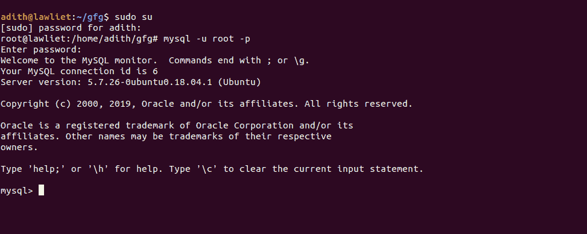
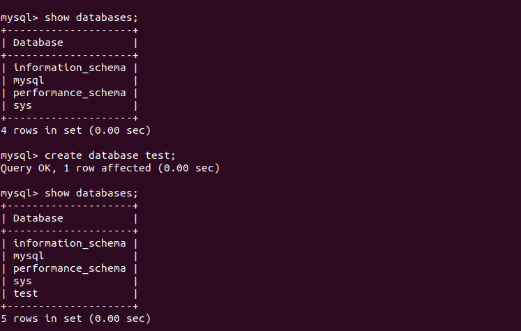
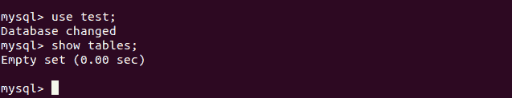
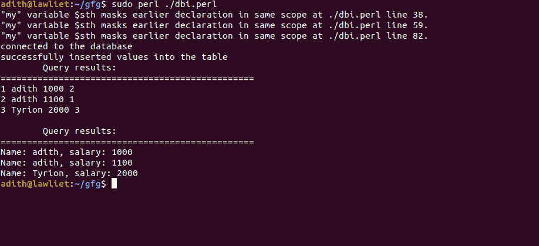

# Perl |使用 DBI 的数据库管理

> 原文:[https://www . geesforgeks . org/perl-数据库-管理-使用-dbi/](https://www.geeksforgeeks.org/perl-database-management-using-dbi/)

**先决条件:**

*   [Perl 简介](https://www.geeksforgeeks.org/introduction-to-perl/)
*   [数据库系统](https://www.geeksforgeeks.org/dbms/)

创建数据库程序是 Perl 最常见的用途之一。使用 Perl，我们可以创建健壮的 web 应用程序以及管理所有数据的数据库。它为接口和广泛的数据库格式提供了极好的支持。为了连接和查询数据库，Perl 提供了一个名为 **DBI** 的模块。DBI 是一个数据库接口，用于与使用**结构化查询语言**获取数据的数据库服务器进行通信。

用 Perl 访问数据库通常需要两步。DBI 模块为数据库访问提供了一个**应用编程接口**。一个程序使用 DBI 的功能来操作数据库。从 Perl 访问数据库的第二阶段是一个**数据库驱动程序(DBD)** 模块。每个不同的数据库系统都需要自己的驱动程序。这种方法允许一个 Perl 数据库应用程序相对独立于它将要访问的特定数据库。

**安装:**要安装 DBI 模块，请打开终端并键入以下命令，然后按回车键:

```
perl -MCPAN -e 'install Bundle::DBI'
```

这将自动下载并安装 DBI 模块的驱动程序，以提供与 Perl 的数据库连接。

**Database Independent Interface(DBI)**

顾名思义，DBI 为 Perl 程序提供了一个独立的接口。这意味着 Perl 代码不依赖于后端运行的数据库。DBI 模块提供 ***抽象*** ，也就是说，我们可以编写自己的代码，而不用担心后端运行的数据库。

要导入数据库独立接口模块的功能，我们需要借助“使用”实用程序来导入或包含该模块。`**use DBI**`实用程序允许我们使用 **DBI 模块**来操作我们正在连接的数据库。

> **语法:**使用 DBI；

**连接数据库:**

使用 **`connect()`** 方法连接到指定的数据库。它需要三个参数:

1.  由一个“:”分隔的三个值组成的字符串。在这个例子中，它是“DBI:mysql:test”。第一个值指定我们使用 DBI。第二个值指定数据库引擎，在本例中是 MySQL。第三个值指定要连接的数据库的名称。
2.  connect()方法的下一个参数是用户名。在这种情况下，用户是“root”。
3.  最后一个参数是本地系统的密码。在这个例子中，它是“密码”

**语法:**

> my $ DBH = DBI-> connect(“DBI:MySQL:test”、“root”、“password”)或 die“无法连接:“”。DBI-> errstr()；

如果程序无法与数据库建立连接，则“or die”语句将终止程序，并显示一条错误消息。`**errstr()**`方法返回一个字符串，该字符串包含连接到数据库时遇到的任何错误。

**准备查询:**

**`prepare()`** 方法接受一个参数，即要执行的 SQL 查询。SQL 查询采用包含 SQL 语句的字符串形式。该语句与您在 MySQL 中执行的语句相同。它返回一个名为语句句柄的对象，可用于执行查询。

**语法:**

> my $ sth = $ DBH-> prepare(" CREATE TABLE EMP(id INT PRIMARY KEY，name VARCHAR(10)，salary INT，")；

现在，查询已经准备好执行了。请注意，在上面的查询中，我们正在创建一个带有 **id** 、**姓名**和**工资**列的**表**。

**执行查询:**

`**execute()**`方法执行在`**prepare()**`方法中编写的查询。它不需要任何参数。使用执行“ **prepare** ”语句时创建的语句句柄对象调用它。

**语法:**

> $ sth-> execute()；

**从结果中取值:**

`**fetchrow()**`方法用于从执行的查询结果中检索下一行数据。如果执行选择查询，则`**fetchrow()**`方法从结果中获取下一行。它从可分配给变量的结果中返回一行。当在 while 循环中使用时，我们可以使用 **`fetchrow()`** 方法获取并显示数据库中的所有行。

**语法:**

> ($id，$name，$ salary)= $ sth-> fetch row()；

每一列的值都存储在三个变量中。

**`fetchrow_array()`** 函数返回一个包含结果行的数组

**语法:**

> my @row = $sth->fetchrow_array()

**断开:**

一旦所有的查询被执行，我们需要断开连接。这是通过使用 **`disconnect()`** 功能来完成的。这样做允许 Perl 脚本正确终止连接。不断开与数据库的连接不会产生任何错误。这样做通常是一种好的做法。

**语法:**

> $ DBH-> disconnect()；

**在 MySQL 中创建数据库:**

**MySQL** 必须安装在你的系统中，并且需要 MySQL 的基础知识。

*   登录你的 MySql 服务器
    
*   创建一个名为**测试**的数据库。我们将连接到该数据库，以确保
    的名称为“**测试**”
    
*   确保该数据库没有表，因为我们将创建一个名为“emp”的表，并将值插入该表
    

**综合起来:**

一旦您在 **MySQL** 中创建了数据库，我们就可以在 Perl 中访问该数据库。我们首先在数据库中创建一个名为 test 的 emp 表，其模式为:( **id** INTEGER PRIMARY KEY，**name**VARCAR(10)**薪资** INT， **dept** INT。一旦创建的表没有任何错误，我们就向表中插入值。
一旦插入了值，我们就可以查询表格来选择所有的行，并使用 **`fetchrow()`** 功能向用户显示它们。

**示例:**

```
#!/usr/bin/perl -w
use DBI;

# definition of variables

# name of the database. In this case,
# the name of the database in my local
# system is test.

# user in this case is root
$user = "root";
# this is the password for root
$password = "password"; 

# connect to MySQL database
my $dbh = DBI->connect ("DBI:mysql:test",
                        $user,
                        $password) 
                        or die "Can't connect to database: $DBI::errstr\n";

print "connected to the database\n";

# the test database contains a table called emp 
# the schema : (id INTEGER PRIMARY KEY, 
#               name VARCHAR(10), salary INT, dept INT)
# let us first insert some values

# prepare the query to 
# create the emp table
my $sth = $dbh->prepare("CREATE TABLE emp(id INT PRIMARY KEY, 
                                         name VARCHAR(10), 
                                         salary INT, dept INT)");

# execute the query
# now, the table is created
$sth->execute();

# prepare the query
my $sth = $dbh->prepare("INSERT INTO emp
                        VALUES(?, ?, ?, ?)");

# define the variables to be inserted
# into the table
my $id = 1;
my $name = "adith";
my $salary = 1000;
my $dept = 2;

# insert these values into the emp table.
$sth->execute($id, $name, $salary, $dept);

# insert some more rows into the table.
$sth->execute($id + 1, $name, 
              $salary + 100, $dept - 1);

# insert more rows
$sth->execute($id + 2, "Tyrion",
              $salary + 1000, $dept + 1);

print "Successfully inserted values into the table\n";

# now, select all the rows from the table.
my $sth = $dbh->prepare("SELECT * FROM emp");

# execute the query
$sth->execute();

# Retrieve the results of a row of data and print
print "\tQuery results:\n================================================\n";

# fetch the contents of the table 
# row by row using fetchrow_array() function
while (my @row = $sth->fetchrow_array()) 
{
    print "@row\n";
}

# if the function cannot be execute, show a warning.
warn "Problem in retrieving results", $sth->errstr( ), "\n"
if $sth->err();

print "\n";

# select particular columns. 

# prepare the query
my $sth = $dbh->prepare("SELECT name, salary FROM emp");

# execute the query
$sth->execute( );

# Retrieve the results of a row of data and print
print "\tQuery results:\n================================================\n";

while(($name, $sal) = $sth->fetchrow_array()) 
{
    print "Name: $name, salary: $sal\n";
}
warn "Problem in retrieving results", $sth->errstr( ), "\n"
if $sth->err( );

# end of program
exit;
```

**输出:**
