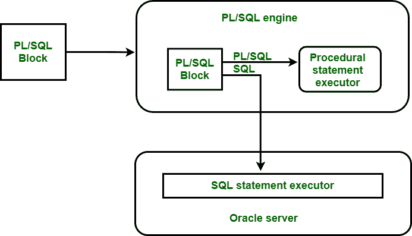

# PL/SQL 架构

> 原文:[https://www.geeksforgeeks.org/pl-sql-architecture/](https://www.geeksforgeeks.org/pl-sql-architecture/)

**先决条件:** [PL/SQL 简介](https://www.geeksforgeeks.org/plsql-introduction/)

**PL/SQL 是什么意思？**

在 Oracle 中， [PL/SQL](https://www.geeksforgeeks.org/functions-in-plsql/) (过程语言/SQL)是非过程 SQL 的过程语言扩展。它结合了 SQL 的数据操作能力和标准编程语言的过程能力。PL/SQL 是由甲骨文公司在 90 年代早期开发的，旨在增强 SQL 的功能。它与 SQL* PLUS 等 Oracle 的应用开发产品集成良好。PL/SQL 是 SQL 的超集。它提供了 SQL 数据操作命令和 SQL 数据类型。在 PL/SQL 中，没有任何名称的块称为匿名块。PL/ SQL 块由各种函数、库、过程、触发器、包等组成。

编写 PL/SQL 程序时，应记住以下几点–

*   在 PL/SQL 中，分号(；)放在 SQL 语句或 PL/SQL 控制语句的末尾。
*   Section 关键字 **DECLARE** 、 **BEGIN** 和 **EXECUTION** 后面没有分号。
*   **END** 关键字和所有其他 PL/SQL 语句都需要分号来终止语句。

**PL/SQL 的特点:**

PL/SQL 的各种特性如下

*   PL/SQL 运行在各种操作系统上，如 windows、Linux 等。
*   PL/SQL 具有错误检查功能，当程序中出现错误时会显示用户友好的消息。

**PL/SQL 架构是什么意思？**

PL/SQL 运行时系统是一种技术，不是独立的产品。这项技术实际上就像一个展示 PL/SQL 块的引擎，像函数和过程这样的子程序。该引擎可以安装在 Oracle 服务器或应用程序开发工具中，如 Oracle 表单生成器、Oracle 报表生成器等。

PL/SQL 架构

**PL/SQL 可以驻留在两个环境中–**

1.  甲骨文服务器
2.  甲骨文工具

这两种环境是相互独立的。在任一环境中，PL/SQL 引擎都接受任何有效的 PL/SQL 块作为输入。PL/SQL 引擎执行语句的过程部分，并在 Oracle 服务器中发送 SQL 语句执行器。将数据块从应用程序发送到 Oracle 服务器需要一次传输，从而提高性能，尤其是在客户机-服务器网络中。PL/SQL 代码也可以作为子程序存储在 Oracle 服务器中，连接到数据库的任何数量的应用程序都可以引用这些子程序。

**PL/SQL 的优势:**

*   PL/SQL 提供了更好的性能。
*   PL/SQL 的生产率很高。
*   它支持面向对象编程概念。
*   它具有可扩展性和可管理性。
*   PL/SQL 支持各种网络应用开发工具。

**PL/SQL 的缺点:**

*   PL/SQL 需要很高的内存。
*   存储过程中缺少功能调试。