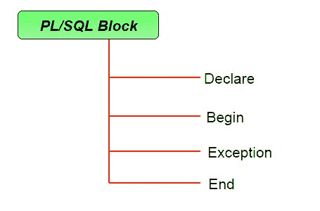

# PL/SQL 简介

> 原文:[https://www.geeksforgeeks.org/plsql-introduction/](https://www.geeksforgeeks.org/plsql-introduction/)

PL/SQL 是一种块结构语言，它使开发人员能够将 SQL 的力量与过程语句结合起来。一个块的所有语句都同时传递给 oracle 引擎，这提高了处理速度并减少了流量。

**SQL 的缺点:**

*   SQL 没有为程序员提供条件检查、循环和分支的技术。
*   SQL 语句一次传递给一个 Oracle 引擎，这会增加流量并降低速度。
*   在数据操作过程中，SQL 没有错误检查功能。

**PL/SQL 的特点:**

1.  PL/SQL 基本上是一种过程语言，它提供了决策、迭代的功能以及过程编程语言的更多特性。
2.  PL/SQL 可以使用一个命令在一个块中执行多个查询。
3.  人们可以创建一个 PL/SQL 单元，如过程、函数、包、触发器和类型，它们存储在数据库中供应用程序重用。
4.  PL/SQL 提供了一个功能来处理发生在 PL/SQL 块中的异常，称为异常处理块。
5.  用 PL/SQL 编写的应用程序可以移植到运行 Oracle 的计算机硬件或操作系统中。
6.  提供广泛的错误检查。

**SQL 和 PL/SQL 的区别:**

| SQL | pl/SQL |
| SQL 是用于执行 DML 和 DDL 操作的单个查询。 | PL/SQL 是用于编写整个程序块/过程/函数等的代码块。 |
| 它是声明性的，定义了需要做什么，而不是事情需要如何做。 | PL/SQL 是程序性的，它定义了需要如何完成的事情。 |
| 作为单个语句执行。 | 整体执行。 |
| 主要用于操纵数据。 | 主要用于创建应用程序。 |
| 其中不能包含 PL/SQL 代码。 | 它是 SQL 的扩展，所以它里面可以包含 SQL。 |

**PL/SQL 块的结构:**

PL/SQL 通过添加过程语言中的构造来扩展 SQL，从而产生了比 SQL 更强大的结构语言。PL/SQL 中的基本单位是块。所有的 PL/SQL 程序都是由块组成的，这些块可以相互嵌套。



通常，每个块在程序中执行一个逻辑动作。块具有以下结构:

```
DECLARE
    declaration statements;

BEGIN
    executable statements

EXCEPTIONS
    exception handling statements

END;

```

*   Declare 部分以 **DECLARE** 关键字开始，在该关键字中可以声明变量、常数、记录作为游标，临时存储数据。它基本上由 PL/SQL 标识符的定义组成。这部分代码是可选的。
*   执行部分以 **BEGIN** 开始，以 **END** 关键字结束。这是一个强制性的部分，这里的程序逻辑是用来执行任何任务的，比如循环和条件语句。它支持所有 [DML](https://en.wikipedia.org/wiki/Data_manipulation_language) 命令、 [DDL](https://en.wikipedia.org/wiki/Data_definition_language) 命令以及 SQL*PLUS 内置功能。
*   异常部分以**异常**关键字开始。此部分是可选的，它包含在运行时出错时执行的语句。任何异常都可以在本节中处理。

### PL/SQL 标识符

有几个 PL/SQL 标识符，如变量、常数、过程、游标、触发器等。

1.  <u>**变量**</u> :
    像其他几种编程语言一样，PL/SQL 中的变量在使用之前必须声明。它们也应该有有效的名称和数据类型。

    变量声明的语法:

    ```
    variable_name datatype [NOT NULL := value ];

    ```

    演示如何在 PL/SQL 中声明变量的示例:

    ```
    SQL> SET SERVEROUTPUT ON;

    SQL> DECLARE
        var1 INTEGER;
        var2 REAL;
        var3 varchar2(20) ;

    BEGIN
        null;
    END;
    /
    ```

    输出:

    ```
    PL/SQL procedure successfully completed.

    ```

    ***解说:***

    *   **<u>设置服务器输出开启</u>** :用于显示 dbms_output 使用的缓冲区。
    *   **<u>var1 INTEGER</u> :** 是变量的声明，命名为 ***var1*** ，为整数类型。还有许多其他数据类型可以使用，如浮点、int、实数、smallint、long 等。它还支持在 SQL 中使用的变量，如 NUMBER(prec，scale)，varchar，varchar2 等。
    *   **<u>PL/SQL 程序成功完成。</u> :** 代码编译执行成功时显示。
    *   <u>**END 后斜线(/)；**</u> :斜线(/)告诉 SQL*Plus 执行该块。

    **1.1)初始化变量:**
    变量也可以像其他编程语言一样初始化。让我们看一个同样的例子:

    ```
    SQL> SET SERVEROUTPUT ON;
    SQL> DECLARE
         var1 INTEGER := 2 ;
         var3 varchar2(20) := 'I Love GeeksForGeeks' ;

      BEGIN
         null;

      END;
      /
    ```

    输出:

    ```
    PL/SQL procedure successfully completed.

    ```

    ***解说:***

    *   <u>**赋值运算符(:=)**</u> :用于给变量赋值。
2.  <u>**显示输出**</u> :
    输出通过使用 DBMS_OUTPUT 来显示，DBMS _ Output 是一个内置的包，使用户能够显示输出、调试信息以及发送来自 PL/SQL 块、子程序、包和触发器的消息。

    让我们看一个例子，看看如何使用 PL/SQL 显示消息:

    ```
    SQL> SET SERVEROUTPUT ON;
    SQL> DECLARE
         var varchar2(40) := 'I love GeeksForGeeks' ;

      BEGIN
         dbms_output.put_line(var);

      END;
      /
    ```

    输出:

    ```
    I love GeeksForGeeks

    PL/SQL procedure successfully completed.

    ```

    ***解说:***

    *   *dbms_output.put_line* :此命令用于将 PL/SQL 输出导向屏幕。
3.  <u>**使用注释**</u> :
    像许多其他编程语言一样，在 PL/SQL 中，注释也可以放在代码中，但对代码没有影响。在 PL/SQL 中创建注释有两种语法:

    *   **<u>单行注释:</u>** 要创建单行注释，请使用符号<font color="red">––</font>。
    *   **<u>多行注释:</u>** 要创建跨越多行的注释，请使用符号 <font color="red">/*</font> 和 <font color="red">*/</font> 。

    演示如何在 PL/SQL 中创建注释的示例:

    ```
    SQL> SET SERVEROUTPUT ON;
    SQL> DECLARE

         -- I am a comment, so i will be ignored.
         var varchar2(40) := 'I love GeeksForGeeks' ; 

      BEGIN
         dbms_output.put_line(var);

      END;
      /
    ```

    输出:

    ```
    I love GeeksForGeeks

    PL/SQL procedure successfully completed.

    ```

4.  <u>**从用户处获取输入**</u> :
    就像在其他编程语言中一样，在 PL/SQL 中，我们也可以从用户处获取输入，并将其存储在变量中。让我们看一个例子来展示如何在 PL/SQL 中从用户那里获取输入:

    ```
    SQL> SET SERVEROUTPUT ON;

    SQL> DECLARE

          -- taking input for variable a
          a number := &a;       

          -- taking input for variable b
          b varchar2(30) := &b;     

      BEGIN
          null;

      END;
      /
    ```

    输出:

    ```
    Enter value for a: 24
    old   2: a number := &a;
    new   2: a number := 24;
    Enter value for b: 'GeeksForGeeks'
    old   3: b varchar2(30) := &b;
    new   3: b varchar2(30) := 'GeeksForGeeks';

    PL/SQL procedure successfully completed.

    ```

5.  **(* *)*****让我们看一个 PL/SQL 上的例子，在一个代码块中演示所有上述概念。***

    ```
    --PL/SQL code to print sum of two numbers taken from the user.
    SQL> SET SERVEROUTPUT ON;

    SQL> DECLARE

         -- taking input for variable a
         a integer := &a ; 

         -- taking input for variable b
         b integer := &b ; 
         c integer ;

      BEGIN
         c := a + b ;
         dbms_output.put_line('Sum of '||a||' and '||b||' is = '||c);

      END;
      /
    ```

    ```
    Enter value for a: 2
    Enter value for b: 3

    Sum of 2 and 3 is = 5

    PL/SQL procedure successfully completed.

    ```

**PL/SQL 执行环境:**

PL/SQL 引擎驻留在 Oracle 引擎中。Oracle 引擎不仅可以处理单个 SQL 语句，还可以处理多个语句的块。如果将任意数量的 SQL 语句捆绑在一个 PL/SQL 块中，只需要调用一次 Oracle 引擎就可以执行这些语句。