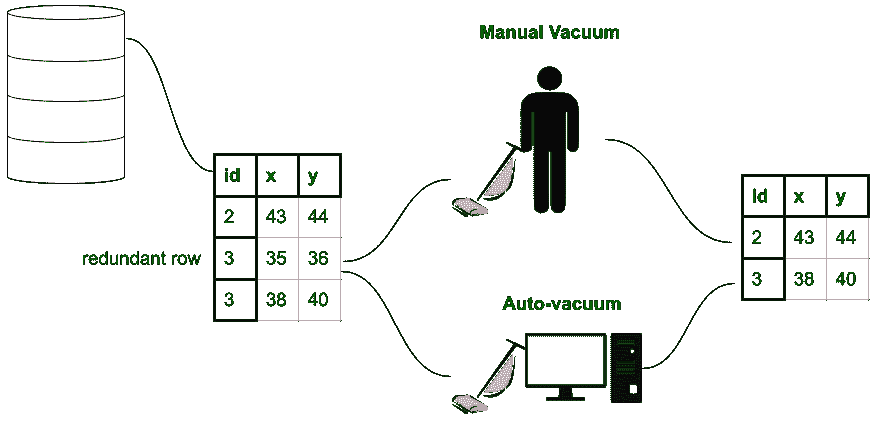
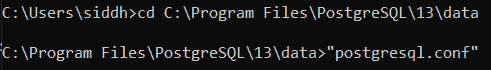
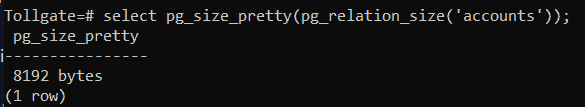
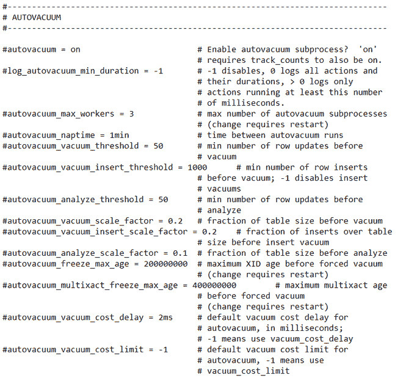
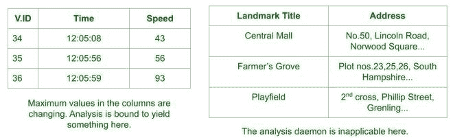

# PostgreSQL–自动真空

> 原文:[https://www.geeksforgeeks.org/postgresql-autovacuum/](https://www.geeksforgeeks.org/postgresql-autovacuum/)

在 2000 年代的某个时候，PostgreSQL 的开发人员在他们的关系数据库管理系统的设计中发现了一个关于存储空间和事务速度的主要漏洞。事实证明，更新查询正在成为一个昂贵的例程。UPDATE 正在复制旧行并在中重写新数据，这意味着数据库或表的大小不受任何限制！此外，删除一行只会将该行标记为已删除，而实际数据保持不变—数据取证在以后得到支持。

这听起来可能很熟悉，因为这是当今文件系统和数据恢复软件所依赖的，即数据在被删除后，会以原始形式完整地保留在磁盘上，但会隐藏在界面上。然而，保留旧数据对于旧事务也很重要。所以从技术上讲，在事务完整性上妥协是不对的。这是足够的刺激，Postgres 团队很快引入了“真空”功能，实际上是真空删除行。然而，这是一个手动过程，由于函数中涉及的几个参数，这是不可取的。因此，自动真空技术得以发展。



### 什么是自动真空？

Autovacuum 是 PostgreSQL 提供给用户的后台实用程序进程**守护程序**或**后台实用程序进程**，用于定期清理数据库和服务器中的冗余数据。它不需要用户手动释放真空，而是在 **postgresql.conf** 文件中定义。为了访问该文件，只需将自己指向终端上的以下目录，然后在合适的编辑器中打开该文件。

```
>> cd C:\Program Files\PostgreSQL\13\data
>> "postgresql.conf"
```

在命令提示符下实现时:



autovacuum 实用程序将删除的数据块(标记为已删除的数据块)重新分配给新的事务，方法是首先删除失效/过时的元组，然后通知排队的事务表中可以放置任何更新或插入的位置。这与旧的和以前的过程形成鲜明对比，在旧的和以前的过程中，事务会盲目地插入具有相同标识元素和更新属性的新数据行。自动吸尘的好处显而易见:

*   储物空间得到充分利用。
*   提高了自由空间地图的可见性。有限状态机是多个二叉树的映射，表示关系/表中的可用空间。
*   与手动吸尘器不同，它们不需要大量的时间和资源。
*   它们不会在表上放置排他锁(完全真空会在想要访问表的事务上放置锁)。
*   防止桌子膨胀。膨胀是一个过程，通过这个过程，表的大小达到了巨大的值，并带有不必要的和无效的数据。

监视事务前后数据大小的一种方法是，在连接到特定数据库后，在 Shell 中执行以下代码行:

```
postgresql=# SELECT pg_size_pretty(pg_relation_size('table_name');
```

考虑一张存储收费站客户账户的表格:


该表的大小由下式给出:



如果事务接踵而至，这个查询可能会被再次处理，以演示表大小的变化。大小的不成比例的变化意味着自动清空失败(如果大小没有变化，即使事务不使用过时的行状态)。

### 配置自动真空

由于 autovacuum 是一个后台实用程序，因此默认情况下是打开的。但是，请记住，它是很久以前开发的，因此参数设置是保守的，即参数是根据硬件的可用性和软件版本设置的。现代应用要求检查这些参数并按比例调整它们。我们将快速查看节点参数:



postgresql.conf 文件中的 auto 真空部分。

*   **自动真空:**默认设置为“开”，因此不会在外壳或终端中单独声明。
*   **自动真空 _ napt time:**此参数设置为 1 分钟或 60 秒，表示连续自动真空呼叫或唤醒之间的持续时间。
*   **autovacuum_max_workers:** 这表示每次在“naptime”后唤醒该功能时，被抽真空的进程数。
*   **autovacuum _ vacuum _ scale _ factor:**通常设置为 0.2，这意味着 auto vacuum 只有在关系/表的 20%被更改/更新时才会进行清理。
*   **自动抽真空 _ 真空 _ 阈值:**作为预防措施，此参数确保自动抽真空仅在对表进行设定数量的更改(默认为 50)时发生。
*   **auto vacuum _ analyze _ scale _ factor:**这是在事务期间创建表的常规统计数据的分析工具。如果设置为 0.1，只有当 10%的表观察到更新(删除、更新、插入、更改等)时，才会进行分析。).
*   **auto vacuum _ analyze _ threshold:**类似于 autovacuum_vacuum_threshold，不过这里执行的动作是分析。仅当交易至少进行了 50 次更改时，才会执行分析。

这些参数根据事务影响数据库的频率以及数据库的规模或预期增长来修改。因此，如果事务似乎以更快的速度发生，那么如果事务不需要更早的数据，那么 **autovacuum_max_workers** 可能会增加，或者**auto vacuum _ vacuum _ scale _ factor**可能会减少。此外，开发人员可以调整分析参数以制定更好的查询技术。

这让我们质疑经常分析表格背后的想法。

### 哪些表格需要分析？

分析可以手动进行，也可以简单地保持自动真空开启。分析提供了关于数据库的特定统计信息，这有助于开发人员提高效率。本质上，分析提供了以下信息:

1.  关系/表的特定列中最常见值的列表。在某些情况下，这不是必需的，因为该列可能是唯一的标识符-唯一的标识符不能在表中重复。
2.  数据分布的直方图。这可能包括各列的数据大小，或者哪些列受到事务的最高和最低更新。

现在回答相关问题——哪些表格实际上需要分析。借助自动真空，大多数桌子都要进行分析。然而，在发出显式分析函数的可能情况下，这是由于以下原因:

*   当更新活动似乎不直接影响某些列时使用。可能会发生这样的情况:需要某些列的统计数据，而这些数据不会被正在进行的事务所改变。因此，自动分析可能微不足道。
*   分析对于在更新发生率相关的表上保持标签可能是重要的。
*   了解数据的哪些方面最不容易发生变化以建立模式。

另一个可能提出的问题是——如何列出必须单独发布分析守护程序的表？

有一个简单的经验法则:只要列的最小值或最大值易于改变，对表的分析就有意义。例如，显示由速度枪测量的车辆速度的表格必然会改变其最大值。因此，分析会得出一些结论。

