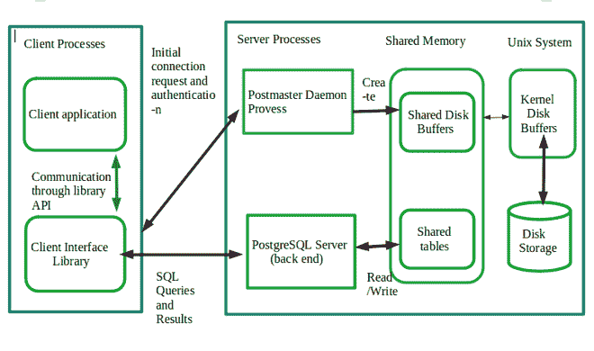

# PostgreSQL–系统架构

> 原文:[https://www . geesforgeks . org/PostgreSQL-system-architecture/](https://www.geeksforgeeks.org/postgresql-system-architecture/)

[PostgreSQL](https://www.geeksforgeeks.org/what-is-postgresql-introduction/) 是一个开源的数据库管理系统，具有对象关系的性质。PostgreSQL 是最早的系统之一，即 POSTGRES 系统的继承者。它是最广泛使用的开源数据库管理系统之一。

PostgreSQL 有一个客户机-服务器架构模型。用最简单的术语来说，PostgreSQL 服务有两个过程:

*   **服务器端进程:**这是管理连接、操作和静态&动态资产的“Postgres”应用程序。
*   **客户端进程(前端应用):**这些是用户用来与数据库交互的应用。它通常有一个简单的用户界面，通常通过应用编程接口用于用户和数据库之间的通信。

## **客户端流程:**

当用户在 PostgreSQL 上运行查询时，客户端应用程序可以连接到 PostgreSQL 服务器(Postmaster Daemon Process)，并通过 PostgreSQL 支持的众多**数据库客户端应用程序**程序接口之一提交查询，如 JDBC、Perl DBD、ODBC 等。这有助于提供客户端库。在客户端进程中，客户端应用程序和客户端应用程序库之间的通信是在库应用编程接口的帮助下进行的，如下图所示:

系统架构

### **1。邮局主管守护进程:**

PostgreSQL 的系统架构基于进程传输模型(客户机/服务器模型)。一个正在运行的 PostgreSQL 站点由**邮政局长**管理，这是一个中央协调过程。它也被称为服务器进程。

邮局主管后台进程负责:

*   正在初始化服务器
*   关闭服务器
*   处理来自新客户端的连接请求。
*   执行恢复。
*   运行后台进程。

**共享内存:**共享内存是多个程序同时访问的内存，目的是以较少的冗余提供快速高效的结果。这是为数据库缓存和事务日志缓存保留的内存。在 PostgreSQL 中，使用了共享磁盘缓冲区和共享表，其工作原理解释如下:

**共享磁盘缓冲区:**共享磁盘缓冲区的目的是最小化磁盘输入/输出。如果不使用，则磁盘输入/输出需要更多时间，这会导致冗余和系统效率低下。使用共享缓冲区的优点是:

*   减少时间。
*   可以轻松访问大量数据。
*   当多个用户同时使用时，尽量减少加热。

**共享表:**这种方法包括使用同一组表来托管多个客户端数据。使用这种方法的主要优点是:

*   最低的硬件成本
*   最低的备份成本
*   它允许在单个数据库中处理大数据。

**UNIX 系统:**在 UNIX 系统内核中，磁盘缓冲区维护一个内存缓冲区，并为磁盘存储中的数据提供物理存储。此外，PostgreSQL 的命令会验证所写的语法是否正确，并提供一条错误消息，说明命令中缺少什么等原因。

### **2。后端流程:**

邮局主管负责处理初始客户端连接。为此，它会作为已知端口不断监听新的连接。在执行初始化过程(如用户身份验证)后，邮局主管将启动一个新的后端服务器进程来处理新的客户端。客户端只与后端服务器进程交互，如提交查询和接收查询结果。这将表明 PostgreSQL 实际上使用了每事务处理模型。

后端服务器负责通过执行特定的操作来执行客户端提交的查询。每个后端服务器一次只能处理一个查询。一次有多个客户端连接到系统，因此多个后端服务器同时执行查询。后端服务器从放置在共享内存中的主内存缓冲池中访问数据。

之后，后端进程将获得的结果提供给客户端进程。

<figure class="table">

| 提前写日志写入程序 | 该过程写入并刷新沃尔缓冲区上的沃尔数据 |
| 日志收集器 | 这个过程也被称为记录器。它会将错误消息写入日志文件。 |
| 自动真空发射器 | 当自动真空被启用时，这个过程由自动真空守护程序负责在膨胀的桌子上执行真空操作。这个过程依赖于统计收集器过程来进行完美的表分析。 |
| 档案管理员 | 启用精英会后，流程有责任将 WAL 日志文件复制到指定的目录。 |
| 统计数据收集器 | 在这个统计中，像 *pg_stat_activity* 和 *pg_stat_all_tables* 这样的信息被收集 |
| 检查指针 | 当检查点出现时，脏缓冲区被写入文件。 |
| 作者 | 它会定期将脏缓冲区写入文件。 |

### **3。共享池:**

共享池是在启动期间创建的内存堆中的一个内存区域。共享池是 SGA(系统全球区域)的一个组成部分。如果共享池在内存中不可用或未被使用，则会导致库高速缓存重载、行高速缓存重载。共享池是在启动期间创建的内存堆中的一个内存区域。共享池是 SGA(系统全球区域)的一个组成部分。如果共享池在内存中不可用或未被使用，则会导致库高速缓存重载、行高速缓存重载。

【PostgreSQL 为什么不使用共享池？

PostgreSQL 不提供共享池尽管大多数数据库系统都像 Oracle 一样，共享池是其结构的重要组成部分。它没有，因为与共享池相比，PostgreSQL 将提供在进程级别共享 SQL 信息的功能。简而言之，如果用户在一个进程中多次执行同一个 SQL 查询，那么它只会**硬解析**一次，这比其他数据库系统更有优势，因为在另一个使用共享池的数据库系统中，**硬解析**发生在从共享池加载的单个 SQL 语句上。如果用户多次同时执行单个 SQL 查询，那么它将导致更大的负载。

### **4。PostgreSQL 中的 OID:**

OID 代表对象标识符类型。PostgreSQL 将 OID 用作各种系统表的主键。它被实现为一个无符号的四字节整数。我们还可以选择在用户定义的表中使用 OID 作为“WITH OIDS”，但不建议使用，因为它不够大，无法在大型用户定义的表中提供唯一性。OID 通常最适合系统表。它基本上为包含在系统列中的每一行给出一个内置 id。

在 PostgreSQL 12 版本中，用户表的 OID 特性被间接移除，即我们可以显式使用 OID。

### **PostgreSQL 的优点:**

*   PostgreSQL 是一个高度容忍风险的数据库，并且需要低维护成本。
*   它使用 LAMP (Linux、Apache、MySQL、PHP)栈来执行动态网站和网络应用。

### **PostgreSQL 的缺点:**

*   与商业数据库相比，它有点慢。
*   与 MYSQL 相比，它不支持各种开源应用程序。

</figure>