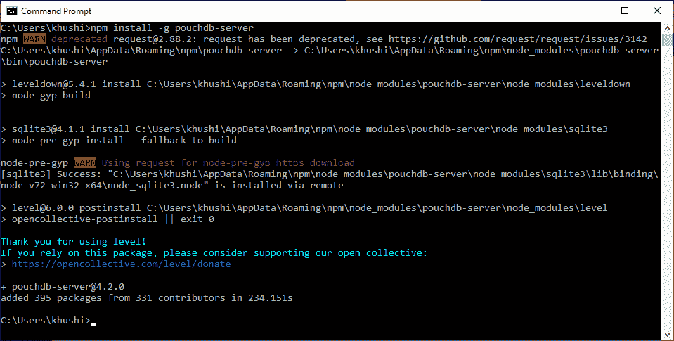
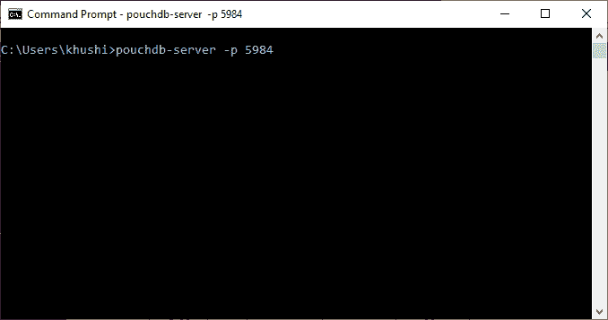
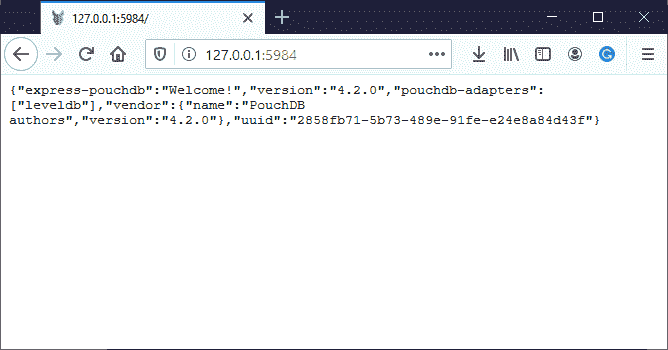

# PouchDB

> 原文:[https://www.geeksforgeeks.org/pouchdb/](https://www.geeksforgeeks.org/pouchdb/)

PouchDB 是一个**开源**[NoSQL](https://www.geeksforgeeks.org/introduction-to-nosql/)在线数据库。它是用 javascript 编写的，基本上是 CouchDB 的 JavaScript 实现。

它是仿照 NoSQL 的一个为 npm 提供动力的数据库 CouchDB 建立的。我们还可以使用 PouchDB 创建应用程序，它可以离线和在线工作，因此可以在本地保存数据。PouchDB 内部使用 **IndexedDB** 和 **WebSQL** 进行数据存储。

【PouchDB 如何离线工作？
PouchDB 离线和在线工作效率相同。它通过将数据存储在本地并在联机时将其同步到服务器和 CouchDB 来脱机工作。它使用浏览器中的 IndexedDB 和 WebSQL 在本地存储数据。

您还可以连续使用 PouchDB 与远程和本地数据库通信，而不会注意到任何差异。

**PouchDB 的特征:**

1.  **开源–**
    它可以在 GitHub 和其他开源应用程序上获得。

2.  **跨浏览器–**
    我们可以在各种浏览器上运行 PouchDB，因为它提供的 API 在每个环境中都是一样的。

3.  **易学易懂–**
    如果你有一定的编程语言知识，PouchDB 非常易学易懂。

4.  **轻量级–**
    我们可以很容易地使用脚本标签包含它，因为它有一个轻量级的 API。

**PouchDB 的优势:**T2】

*   不需要通过网络执行查询，因为 PouchDB 位于浏览器内部，因此速度非常快。

*   您可以在线和离线运行应用程序，因为您可以将数据与任何受支持的服务器同步。

**<u>安装 PouchDB</u>:**T4】

**1。**下载安装 Node.js 和 npm ( [Windows](https://www.geeksforgeeks.org/installation-of-node-js-on-windows/) 、 [Linux](https://www.geeksforgeeks.org/installation-of-node-js-on-linux/) )。

**2。安装 PouchDB–**在命令提示符下执行以下代码来安装 PouchDB。

```
npm install pouchdb 

```


**3。安装 PouchDB 服务器–**在命令提示符下执行以下代码来安装 PouchDB 服务器。

```
npm install -g pouchdb-server 

```



**4。设置本地端口号–**现在设置一个运行 PouchDB 的端口:

```
pouchdb-server -p 5984 
```



之后，让指针一直闪烁。

**5。打开 PouchDB–**现在访问以下地址。

```
http://127.0.0.1:5984/ 
```



现在，您的 PouchDB 安装成功了。