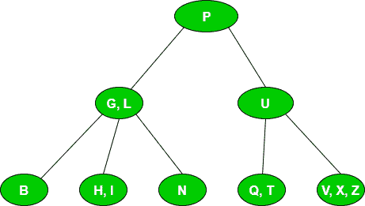
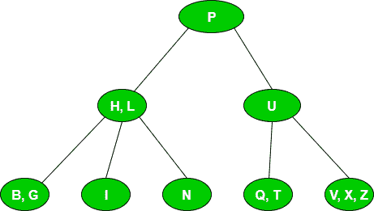
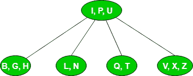
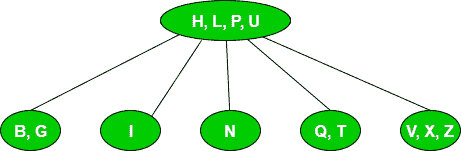
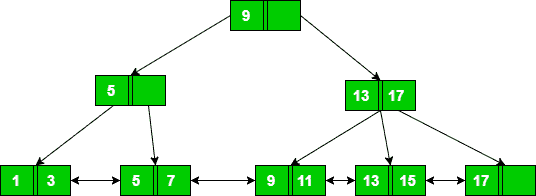
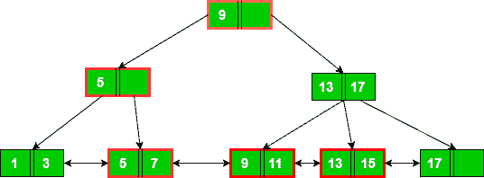
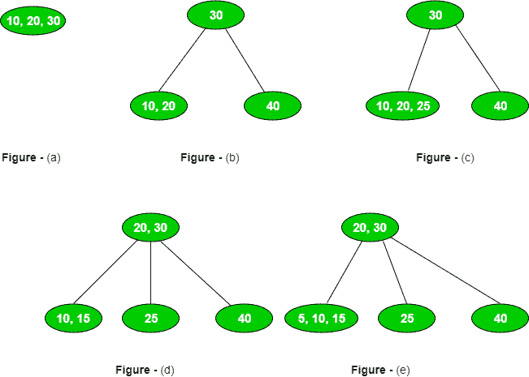
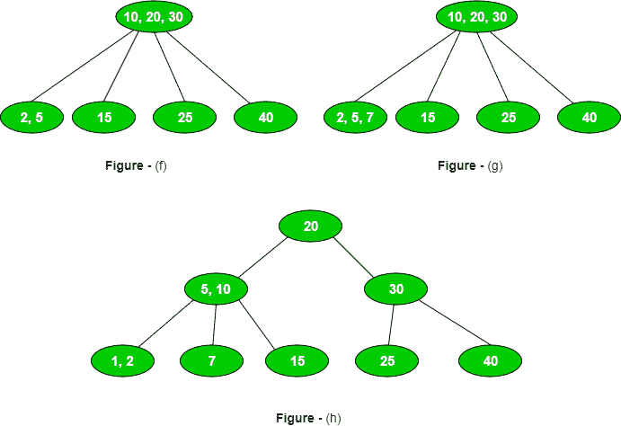

# B and B+树木练习题

> 原文:[https://www.geeksforgeeks.org/practice-questions-b-b-trees/](https://www.geeksforgeeks.org/practice-questions-b-b-trees/)

在本文中，我们将讨论基于 B and B+树的不同类型的问题。在理解这篇文章之前，你应该先了解一下 B and B+树木的基础知识(见:[简介](https://www.geeksforgeeks.org/b-tree-set-1-introduction-2/)、[插入](https://www.geeksforgeeks.org/b-tree-set-1-insert-2/)、[删除](https://www.geeksforgeeks.org/b-tree-set-3delete/))。

这些是在基于 B and B+树的 GATE 中提出的问题类型。

**1 型。基于 B and B+树–**
中的键的顺序和数量，以下是与键的顺序和数量相关的几个要点:

*   具有 p 阶的 B/B+树有最大 p 个指针，因此有最大 p 个子树。
*   具有 p 阶的 B/B+树具有最小上限(p/2)指针，因此具有最小上限(p/2)子树。
*   顺序为 p 的 B/B+树具有最大值(p–1)和最小值上限(p/2–1)键。

**Que–1。**考虑一个 B+-树，其中一个节点中的最大键数为 5。任何非根节点中的最小键数是多少？(GATE CS 2010)
(A)1
(B)2
(C)3
(D)4

**解:**假设 B+树的顺序为 p，最大键数为(p–1)。如给定的那样，
p–1 = 5 =>p = 6
因此，最小键数:
ceil(p/2)–1 = 2

**2 型。基于在 B/B+树中插入一个键–**
给定 B/B+树的顺序和要插入的键，可以要求它查找结果 B/B+树或 B/B+树的高度。

**Que–2。**考虑以下 2-3-4 树(即最小二度的 B 树)，其中每个数据项都是一个字母。通常字母的字母顺序用于构建树。
T3】

在上面的树中插入 G 的结果是什么？
(A)

(B)

(C)

(D)无

**解:**由于给定 B 树的最小度为 2，最大度或阶将为 2*2 = 4。因此，它最多有 4 个指针或 3 个键。
我们将从根到叶节点遍历，在那里插入 G。由于 G 小于 L，它将被插入到具有 BHI 元素的叶节点中。插入 G 后，排序后的叶节点会是 BGHI，导致溢出。它将被分成两部分 BG 和 I，中间元素 H 将被发送到其父节点，如下所示:

现在，键为 H、L、P、U 的根节点溢出，导致根节点分裂为 HL 和 U 两部分，中间元素 P 将是匹配选项 b 的根节点。
注意:

*   g 的插入出现了两次分裂
*   在插入 G 之前，B 树的高度为 1(从根节点到叶节点的路径)，插入 G 之后，B 树的高度达到 2。

**3 型。基于在 B/B+树中搜索关键字–**
以下是与在 B/B+树中搜索相关的要点:

*   为了在 B 树中搜索关键字，我们从根节点开始遍历，直到找到关键字或到达叶节点。
*   为了在 B+树中搜索关键字，我们从根节点开始遍历，直到到达叶节点，因为每个关键字都存在于叶节点中。此外，叶节点相互连接，这有助于更快地访问范围查询的数据。

**Que–3。**参考下面所示的顺序 1 的 B+树索引，为了满足以下查询:“获取搜索关键字大于或等于 7 且小于 15 的所有记录”必须提取的最小节点数(包括根节点)是 ____。(GATE-CS-2015)

(甲)4
(乙)5
(丙)6
(丁)7

**解:**首先我们搜索等于 7 的 key。为了找到 7，我们将从根节点开始，用键 5 移动到节点，然后用键 5 和 7 移动到叶节点。所以对于搜索 7，我们需要访问 3 个节点。

一旦搜索到 7，我们就可以转到包含键 9 和 11 的下一个叶节点。由此，我们可以使用键 13 和 15 进入叶节点。由于我们想要少于 15 把的钥匙，我们可以就此打住。因此，访问的节点总数= 3(用于搜索 7) + 2(用于查找小于 15 的关键字)= 5。

注意:如果我们使用 B 树，那么我们需要单独搜索 7、8、9、10、11，因为哪个节点的访问会更高。因此，B+ tee 是范围查询的首选。

**4 型。B/B+树节点拆分计数–**

**Que–4。**一个 4 阶的 B 树由 10 个连续的插入从头开始构建。可能发生的节点拆分操作的最大数量是多少？(GATE CS 2008)
(一)3
(二)4
(三)5
(四)6

**解决方法:**一棵 B 级的树最多可以有 3 个键。

前 3 次插入不会有任何分裂，如图(a)所示。
插入第 4 个元素时，会出现 1 个拆分，如图(b)所示。
在插入第 5 个元素时，将不会有分裂，但是我们将插入具有最大元素的叶节点，以在进一步的插入中产生更多的分裂，如图(c)所示。
在插入第 6 个元素时，将出现 1 个分割，如图(d)所示。
在插入第 7 个元素时，将不会有分裂，但是我们将插入具有最大元素的叶节点，以在进一步的插入中产生更多的分裂，如图(e)所示。
在插入第 8 个元素时，将出现 1 个分割，如图(f)所示。
在插入第 9 个元素时，将不会有分裂，但是我们将插入具有最大元素的叶节点，以在进一步的插入中产生更多的分裂，如图(g)所示。
插入第 10 个元素时，会出现 2 个拆分，如图(h)所示。
拆分总数= 5。