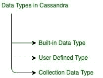

# Apache Cassandra 中的预定义数据类型

> 原文:[https://www . geesforgeks . org/预定义-数据类型-in-apache-cassandra/](https://www.geeksforgeeks.org/pre-defined-data-type-in-apache-cassandra/)

先决条件–[Cassandra 中的用户定义类型(UDT)](https://www.geeksforgeeks.org/overview-of-user-defined-type-udt-in-cassandra/)
在本文中，我们将讨论 Cassandra 中不同类型的数据类型，这些数据类型在 Cassandra 中用于各种目的，例如在数据建模、创建表等。

基本上，Cassandra 中有 3 种数据类型。让我们看看。



<center>**Figure –** Data Types in Cassandra</center>

现在，我们将讨论 Cassandra 中的内置数据类型。

**内置数据类型:**
在 Cassandra 中是预定义的数据类型。我们可以直接使用，只需根据需要给出数据类型名称。卡珊德拉有很多内置的数据类型。让我们一个一个来讨论。

*   **Boolean:**
    It is a data type that represents two values, true or false. So, we can use such type of data type where we need just two values.

    ```
    true or false 
    ```

    **语法:**

    ```
    CREATE TABLE table_name(
     field_name1 Boolean,
     ...
     ); 
    ```

*   **blob:**
    It is used for binary large objects such that audio, video or other multimedia and sometimes binary executable code stored as a blob.

    ```
    binary large objects 
    ```

    **语法:**

    ```
    CREATE TABLE table_name(
     field_name1 blob,
     ...
     ); 
    ```

*   **ASCII:**
    It is used for strings type such that words and sentences. It represents the ASCII value of the character. For example, for ‘A’ ASCII value is 65\. so, it will store its ASCII value.

    ```
    65 for A, 97 for a, etc. 
    ```

    **语法:**

    ```
    CREATE TABLE table_name(
     field_name1 ascii,
     ...
     ); 
    ```

*   **bigint:**
    用于 64 位有符号长整数。基本上，它用于表示从-(2^32)到+(2^32)的大范围整数。

```
only for integers -(2^32) to +(2^32) 
```

**语法:**

```
CREATE TABLE table_name(
 field_name1 bigint,
 ...
 ); 
```

*   **counter:**
    It is used for integers and represents a counter column. These columns part of the row which represents column family which basically contains numeric values, containing the number of columns.

    ```
    1, 2, 3... (integer)  
    ```

    **语法:**

    ```
    CREATE TABLE table_name(
     field_name1 counter,
     ...
     ); 
    ```

    *   **Decimal:**
    It is used to save integer and float values. In Decimal data type is important to note when we tried to save decimal value such as .907 ( dot 907), it will give an error “no viable alternative at input ‘.’ (…DecimalValue) Values ( 1, [.]…)”. If we need to save decimal like that then start with zero e.g 0.907.

    ```
    10.45, 1, -1, 0.32...  
    ```

    **语法:**

    ```
    CREATE TABLE table_name(
     field_name1 DECIMAL,
     ...
     ); 
    ```

    *   **Double:**
    It is used for integers which represents a 64 bit floating point. It include a number with a decimal points. for example: 5.838, 10.45 etc.

    ```
    10.4556, 3.566, 0.5875 etc.  
    ```

    **语法:**

    ```
    CREATE TABLE table_name(
     field_name1 double,
     ...
     ); 
    ```

    *   **float:**
    It is used for numbers which represents a 32-bit floating point. It represents a number values with a decimal point. for example : 6.254, 5.23 etc.

    ```
    5.423, 2.31, 3.12...[32 bit floating point]  
    ```

    **语法:**

    ```
    CREATE TABLE table_name(
     field_name1 float,
     ...
     ); 
    ```

    *   **inet:**
    用于表示包含数字和字符的 IP 地址。基本上它代表一个 IP 地址，IPv4 或 IPv6。例如，对于 64.233.160.0 这种类型的地址，我们可以使用 inet 数据类型。

```
64.233.160.0 ...[IP address, IPv4 or IPv6]  
```

**语法:**

```
CREATE TABLE table_name(
 field_name1 inet,
 ...
 ); 
```

*   **int:**
    It is used to Represents 32-bit signed integers. It represents both positive and negative numbers. The range of int lies from -(2^16) to +(2^16) [only integers].

    ```
    24, 907, -9,  ... 
    ```

    [代表从-(2^16 到+(2^16 的 32 位有符号整数]]

    **语法:**

    ```
    CREATE TABLE table_name(
     field_name1 int,
     ...
     ); 
    ```

    *   **text:**
    It is used to store string type which Represents UTF8 encoded string. It encodes all valid points in Uni-code by using 1 bit to four 8 bit types in Cassandra.

    ```
    Ashish, rana, ...[Represents UTF8 encoded string]   
    ```

    **语法:**

    ```
    CREATE TABLE table_name(
     field_name1 text,
     ...
     ); 
    ```

    *   **varchar:**
    It is used to store arbitrary string which represents UTF8 encoded string.

    ```
    Ashish, rana, a$#34, A67dgg...
    ```

    [任意字符串，代表 UTF8 编码的字符串]

    **语法:**

    ```
    CREATE TABLE table_name(
     field_name1 varchar,
     ...
     ); 
    ```

    *   **timestamp:**
    It is used to represents a timestamp which is very helpful to store the exact time format value of timestamp. For example, if we want to store 15 dec 1995 at 4:00 AM then timestamp would be:

    ```
    1995-12-15 04:00 +0530 
    ```

    这里+0530 是代表印度的子午线。

    ```
    [formats: yyyy-mm-dd HH:mm or yyyy-mm-dd HH:mm:ss]  
    ```

    **语法:**

    ```
    CREATE TABLE table_name(
     field_name1 timestamp,
     ...
     ); 
    ```

    *   **variant:**
    It is used to represents arbitrary-precision integer such that 124, 24, 1, 5468 etc.

    ```
    1, 24, 07, 897, 4568, etc.  
    ```

    **语法:**

    ```
    CREATE TABLE table_name(
     field_name1 variant,
     ...
     ); 
    ```