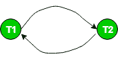
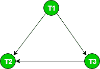

# 测试数据库管理系统中冲突可串行化的优先图

> 原文:[https://www . geesforgeeks . org/preference-graph-for-testing-conflict-serializability-in-DBMS/](https://www.geeksforgeeks.org/precedence-graph-for-testing-conflict-serializability-in-dbms/)

先决条件:[冲突可串行化](https://www.geeksforgeeks.org/conflict-serializability/)

**优先图**或**序列化图**通常用于测试计划的冲突可序列化性。
它是由一组节点 V = {T <sub>1</sub> 、T <sub>2</sub> 、T <sub>3</sub> ……组成的有向图(V，E)。T <sub>n</sub> 和一组定向边 E = {e <sub>1</sub> ，e <sub>2</sub> ，E<sub>3</sub>…………E<sub>m</sub>}。
该图包含每个事务 T <sub>i</sub> 的一个节点。边 e <sub>i</sub> 为 T<sub>j</sub>–>T<sub>k</sub>形式，其中 T <sub>j</sub> 为 e <sub>i</sub> 的起始节点，T <sub>k</sub> 为 e <sub>i</sub> 的终止节点。如果 T <sub>j</sub> 中的操作之一出现在 T <sub>k</sub> 中的一些冲突操作之前，则在节点 T <sub>j</sub> 到 T <sub>k</sub> 之间构建边 e <sub>i</sub> 。

该算法可以写成:

1.  在图表中为计划中的每个参与事务创建一个节点 T。
2.  对于相互冲突的操作 read_item(X)和 write_item(X)–如果事务 T <sub>j</sub> 在 T <sub>i</sub> 执行 write _ item(X)之后执行 read_item (X)，则在图中绘制一条从 T <sub>i</sub> 到 T <sub>j</sub> 的边。
3.  对于冲突操作 write_item(X)和 read_item(X)–如果事务 T <sub>j</sub> 在 T <sub>i</sub> 执行 read _ item(X)之后执行 write_item (X)，则在图中从 T <sub>i</sub> 到 T <sub>j</sub> 绘制一条边。
4.  对于相互冲突的操作 write_item(X)和 write_item(X)–如果事务 T <sub>j</sub> 在 T <sub>i</sub> 执行 write_item (X)之后执行 write _ item(X)，则在图中绘制一条从 T <sub>i</sub> 到 T <sub>j</sub> 的边。
5.  **如果优先图**中没有循环，则调度 S 是可串行化的。

如果优先图中没有循环，这意味着我们可以构造一个与调度 S.
冲突等价的串行调度 S′。串行调度 S′可以通过非循环优先图的[拓扑排序](https://www.geeksforgeeks.org/topological-sorting-indegree-based-solution/)找到。此类计划可以超过 1 个。

例如，
考虑时间表 S:

```
 S : r1(x) r1(y) w2(x) w1(x) r2(y) 
```

**创建优先图:**

1.  制作交易 T <sub>1</sub> 和 T <sub>2</sub> 对应的两个节点。
    
2.  对于冲突对 r1(x) w2(x)，其中 r1(x)发生在 w2(x)之前，绘制一条从 T <sub>1</sub> 到 T <sub>2</sub> 的边。
    
3.  For the conflicting pair w2(x) w1(x), where w2(x) happens before w1(x), draw an edge from T<sub>2</sub> to T<sub>1</sub>.

    

由于该图是循环的，我们可以断定它是**而不是任何调度序列调度的冲突可串行化**。
让我们尝试使用拓扑排序从这个图中推断出一个连续的时间表。
边 T<sub>1</sub>–>T<sub>2</sub>告诉 T <sub>1</sub> 应该在线性排序中排在 T <sub>2</sub> 之前。
边 T<sub>2</sub>–>T<sub>1</sub>告诉 T <sub>2</sub> 应该在线性排序中排在 T <sub>1</sub> 之前。
所以，我们无法预测任何特定的顺序(当图形是循环的)。因此，无法从该图中获得序列时间表。

考虑一下 S1 的另一个时间表:

```
 S1: r1(x) r3(y) w1(x) w2(y) r3(x) w2(x)
```

该计划的图表如下:



因为该图是非循环的，所以调度是冲突可串行化的。对这个图执行拓扑排序会给我们一个可能的串行调度，它与调度 S1 是冲突等价的。
在拓扑排序中，我们首先选择 In 度为 0 的节点，即 T1。接下来是 T3 和 T2。
所以， **S1 是冲突可串行化的**，因为它是**冲突等效的**到**串行时间表 T1 T3 T2。**

资料来源:操作系统书，西尔伯沙茨，高尔文和加涅

本文由**萨罗尼·巴韦贾**供稿。如果你喜欢 GeeksforGeeks 并想投稿，你也可以使用[write.geeksforgeeks.org](https://write.geeksforgeeks.org)写一篇文章或者把你的文章邮寄到 review-team@geeksforgeeks.org。看到你的文章出现在极客博客主页上，帮助其他极客。