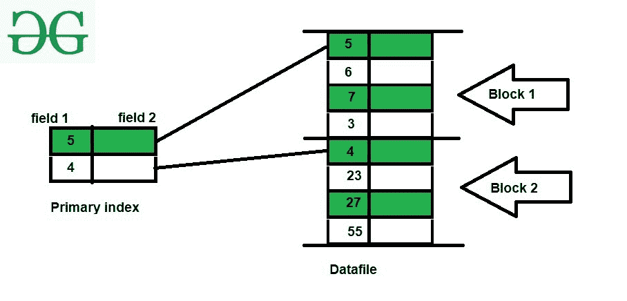

# 数据库中的主索引

> 原文:[https://www . geesforgeks . org/primary-indexing-in-databases/](https://www.geeksforgeeks.org/primary-indexing-in-databases/)

[索引](https://www.geeksforgeeks.org/indexing-in-databases-set-1/)是一种通过最小化处理查询时所需的磁盘访问次数来优化数据库性能的方法。它是一种数据结构技术，用于快速定位和访问数据库中的数据。

**索引类型:**
有以下两种方式。

**1。单级索引–**

1.  主索引
2.  聚类索引
3.  二级索引

**2。多级索引–**

1.  [B 树](https://www.geeksforgeeks.org/introduction-of-b-tree-2/)
2.  [B+树](https://www.geeksforgeeks.org/introduction-of-b-tree/)

**主索引**主要定义在数据文件的主键上，其中数据文件已经基于主键排序。

主索引是一个有序文件，其记录长度固定，有两个字段。索引的第一个字段以有序的方式复制数据文件的主键，有序文件的第二个字段包含一个指针，该指针指向包含该键的记录可用的数据块。

每个块的第一条记录称为锚记录或块锚。数据文件的每个块在主索引文件中都有一条记录。

使用主索引的平均块数为= **log 2 B + 1** ，其中 B 为索引块数。

