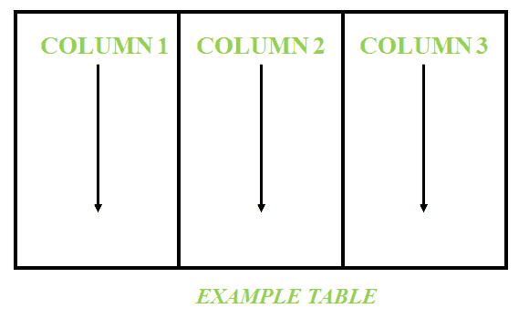

# 惠普-Vertica 的预测

> 原文:[https://www.geeksforgeeks.org/projections-in-hp-vertica/](https://www.geeksforgeeks.org/projections-in-hp-vertica/)

**惠普-Vertica :**
中的预测当我们在数据库管理系统中创建表时，该表不会像在物理磁盘中那样存储。但是表格将使用惠普-Vertica 中的投影概念进行存储。**投影**是表格物理存储在磁盘上的方式。只有当我们最初将数据加载到表中时，并且恰好在创建表时，才会创建投影。

投影可以手动创建，也可以使用惠普-Vertica 提供的数据库设计器(DBD)创建。

**示例:**
考虑由如下所示的 3 列组成的表:

当在数据的初始加载上创建投影时，群集中特定节点的投影如下所示:

**注意:**
在 HP-Vertica 中，数据出现柱状存储，因此各种列作为投影分布在集群的节点上。