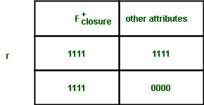
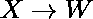
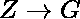
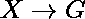

# 证明阿姆斯特朗公理的正确性

> 原文:[https://www . geeksforgeeks . org/proof-正确性-Armstrong s-公理/](https://www.geeksforgeeks.org/proving-correctness-of-armstrongs-axioms/)

先决条件–[阿姆斯特朗在 DBMS 中的函数依赖公理](https://www.geeksforgeeks.org/armstrongs-axioms-in-functional-dependency-in-dbms/)
阿姆斯特朗提到规则 1 到 3 具有完整性和合理性。阿姆斯壮的公理是完整的，因为对于给定的一组函数依赖 F，所有由 F <sup>+</sup> 隐含的函数依赖都可以使用这些规则从 F 中导出。

**我们需要证明的–**
可以用逻辑从给定的一组功能依赖项(F <sub>闭包</sub>)中推导出的一组功能依赖项和可以从阿姆斯特朗公理(F <sub>阿姆斯特朗</sub>)中推导出的一组功能依赖项是相同的。就集合而言，如果我们想表示相等，那么我们把它写成，一个是另一个的适当子集。因此，我们需要表明，

```
F<sub>closure</sub>  is a proper subset of F<sub>armstrong</sub> 
```

正确性意味着任何可以从 F 中导出的东西也可以用阿姆斯特朗的公理导出。


F <sub>闭包</sub> <sup>+</sup> 代表 F 的闭包，数学上我们可以表示，F <sub>闭包</sub> <sup>+</sup> = {A| F <sub>闭包</sub>+<sup>+</sup>隐含 A 可以利用阿姆斯特朗公理从 F 中导出}其中，A 属于实数。

**权利要求-1 :**
是利用阿姆斯壮公理从 F 推导出来的，当且仅当 Y 是 F 的适当子集<sub>闭包</sub> <sup>+</sup> 。

证明‘如果’部分:
让 Y={A <sub>0</sub> ，A <sub>1</sub> ，……，A <sub>m</sub> ，其中 Y 是 F <sub>闭包</sub> <sup>+</sup> 的适当子集。F <sub>闭包</sub> <sup>+</sup> 暗示 A <sub>j</sub> 可以使用阿姆斯特朗公理从 F 中推导出来}其中，A 属于 0 < j < =m
如果我们遵循并集规则，那么可以从 F 中推导出来

为了证明‘仅当’部分:
是由 F 利用阿姆斯壮公理
通过投影规则导出的，我们知道 F <sub>闭包</sub> <sup>+</sup> 隐含着 A <sub>j</sub> 其中，A 属于 0 < j < =m
因此通过 F <sub>闭包</sub> <sup>+</sup> 的性质，A <sub>j</sub> 属于 F <sub>闭包</sub>T11
这意味着 Y 是 F <sub>闭包</sub> <sup>+</sup> 的适当子集。

用阿姆斯特朗的公理，x 决定 Y。
我们将试图证明上述说法的反命题。
我们将证明 X 决定 Y 不能用阿姆斯特朗的公理从 F 决定。就元组关系而言，我们可以说，存在一个属于实数的实例 r，因此，F 的所有函数依赖都保持在 r 上。然而，X 暗示 Y 不保持。
这里提到我们的假设是错误的，这个说法是正确的。
由此证明权利要求 01 是正确的。

让我们考虑 r 只有 2 行，由 r{F <sub>闭包</sub> <sup>+</sup> 属性，其他属性}
表示



**索赔-2:**
F 的所有 FDs 都被 r 满足，让我们再一次否定它。让 W 暗示属于 F 的 R 不满足 R，那么 W 是 F <sub>闭包</sub> <sup>+</sup> 的适当子集，Z 不是 F <sub>闭包</sub> <sup>+</sup> 的适当子集。
让 G 属于 Z- F <sub>闭合</sub> <sup>+</sup>

我们得到:
因为 W 是 F 的适当子集<sub>闭包</sub> <sup>+</sup> 、
通过及物性规则，
通过自反性规则作为 G 属于 Z 而
通过及物性规则。

根据闭包的定义，G 必须属于 F <sub>闭包</sub> <sup>+</sup>
我们得到一个矛盾。
我们采取了一个被证明是错误的矛盾，这意味着该声明是真实的。
由此证明权利要求 02 是正确的。

**索赔-3 :**
X 暗示 Y 不满足 r.
我们再次假设矛盾(X 不暗示 Y)。由于 r 的结构，Y 是 F <sub>闭包</sub> <sup>+</sup> 的适当子集，这意味着 X 暗示 Y 可以用阿姆斯壮公理证明。
我们的假设被证明是错误的，因此索赔是正确的。
由此证明权利要求 03 是正确的。

这意味着当 X 不暗示 Y 时，使用阿姆斯特朗的公理，那么 F 在逻辑上不暗示 X 暗示 Y。
我们也可以说，当 X 暗示 Y 时，使用阿姆斯特朗的公理(机械地)，那么 F 在逻辑上暗示 X 也暗示 Y。
由此证明阿姆斯特朗的公理是完整的。