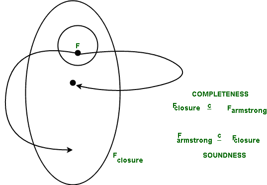
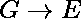
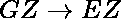
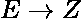

# 证明阿姆斯特朗公理的正确性

> 原文:[https://www . geeksforgeeks . org/proving-稳健性-Armstrong s-公理/](https://www.geeksforgeeks.org/proving-soundness-of-armstrongs-axioms/)

先决条件–[阿姆斯特朗在 DBMS 中的函数依赖公理](https://www.geeksforgeeks.org/armstrongs-axioms-in-functional-dependency-in-dbms/)
阿姆斯特朗提到规则 1 到 3 具有完整性和合理性。阿姆斯特朗公理是合理的，因为它们不会产生任何不正确的[功能依赖](https://www.geeksforgeeks.org/functional-dependency-and-attribute-closure/)，并且它允许我们产生 F <sup>+</sup> 闭包。

**稳健性的证明–**
可以用逻辑从给定的一组函数依赖项(F <sub>闭包</sub>)中推导出的一组函数依赖项和可以从阿姆斯特朗公理(F <sub>阿姆斯特朗</sub>)中推导出的一组函数依赖项是相同的。就集合而言，如果我们想表示相等，那么我们提到一个是另一个的适当子集。因此，我们需要证明，

```
 F<sub>armstrong</sub>  is a proper subset of F<sub>closure</sub> 
    for soundness.
```

这意味着在应用阿姆斯特朗公理后，从 F 中导出的所有东西都是正确的函数依赖，这个属性被称为稳健性。



**考虑稳健性–**
在 m 步之后，使用阿姆斯壮公理从 F 中导出。

在每一步中，我们将应用自反性、增强性和传递性的规则。
(如果我们从数量只有 3 的公理推导出来，它们的重复应用也会给出类似的结果。)

**反身性规则–**
该规则规定，如果 E 是 G 的适当子集，那么 G 暗示 E ( )。这个规则总是产生正确的函数依赖，因为它是一个微不足道的函数依赖。

**扩增规则–**
该规则规定对于，如果我们在两边加上 Z，那么我们将得到，这将是一个正确的函数依赖。
如果 t <sub>a</sub> 和 t <sub>b</sub> 在 G 和 Z (GZ)中具有相同的对应值，
将意味着它们对于 G 具有相同的对应值，
将意味着它们对于 E 具有相同的对应值，因为 G 意味着 E，
也将意味着它们对应于 E 和 Z (EZ)。

**及物性规则–**
该规则规定，如果、那么 G 确定 Z (  )
如果 t <sub>a</sub> 和 t <sub>b</sub> 在 G
中具有相同的对应值，这意味着它们对于 E 具有相同的对应值，因为 G 意味着 E 成立，
也意味着它们对应于 E，因为 E 意味着 Z 成立。

因此，应用这 3 个规则将总是产生正确的函数依赖(即使我们应用它们 m 次)。
由此证明。