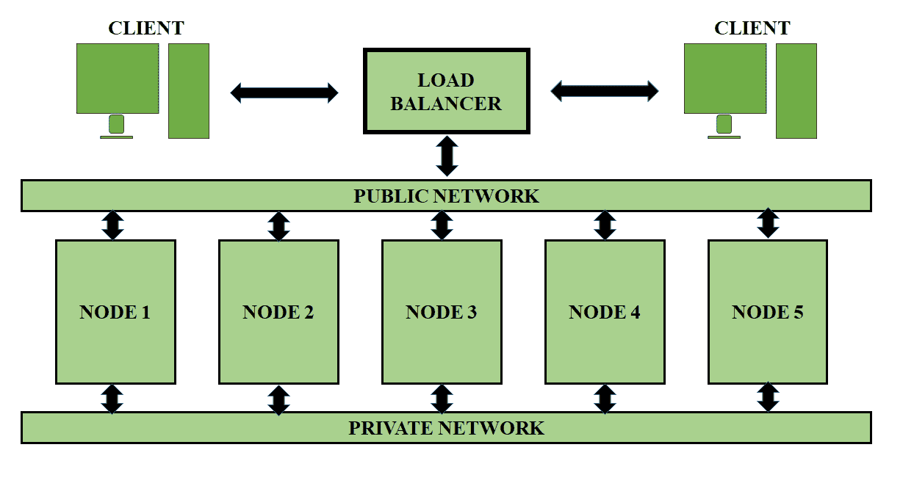

# 惠普 Vertica 中的查询执行

> 原文:[https://www . geesforgeks . org/query-execution-in-HP-vertica/](https://www.geeksforgeeks.org/query-execution-in-hp-vertica/)

SQL 查询是针对表编写的。为了执行查询， [Vertica](https://www.geeksforgeeks.org/features-of-hp-vertica/) 数据库生成查询计划。查询计划是用于确定每个步骤的执行路径&资源成本的步骤序列。查询计划中每一步计算的成本是对所用资源的估计，如下所示:

*   数据分布统计
*   磁盘空间
*   网络带宽
*   中央处理器速度
*   跨集群的数据分割

当您提交查询时，发起者选择要使用的预测，优化和计划查询执行。规划和优化很快，最多需要几毫秒。

基于所选的预测，优化器生成的查询计划被分解为“小计划”这些小计划被分发到其他节点，称为执行者。节点并行处理微型计划，中间穿插数据移动操作。

查询执行继续进行，中间结果集(行)根据需要流经节点之间的网络连接。在执行查询计划的最后阶段，一些总结工作在发起者处完成，例如:

*   在分组操作中组合结果
*   合并来自所有执行器的多个排序的部分结果集
*   格式化结果以返回客户端

一些小查询，例如对复制维度表的查询，可以在本地执行。在这些类型的查询中，查询规划避免了不必要的网络通信。