# 关系代数中的查询优化

> 原文:[https://www . geesforgeks . org/query-optimization-in-relational-代数/](https://www.geeksforgeeks.org/query-optimization-in-relational-algebra/)

**查询:**查询是从数据库中获取信息的请求。

**查询计划:**查询计划(或查询执行计划)是用于访问 SQL 关系数据库管理系统中的数据的一组有序步骤。

**查询优化:**单个查询可以通过不同的算法执行，也可以用不同的形式和结构重写。因此，查询优化的问题就出现了——这些形式或路径中哪一个是最理想的？查询优化器试图通过考虑可能的查询计划来确定执行给定查询的最有效方式。

**重要性:**查询优化的目标是减少完成查询所需的系统资源，最终更快地为用户提供正确的结果集。

*   首先，它为用户提供了更快的结果，这使得应用程序对用户来说似乎更快。
*   其次，它允许系统在相同的时间内服务更多的查询，因为每个请求比未优化的查询花费更少的时间。
*   第三，查询优化最终减少了硬件(例如磁盘驱动器)的磨损量，并允许服务器更高效地运行(例如更低的功耗、更少的内存使用)。

**查询优化大致有两种方式:**

1.  分析和转换等价的关系表达式:尽量减少中间和最终查询过程的元组和列数(在此讨论)。
2.  对每个操作使用不同的算法:这些底层算法决定了如何从存储元组的数据结构中访问元组、索引、散列、数据检索，并因此影响磁盘和块访问的数量(在查询处理中讨论)。

**分析并转换等价关系表达式。**
在这里，我们将讨论生成最小等价表达式。为了分析等价表达式，列出了一组等价规则。这些函数为用关系代数编写的查询生成等价表达式。为了优化查询，只要满足等价规则，我们就必须将查询转换为它的等价形式。

1.  **Conjunctive selection operations can be written as a sequence of individual selections. This is called a sigma-cascade.** 

    

    **说明:**申请条件路口贵。相反，过滤出满足条件(内部选择)的元组，然后将条件(外部选择)应用于随后产生的较少元组。这使得我们第二次处理的元组更少。这可以扩展到两个或多个相交的选择。因为我们将一个单一的条件分解成一系列的选择或级联，所以它被称为“级联”。

2.  **Selection is commutative.** 
    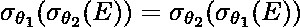

    **解释:** 条件本质上是可交换的。这意味着，我们先申请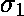还是先申请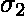并不重要。在实践中，首先应用产生较少数量元组的选择是更好和更优化的。这节省了我们外部选择的时间。

3.  **All following projections can be omitted, only the first projection is required. This is called a pi-cascade.** 
    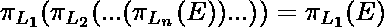

    **解释:**一个级联或者一系列的投射是没有意义的。这是因为最终，我们只选择最后一个或最外层投影中指定的那些列。因此，最好将所有投影折叠成一个，即最外面的投影。

4.  **笛卡尔乘积上的选择可以重写为θ连接。**
    *   **Equivalence 1** 
        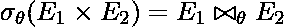

        **说明:**众所周知，叉积操作非常昂贵。这是因为它将 E1 的每个元组(总共 m 个元组)与 E2 的每个元组(总共 n 个元组)相匹配。这产生 m*n 个条目。如果我们在此之后应用选择操作，我们将不得不扫描 m*n 个条目以找到满足条件的合适元组。与其做所有这些，不如使用 Theta Join，这是一种专门设计的 Join，只选择叉积中满足 Theta 条件的条目，而不首先评估整个叉积。

    *   **Equivalence 2** 
        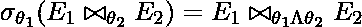

        **解释:** Theta Join 从根本上减少了结果元组的数量，因此如果我们将两个连接条件(即和的交集应用到 Theta Join 本身，我们需要做的扫描会更少。另一方面，外部的条件不必要地增加了要扫描的元组。

5.  **Theta Joins are commutative.** 
    

    **说明:** Theta 联接是可交换的，查询处理时间在某种程度上取决于联接过程中哪个表用作外循环，哪个表用作内循环(基于索引结构和块)。

6.  **连接操作是关联的。**
    *   **Natural Join** 
        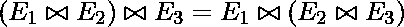

        **说明:**连接既可以是交换的，也可以是关联的，因此必须先连接这两个表，这样产生的条目数就更少，然后再应用另一个连接。

    *   **Theta Join** 
        

        **解释:** Theta 联接以上述方式关联，其中仅涉及来自 E2 和 E3 的属性。

7.  **选择操作可以分配。**
    *   **Equivalence 1** 
        

        **解释:**在执行 Theta Join 后应用选择会导致 Theta Join 返回的所有元组在连接后被监控。如果这个选择只包含来自 E1 的属性，最好将这个选择应用于 E1(因此导致元组数量较少)，然后将其与 E2 连接。

    *   **Equivalence 2** 
        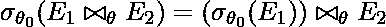

        **说明:**这个可以扩展到两个选择条件，和，其中 Theta1 只包含 E1 的属性，只包含 E2 的属性。因此，我们可以在加入之前单独应用选择标准，以大幅减少加入的元组数量。

8.  **投影分布在θ连接上。**
    *   **Equivalence 1** 
        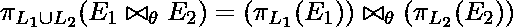

        **说明:**讨论选择的思路也可以用于投影。在这里，如果 L1 是一个只包含 E1 列的投影，而 L2 是另一个只包含 E2 列的投影，那么最好在连接之前在两个表上分别应用投影。这使得我们两边的列数量更少，从而有助于更容易的连接。

    *   **Equivalence 2** 
        

        **解释:**这里，当在连接上应用投影 L1 和 L2 时，其中 L1 只包含 E1 的列，L2 只包含 E2 的列，我们可以引入另一列 E3(这在两个表之间是常见的)。然后，我们可以将 L1 和 L2 的投影分别应用于 E1 和 E2，以及添加的列 L3。L3 使我们能够加入。

9.  **Union and Intersection are commutative.** 
    
    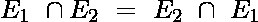

    **说明:**并和交都是分配的；我们可以根据需要和方便的访问将任何表格括在括号中。

10.  **Union and Intersection are associative.** 
    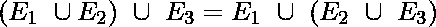
    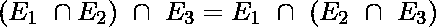

    **说明:**并和交都是分配的；我们可以根据需要和方便的访问将任何表格括在括号中。

11.  **Selection operation distributes over the union, intersection, and difference operations.** 
    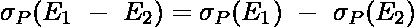

    **说明:**在集合差中，我们知道只显示那些属于表 E1 而不属于表 E2 的元组。因此，对整个集合差应用选择条件相当于对单个表应用选择条件，然后应用集合差。这将减少设置差异步骤中的比较次数。

12.  **Projection operation distributes over the union operation.** 
    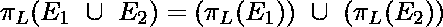

    **说明:**在计算 E1 和 E2 的并集之前应用单个投影比左表达式更优，即在并集步骤之后应用投影。

**极小性–**
如果没有规则可以从其他规则的任何组合中导出，那么一组等价规则被称为极小。当查询最小时，称之为最佳查询。

**示例–**
假设以下表格:

```
instructor(ID, name, dept_name, salary)
teaches(ID, course_id, sec_id, semester, year)
course(course_id, title, dept_name, credits)
```

**查询 1:找到音乐系所有导师的名字，以及他们所教课程的名称**


这里，dept_name 只是教师表的一个字段。因此，我们可以在加入表之前选择音乐教师，从而减少查询时间。

**优化查询:**
使用规则 7a，尽可能早地执行选择会减小要连接的关系的大小。


**查询 2:找到 2009 年在 CSE 部门教过一门课程的所有导师的名字，以及他们教过的课程名称**


**优化查询:**
我们可以进行“提前选择”，因此优化查询变成:


本文由**阿南尼亚·乌拜伊**供稿。如果你喜欢 GeeksforGeeks 并想投稿，你也可以使用[contribute.geeksforgeeks.org](http://www.contribute.geeksforgeeks.org)写一篇文章或者把你的文章邮寄到 contribute@geeksforgeeks.org。看到你的文章出现在极客博客主页上，帮助其他极客。

如果你发现任何不正确的地方，或者你想分享更多关于上面讨论的话题的信息，请写评论。