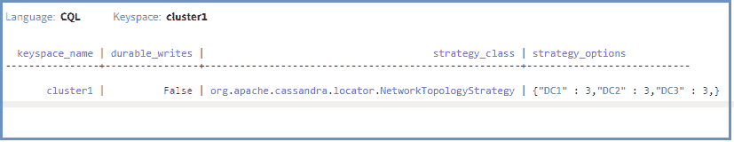
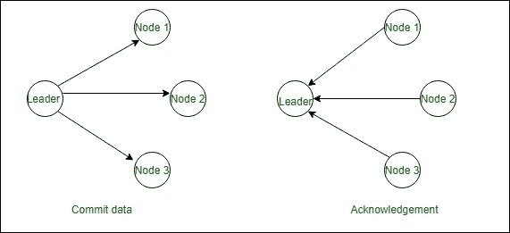

# 卡珊德拉的法定人数一致性

> 原文:[https://www . geesforgeks . org/quorum-consistency in-Cassandra/](https://www.geeksforgeeks.org/quorum-consistency-in-cassandra/)

在本文中，我们将讨论仲裁一致性在 [Cassandra](https://www.geeksforgeeks.org/introduction-to-apache-cassandra/) 中有什么帮助，以及我们如何计算它，还将讨论仲裁一致性是如何工作的。

**什么是法定一致性？**
Quorum 一致性就是在 Cassandra 中的一致性对于高机制和保证有多少节点会响应的时候我们会在 Cassandra 中定义读写一致性。在仲裁一致性中，副本的大多数(n/2 +1)节点必须响应。

在 Quorum 中，我们检查大多数副本(这只是意味着复制因子的数量)。例如，如果我们的数据中心的复制系数为 3:2，那么它们的副本将有多少。所以，会有 6 个，大多数是 4 个。(total _ sum _ replications/2+1)。

通常，在大多数情况下，当 3 个数据中心各有 3 个副本时，我们需要本地 DC 的 2 个节点才能成功，此时我们使用本地仲裁。

现在，我们将在这里定义相同的 CQL 查询。让我们来看看。

```
CREATE KEYSPACE cluster1
with replication =  {'class' : 'NetworkTopologyStrategy', 
                     'DC1': 3, 'DC2': 3, 'DC3': 3}
AND DURABLE_WRITES = false; 
```

为了验证结果，使用了下面给出的 CQL 查询。

```
SELECT * 
FROM system_schema.keyspaces; 
```

**输出:**



**如何计算法定人数？**
这就是我们计算法定人数的方式，简单来说就是有多少节点会确认。

```
Quorum = (sum_of_replication_factors / 2) + 1 
```

法定人数等于复制因子的总和除以 2 再加 1。因为要把它变成整数。

**法定一致性:**
每个数据中心的所有复制因子设置的总和是复制因子的总和。

```
Total_sum_of_replication_factor = DC1_RF + DC2_RF + DC3_RF+ ... +DC_RF 

```

**Quorum 一致性是如何工作的？**
如果有三个节点占多数，并且它们必须以 Quorum 一致性响应，那么在下面给出的图表中，确认显示有三个节点响应，并且在写入数据时，提交的节点显示我们将数据提交到三个节点中。



在上图中，如果我们将数据插入表中，并且 RF =3，这意味着数据将在可用的三个节点上复制，这在提交的图中显示。在确认图的情况下，如果我们正在读取数据，并且总共有 5 个节点，并且应用了仲裁一致性，则(5/2 +1)个节点必须响应。因此，在图中可以清楚地看到三个节点是如何可用的，以及如何确认这一点。