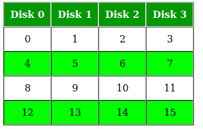
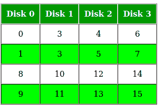
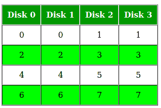
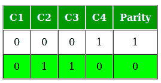
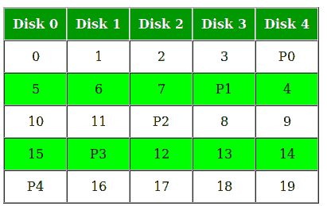

# RAID(独立磁盘冗余阵列)

> 原文:[https://www . geeksforgeeks . org/raid-独立磁盘冗余阵列/](https://www.geeksforgeeks.org/raid-redundant-arrays-of-independent-disks/)

RAID 或“独立磁盘冗余阵列”是一种技术，它利用多个磁盘的组合，而不是使用单个磁盘来提高性能和/或数据冗余。这个词是由加州大学伯克利分校的大卫·帕特森、加斯·吉布森和兰迪·卡茨于 1987 年创造的。

**为什么数据冗余？**

数据冗余虽然占用额外空间，但增加了磁盘可靠性。这意味着，在磁盘出现故障的情况下，如果相同的数据也备份到另一个磁盘上，我们可以检索数据并继续操作。另一方面，如果在没有 RAID 技术的情况下，数据仅分布在多个磁盘上，单个磁盘的丢失会影响整个数据。

**磁盘阵列系统的关键评估点**

*   **可靠性:**系统能容忍多少磁盘故障？
*   **可用性:**系统在正常运行时间模式下占总会话时间的比例是多少，即系统在实际使用中的可用性如何？
*   **性能:**响应时间有多好？吞吐量(处理工作的速率)有多高？请注意，性能包含许多参数，而不仅仅是这两个。
*   **容量:**给定一组 N 个磁盘，每个磁盘有 B 个数据块，用户有多少可用容量？

RAID 对底层系统非常透明。这意味着，对于主机系统来说，它看起来像一个大磁盘，以线性块阵列的形式出现。这允许旧技术被 RAID 取代，而无需对现有代码进行太多更改。

**不同的 RAID 级别**

**RAID-0(剥离)**

*   块跨磁盘“剥离”。

*   在图中，块“0，1，2，3”形成一个条带。
*   我们可以先将两个(或更多)块放入磁盘，然后再继续下一个，而不是一次只将一个块放入磁盘。

**评估:**

*   可靠性:0
    无重复数据。因此，数据块一旦丢失就无法恢复。
*   容量:N*B
    整个空间都在用来存储数据。由于没有复制，因此每个磁盘都有 B 个数据块的 N 个磁盘得到了充分利用。

**RAID-1(镜像)**

*   每个块的多个副本存储在单独的磁盘中。因此，每个数据块都有两个(或更多)副本，位于不同的磁盘上。

*   上图显示了镜像级别为 2 的 RAID-1 系统。
*   RAID 0 无法容忍任何磁盘故障。但是 RAID 1 具有可靠性。

**评估:**

假设一个镜像级别为 2 的 RAID 系统。

*   可靠性:1 到 N/2
    1 可以肯定地处理磁盘故障，因为该磁盘的块在其他磁盘上会有副本。如果我们足够幸运，磁盘 0 和 2 出现故障，那么这也可以处理，因为这些磁盘的块在磁盘 1 和 3 上有重复。因此，在最好的情况下，可以处理 N/2 个磁盘故障。
*   容量:N*B/2
    只有一半的空间用于存储数据。另一半只是已存储数据的镜像。

**RAID-4(带专用奇偶校验的块级剥离)**

*   这不是复制数据，而是采用基于奇偶校验的方法。

*   在图中，我们可以观察到一列(磁盘)专用于奇偶校验。
*   奇偶校验是使用简单的异或函数计算的。如果数据位为 0，0，0，1，奇偶校验位为异或(0，0，0，1) = 1。如果数据位为 0，1，1，0，奇偶校验位为异或(0，1，1，0) = 0。一个简单的方法是偶数个 1 产生奇偶校验 0，奇数个 1 产生奇偶校验 1。

*   假设在上图中，由于一些磁盘故障，C3 丢失了。然后，我们可以通过查看所有其他列的值和奇偶校验位来重新计算存储在 C3 的数据位。这使我们能够恢复丢失的数据。

**评估:**

*   可靠性:1
    RAID-4 最多允许恢复 1 个磁盘故障(因为奇偶校验的工作方式)。如果多个磁盘出现故障，则无法恢复数据。
*   容量:(N-1)*B
    系统中预留一个磁盘用于存储奇偶校验。因此，(N-1)个磁盘可用于数据存储，每个磁盘有 B 个块。

**RAID-5(带分布式奇偶校验的块级剥离)**

*   这是对 RAID-4 系统的轻微修改，唯一的区别是奇偶校验在驱动器之间轮换。

*   在图中，我们可以看到奇偶校验位是如何“旋转”的。
*   引入这一点是为了使随机写入性能更好。

**评估:**

*   可靠性:1
    RAID-5 最多允许恢复 1 个磁盘故障(因为奇偶校验的工作方式)。如果多个磁盘出现故障，则无法恢复数据。这与 RAID-4 相同。
*   容量:(N-1)*B
    总的来说，相当于一个磁盘的空间用于存储奇偶校验。因此，(N-1)个磁盘可用于数据存储，每个磁盘有 B 个块。

**其他 RAID 级别呢？**

RAID-2 由使用汉明码奇偶校验的位级剥离组成。RAID-3 由字节级条带化和专用奇偶校验组成。这两个不太常用。
RAID-6 是最近的一项进步，它包含分布式双奇偶校验，这涉及到块级剥离，具有 2 个奇偶校验位，而不是仅 1 个分布在所有磁盘上。还有混合 RAID，它利用一个接一个嵌套的多个 RAID 级别来满足特定的要求。

**参考文献:**

*   https://en.wikipedia.org/wiki/RAID 
*   操作系统的三个简单部分。

本文由 **Anannya Uberoi** 供稿。如果你喜欢 GeeksforGeeks 并想投稿，你也可以使用[write.geeksforgeeks.org](https://write.geeksforgeeks.org)写一篇文章或者把你的文章邮寄到 review-team@geeksforgeeks.org。看到你的文章出现在极客博客主页上，帮助其他极客。

如果你发现任何不正确的地方，或者你想分享更多关于上面讨论的话题的信息，请写评论。