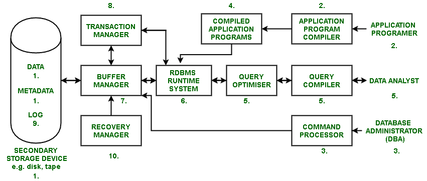

# 关系数据库管理系统架构

> 原文:[https://www.geeksforgeeks.org/rdbms-architecture/](https://www.geeksforgeeks.org/rdbms-architecture/)

[**关系数据库管理系统**](https://www.geeksforgeeks.org/rdbms-full-form/) 代表关系数据库管理系统，实现 [SQL](https://www.geeksforgeeks.org/sql-tutorial/) 。
在现实场景中，人们使用关系数据库管理系统收集信息并对其进行处理，提供服务。例如，在票处理系统中，收集关于我们的细节(例如，年龄、性别)和我们的旅程(例如，来源、目的地)，并且票被提供给我们。

**关系数据库管理系统架构:**

**注–**
图表中的每个术语在下面与该术语相关的点号中解释。

1.  所有数据、关于数据的数据(元数据)和日志都存储在辅助存储设备(固态硬盘)中，如磁盘和磁带。用于完成企业日常任务的程序称为应用程序。这些程序为企业的日常运营提供功能。它们是用高级语言(HLL)编写的，如 Java、C 等，与 SQL 一起用于与数据库通信。
2.  关系数据库管理系统有一个编译器，可以将 SQL 命令转换为低级语言，对其进行处理，并将其存储到辅助存储设备中。
3.  数据库管理员的工作是使用命令处理器建立数据库的结构。DDL 代表数据定义语言，由数据库管理员用来创建或删除表、添加列等。数据库管理员还使用其他命令来设置约束和访问控制。
4.  应用程序程序员使用编译器编译应用程序，并创建可执行文件(已编译的应用程序)，然后将数据存储在辅助存储设备上。
5.  数据分析师的工作是使用查询编译器和查询优化器(使用关系属性来执行查询)来操作数据库中的数据。
6.  运行时系统执行编译后的查询和应用程序，并与事务管理器和缓冲区管理器交互。
7.  缓冲区管理器将数据库的数据临时存储在主内存中，并使用分页算法，以便更快地执行操作并管理磁盘空间。
8.  事务管理器处理要么完全完成任务要么根本不做任务的原则(原子性属性)。例如，假设一个叫极客的人想给他妹妹寄钱。他送了钱，系统崩溃了。在任何情况下都不应该发生他寄钱但他姐姐没有收到的情况。这是由事务管理器处理的。交易经理要么把钱退还给极客，要么把钱转给他的妹妹。
9.  日志是一个系统，它记录所有事务的信息，以便每当系统出现故障(磁盘故障、系统因断电而关闭等)时。)出现时，部分事务可以撤消。
10.  恢复管理器控制系统，使其在故障后达到稳定状态。恢复管理器会考虑日志文件并撤消部分事务，并将完整的事务反映在数据库中。