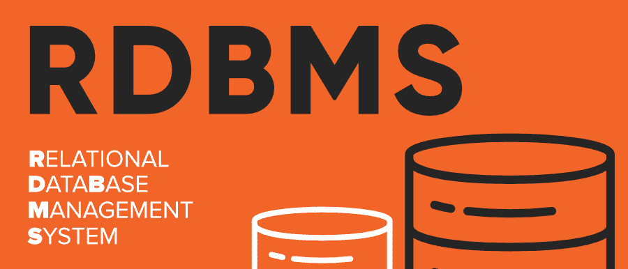

# 关系数据库管理系统完整表单

> 原文:[https://www.geeksforgeeks.org/rdbms-full-form/](https://www.geeksforgeeks.org/rdbms-full-form/)

**关系数据库管理系统**代表**关系数据库管理系统**。它基本上是一个允许我们创建、删除和更新关系数据库的程序。关系数据库是一个以表格形式存储和检索数据的数据库系统，表格以行和列的形式组织。它是由 E . F Codd 在 20 世纪 70 年代设计的数据库管理系统的一个较小的子集。主要的数据库管理系统如 SQL、My-SQL、ORACLE 都是基于关系型数据库管理系统的原理。

关系型数据库管理系统的基础在于每个表的值都是相互关联的。它具有处理更大数据量和轻松模拟查询的能力。

关系数据库管理系统通过模拟以下特征来维护数据完整性:

*   **实体完整性:**数据库表的任何两条记录都不能完全重复。
*   **参照完整性:**只能删除那些表中不被其他表使用的行。否则，可能会导致数据不一致。
*   **用户定义的完整性:**用户基于机密性和访问权限定义的规则。
*   **域完整性:**基于默认值、数据类型或范围，数据库表的列包含在一些结构化限制内。

#### 特征

*   数据必须以表格形式存储在数据库文件中，也就是说，它应该以行和列的形式组织。
*   表的每一行都称为记录/元组。这些记录的集合被称为表的基数
*   表中的每一列都称为属性/字段。这类列的集合称为表的 arity。
*   数据库表的任何两条记录都不能相同。因此，通过使用候选密钥可以避免数据重复。候选关键字是唯一标识每个记录所需的最小属性集。
*   在外键的帮助下，表相互关联。
*   数据库表也允许空值，也就是说，如果表中任何元素的值没有被填充或丢失，它就会变成一个空值，这并不等于零。(注意:主键不能有空值)。

**例:**
下表 STUDENT 由三列 Roll Number、Name、Section 和学生 1、2、3、4 的四条记录组成。记录不能完全相同，滚动号作为分隔记录的候选键。

<figure class="table">

| 辊号 | 名字 | 部分 |
| --- | --- | --- |
| one | 石田 | A |
| Two | 亚什 | B |
| three | 石田 | A |
| four | 马利卡 | C |

#### 优势

*   易于管理:每个表都可以独立操作，不会影响其他表。
*   安全性:由多个安全级别组成的安全性更高。共享数据的访问可能会受到限制。
*   灵活:数据更新可以在一个点完成，而无需在多个文件中进行修改。数据库可以很容易地扩展以包含更多的记录，从而提供更大的可伸缩性。同时，方便了 SQL 查询的简单应用。
*   用户:RDBMS 支持将多个用户存储在一起的客户端架构。
*   便于存储和检索大量数据。
*   轻松的数据处理:
    *   由于关系架构，数据获取更快。
    *   由于密钥、索引和规范化原则，避免了数据冗余或重复。
    *   因为关系数据库管理系统基于数据事务的 ACID 属性(原子性一致性隔离持久性)，所以确保了数据一致性。
*   容错:数据库的复制提供了同步访问，并帮助系统在发生灾难(如电源故障或突然关闭)时恢复

#### 不足之处

*   高成本和广泛的硬件和软件支持:要使这些系统正常运行，需要巨大的成本和设置。
*   可扩展性:在增加更多数据的情况下，需要服务器以及额外的电源和内存。
*   复杂性:庞大的数据会增加理解关系的复杂性，并可能降低性能。
*   结构化限制:关系数据库系统的字段或列包含在各种限制内，这可能会导致数据丢失

</figure>