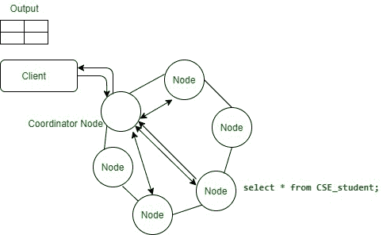

# 卡珊德拉中的读写路径

> 原文:[https://www . geesforgeks . org/读写路径 in-cassandra/](https://www.geeksforgeeks.org/read-and-write-path-in-cassandra/)

**先决条件–**

*   [阿帕奇卡珊德拉介绍](https://www.geeksforgeeks.org/introduction-to-apache-cassandra/)
*   [Apache Cassandra (NOSQL 数据库)](https://www.geeksforgeeks.org/apache-cassandra-nosql-database/)
*   [卡珊德拉的建筑](https://www.geeksforgeeks.org/architecture-of-apache-cassandra/)

**卡珊德拉中的写路径执行:**

*   在 Cassandra 中，在写入数据时，写入会写入集群中的任何节点(协调器)。
*   当任何用户插入数据时，这意味着他们首先将数据写入提交日志，然后写入 memtable。
*   当任何用户写入数据时，每次写入都会包含一个时间戳。
*   一旦 memtable 开始变满，它就会定期刷新到磁盘([表](https://www.geeksforgeeks.org/sstable-in-apache-cassandra/?ref=rp))。
*   之后，在内存中创建新的 memtable。
*   在执行写路径的情况下，删除是特殊的写操作，称为逻辑删除。

**插入数据:**
如果在 Cassandra 中插入数据，我们将创建一个键空间，然后创建一个表，然后将数据插入表中。

**示例–**

```
// Creating a keyspace
create keyspace UniersityData
replication = {'class': 'SimpleStrategy', 'replication_factor' : '3' };

// Creating a table and declaring the columns
create table CSE_Student(
student_id int,
name text,
email text,
primary key(student_id)
);

// Using the newly created keyspace
use UniersityData;

// Inserting values in the table for all the columns
Insert into CSE_student(student_id, name, email) 
values(012345, 'Ashish', 'ashish@gmail.com');

Insert into CSE_student(student_id, name, email) 
values(012346, 'Abi', 'abi@gmail.com');

Insert into CSE_student(student_id, name, email) 
values(012347, 'Rana', 'rana@gmail.com');

Insert into CSE_student(student_id, name, email) 
values(012348, 'Aayush', 'aayush@gmail.com');

Insert into CSE_student(student_id, name, email) 
values(012349, 'harsh', 'haarsh@gmail.com'); 
```

**读取路径执行:**

*   在 Cassandra 中，当读取数据时，可以查询任何充当协调器的服务器。
*   当我们想要访问读取数据时，我们用请求的密钥联系节点。
*   在数据中心的每个节点上，数据从表中取出并合并。
*   在 Cassandra 中，在考虑读一致性的同时，我们可以检查–
    一致性< ALL 在后台执行读修复(read_repair_chance)。

[](https://media.geeksforgeeks.org/wp-content/uploads/20200712140306/Reading.jpg) 

**读取数据:**
编写一个 cqlsh 查询从 CSE_student 读取数据，并给出相同的输出。

```
select * 
from CSE_student;

```

**输出:**

<center>

| 指数 | 学生 id | 名字 | 电子邮件 |
| Zero | one two three four five | Ashish | ashish@gmail.com |
| one | Twelve thousand three hundred and forty-six | Abi | abi@gmail.com |
| Two | Twelve thousand three hundred and forty-seven | 中国林蛙 | rana@gmail.com |
| three | Twelve thousand three hundred and forty-eight | 哦，天啊 | aayush@gmail . com |
| four | Twelve thousand three hundred and forty-nine | 严厉的 | haarsh@gmail.com |

</center>