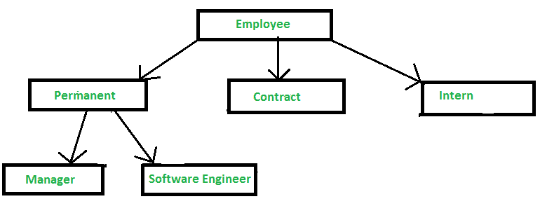
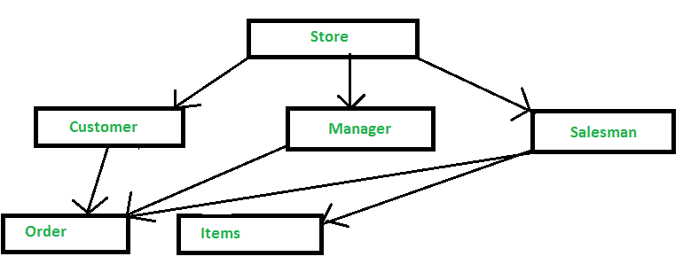
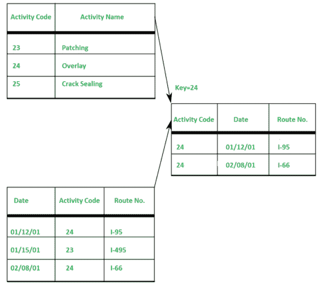

# 基于记录的数据模型

> 原文:[https://www.geeksforgeeks.org/record-based-data-model/](https://www.geeksforgeeks.org/record-based-data-model/)

**[数据模型](https://www.geeksforgeeks.org/data-models-in-dbms/)** 是组织数据元素并告诉它们如何相互关联以及与现实世界实体的属性关联的模型。数据模型的基本目的是确保存储在数据模型中的数据被完全理解。

此外，它有三种类型-

```
1. Physical Data Model, 
2. Record-Based Data Model,
3. Object-Oriented Data Model 
```

物理数据模型现在已经不常使用了。在此，我们将详细研究**基于记录的数据模型**。

**基于记录的数据模型:**
当[数据库](https://www.geeksforgeeks.org/what-is-database/)是以某种固定格式组织的几条记录时，这种模型被称为基于记录的数据模型。在每种记录类型中，它都有固定数量的字段或属性，并且每个字段通常都有固定的长度。

此外，它被分为三种类型-

1.  **Hierarchical Data Model :**
    In hierarchical type, the model data are represented by collection of records. In this, relationships among the data are represented by links. In this model, tree data structure is used.

    它是由 IBM 在 20 世纪 60 年代开发的，用于管理复杂制造项目的大量数据。分层数据模型的基本逻辑结构是上下颠倒的“树”。

    

    **优势–**
    简单性、数据完整性、数据安全性、效率、易于获得专业知识。

    **缺点–**
    复杂、不灵活、缺乏数据独立性、缺乏查询工具、[数据操作语言](https://www.geeksforgeeks.org/dml-full-form/)、缺乏标准。

2.  **Network Data Model :**
    In network type, the model data are represented by collection of records. In this, relationships among the data are represented by links. Graph data structures are used in this model. It permits a record to have more than one parent.

    例如，像脸书、Instagram 等社交媒体网站。

    

    **优势–**
    简单性、数据完整性、数据独立性、数据库标准。

    **缺点–**
    系统复杂，缺乏结构独立性。

3.  **Relational Data Model :**
    Relational Data Model uses tables to represent the data and the relationship among these data. Each table has multiple columns and each column is identified by a unique name. It is a low-level model.

    

    **优势–**
    结构独立、简单、易于设计、实现、特别查询能力。

    **缺点–**
    硬件开销，设计容易导致设计不良。