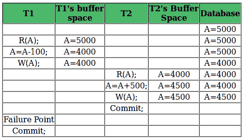
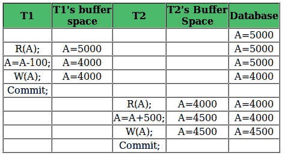

# 数据库管理系统中的可恢复性

> 原文:[https://www.geeksforgeeks.org/recoverability-in-dbms/](https://www.geeksforgeeks.org/recoverability-in-dbms/)

先决条件:

*   [并发控制介绍](https://www.geeksforgeeks.org/concurrency-control-in-dbms/)
*   [时间表类型](https://www.geeksforgeeks.org/dbms-concurrency-control-types-of-schedules/)

如上所述，由于硬件故障、系统崩溃或软件问题，事务可能无法完全执行。在这种情况下，我们必须回滚失败的事务。但是其他一些事务也可能使用了失败事务产生的值。因此，我们也必须回滚这些事务。

**可恢复计划:**

*   事务仅在其读取的更改提交后才提交的计划称为可恢复计划。换句话说，如果某个事务 T <sub>j</sub> 正在读取由某个其他事务 T <sub>i</sub> 更新或写入的值，则 T <sub>j</sub> 的提交必须发生在 T <sub>i</sub> 的提交之后。
    **例 1:**

```
S1: R1(x), W1(x), R2(x), R1(y), R2(y), 
         W2(x), W1(y), C1, C2; 
```

给定的时间表遵循 **Ti- > Tj = > C1- > C2** 的顺序。事务 T1 在 T2 之前执行，因此不会发生冲突。R1(x)出现在 W1(x)之前，事务 T1 在 T2 之前提交，即完成对数据项 x 执行的第一次更新的第一个事务，因此给定的时间表是可恢复的。

**例 2:** 考虑以下涉及两笔交易 T <sub>1</sub> 和 T <sub>2</sub> 的时间表。

| T <sub>1</sub> | T <sub>2</sub> |
| --- | --- |
| 皇家艺术学院 |  |
| 西(阿) |  |
|  | 西(阿) |
|  | 皇家艺术学院 |
| 犯罪 |  |
|  | 犯罪 |

这是自 T <sub>1</sub> 在 T <sub>2</sub> 之前提交以来的可恢复时间表，这使得由 T <sub>2</sub> 读取的值是正确的。

**不可恢复时间表:**

*   下表显示了一个包含两个事务的计划，T1 读写 A，该值由 T2 读写。T2 承诺。但是后来，T1 失败了。所以我们必须回滚 T1。由于 T2 已经读取了 T1 写入的值，因此它也应该回滚。但我们已经承诺了。所以这个时间表是不可恢复的。当 Tj 正在读取 Ti 更新的值，并且 Tj 在提交 Ti 之前提交时，时间表将无法恢复。
    [](https://media.geeksforgeeks.org/wp-content/uploads/scheduleDBMS.png)

**可通过级联回滚恢复:**

*   下表显示了一个包含两个事务的计划，T1 读写 A，该值由 T2 读写。但是后来，T1 失败了。所以我们必须回滚 T1。由于 T2 已经读取了 T1 写入的值，因此它也应该回滚。由于它没有承诺，我们也可以回滚 T2。因此它可以通过级联回滚进行恢复。因此，如果 Tj 正在读取由 Ti 更新的值，而 Tj 的提交被延迟到 Ti 的提交，则该计划称为级联回滚可恢复。
    [](https://media.geeksforgeeks.org/wp-content/uploads/schedule5.png)

**无级联可恢复回滚:**

*   下表显示了一个包含两个事务的计划，T1 读写 A 并提交，该值由 T2 读取。但是如果 T1 在提交之前失败，没有其他事务读取它的值，所以没有必要回滚其他事务。这是一个无级联可恢复的时间表。因此，如果 Tj 仅在提交 Ti 后才读取 Ti 更新的值，则计划将是无级联可恢复的。
    [](https://media.geeksforgeeks.org/wp-content/uploads/schedult3.png)

**问题:**以下哪种情况可能导致数据库系统出现不可恢复的错误？

1.  事务在未提交的事务读取数据项后写入数据项。
2.  事务在未提交的事务读取数据项后读取它。
3.  事务在被提交的事务写入后读取数据项。
4.  事务在被未提交的事务写入后读取数据项。

**回答:**看表 1 讨论的例子，一个事务被一个未提交的事务写入后正在读取一个数据项，这个调度将是不可恢复的。
相关帖子:
[冲突可串行化](https://www.geeksforgeeks.org/conflict-serializability-in-dbms/)

本文由 **Sonal Tuteja** 供稿。如果您发现任何不正确的地方，或者您想分享更多关于上面讨论的主题的信息，请写评论