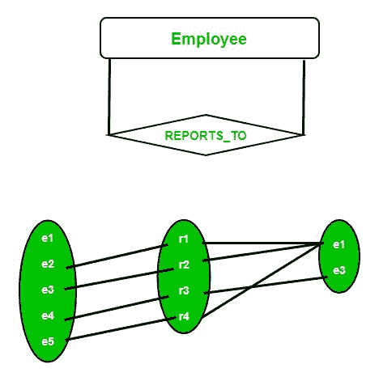

# ER 图中的递归关系

> 原文:[https://www . geeksforgeeks . org/递归关系图/](https://www.geeksforgeeks.org/recursive-relationships-in-er-diagrams/)

先决条件–[ER 模型](https://www.geeksforgeeks.org/database-management-system-er-model/)
相似实体类型的两个实体之间的关系称为**递归**关系。在这里，同一实体类型不止一次地参与关系类型，每个实例都有不同的角色。换句话说，一种关系总是存在于两个不同实体的事件之间。但是，同一实体可以参与关系。这被称为**递归**关系。


**示例–**
假设我们有一个员工表。经理监督下属。除了首席执行官，每个员工都可以有一个主管，每个员工最多可以有一个老板。一个员工可能是多个员工的老板。让我们假设 REPORTS_TO 是雇员实体类型上的递归关系，其中每个雇员扮演两个角色。

1.  监督者
2.  Subordinate



主管和下属被称为**“角色名”**。这里，REPORTS_TO 关系的度是 1，即一元关系。

*   主管实体的最小基数是零，因为最低级别的员工可能不是任何人的经理。
*   主管实体的最大基数是 N，因为一个员工可以管理许多员工。
*   同样，下属实体的最小基数为零，以说明首席执行官永远不能成为下属的情况。
*   它的最大基数是 1，因为一个下属员工最多只能有一个主管。

**注意–**由于两个最小基数都为零，因此这里没有参与者具有全部参与。因此，在 ER 图中，这些关系由单线连接，而不是双线。

为了实现递归关系，员工经理号的外键将保存在每个员工记录中。示例表如下所示

```
Emp_entity( Emp_no,Emp_Fname, Emp_Lname, Emp_DOB, Emp_NI_Number, Manager_no);

Manager no - (this is the employee no of the employee's manager)
```

本文由 [**Siddhant Bajaj 2**](https://auth.geeksforgeeks.org/profile.php?user=Siddhant Bajaj 2) 供稿。如果你喜欢 GeeksforGeeks 并想投稿，你也可以使用[write.geeksforgeeks.org](https://write.geeksforgeeks.org)写一篇文章或者把你的文章邮寄到 review-team@geeksforgeeks.org。看到你的文章出现在极客博客主页上，帮助其他极客。

如果你发现任何不正确的地方，或者你想分享更多关于上面讨论的话题的信息，请写评论。