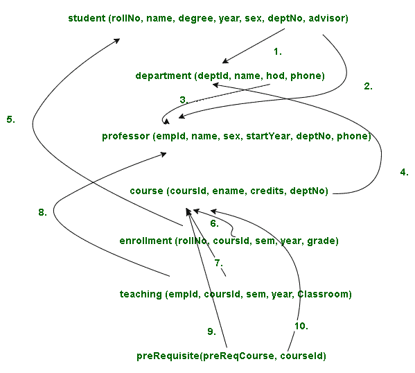

# 数据库管理系统中的关系模式

> 原文:[https://www.geeksforgeeks.org/relation-schema-in-dbms/](https://www.geeksforgeeks.org/relation-schema-in-dbms/)

关系模式定义了关系的设计和结构，就像它由关系名、属性集/字段名/列名组成一样。每个属性都有一个关联的域。

有一个叫极客的学生，她正在攻读 B.Tech，第四年，属于 IT 系(第一系)，学号 1601347，由 S .莫汉蒂夫人监考。如果我们想用数据库表示这一点，我们必须创建一个学生表，以姓名、性别、学位、年份、系、系号、学号和监考老师(顾问)作为属性。

```
student (rollNo, name, degree, year, sex, deptNo, advisor)
```

**注–**
如果我们创建一个数据库，其他学生的详细信息也可以记录下来。

同样，我们有信息技术部门，部门 Id 为 1，由苏亚塔·查克拉瓦蒂夫人担任部门主管。我们可以打电话 0657 228662 给部门。

这个部门和其他部门可以用部门表来表示，属性有部门标识、名称、部门负责人和电话。

```
department (deptId, name, hod, phone)
```

学生选择的课程有课程 id、课程名称、学分和系号。

```
course (coursId, ename, credits, deptNo)
```

教授会有员工的身份证、姓名、性别、部门号和电话号码。

```
professor (empId, name, sex, startYear, deptNo, phone)
```

我们可以有另一个名为“注册”的表，它有 roll no、courseId、学期、年份和年级作为属性。

```
enrollment (rollNo, coursId, sem, year, grade)
```

教学可以是另一个表，有员工 id、课程 id、学期、年份和教室作为属性。

```
teaching (empId, coursed, sem, year, Classroom)
```

当我们开始课程时，有一些课程需要在开始当前课程之前完成另一个课程，因此这可以由具有先决课程和课程 id 属性的先决条件表来表示。

```
prerequisite (preReqCourse, courseId) 
```

它们之间的关系在下面的**关系图**
中用箭头表示



1.  这表示学生表中的 deptNo 与部门表中使用的 deptId 相同。学生表中的 deptNo 是一个[外键](https://www.geeksforgeeks.org/types-of-keys-in-relational-model-candidate-super-primary-alternate-and-foreign/)。是指部门表中的 deptId。

2.  这表示学生表中的指导是外键。指教授表中的 empId。

3.  这表示部门表中的 hod 是外键。指教授表中的 empId。

4.  这表示课程表中的 deptNo 与部门表中使用的 deptId 相同。学生表中的 deptNo 是外键。是指部门表中的 deptId。

5.  这表示注册表中的滚动编号与学生表中使用的滚动编号相同。

6.  这表示注册表中的课程标识与课程表中使用的课程标识相同。

7.  这表示教学表中的课程标识与课程表中使用的课程标识相同。

8.  这表示教学表中的 empId 与教授表中使用的 empId 相同。

9.  这表示先决条件表中的先决条件课程是外键。它引用课程表中的课程 Id。

10.  这表示学生表中的 deptNo 与部门表中使用的 deptId 相同。

**注–**
教授表中的起始年份与学生表
中的年份相同