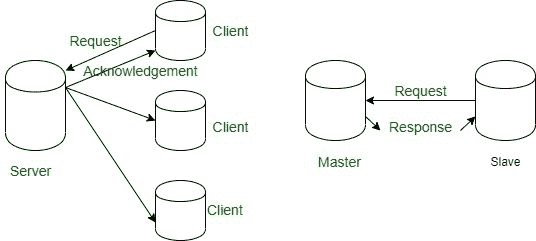
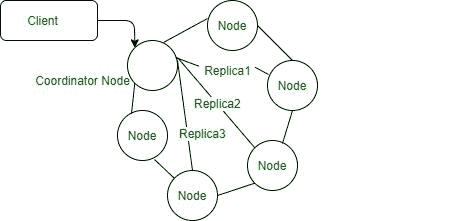

# 关系概述与卡珊德拉概述

> 原文:[https://www . geesforgeks . org/relative-overview-vs-Cassandra-overview/](https://www.geeksforgeeks.org/relational-overview-vs-cassandra-overview/)

在本文中，我们将讨论卡珊德拉和关系概述，其中我们将涵盖并能够了解卡珊德拉如何区分关系概述。我们一个一个来讨论。

**1。[关系概述](https://www.geeksforgeeks.org/relational-model-in-dbms/) :**
在关系数据库中，您可以处理和管理小型、中型数据，如 Postgres、 [MySQL](https://www.geeksforgeeks.org/mysql-common-mysql-queries/) 、Oracle 等。很好，它还支持数百个并发用户，关系数据库中最重要的属性之一是 ACID 属性，这让我们感到自豪。

处理大数据的限制

*   在关系概述中，数据纵向扩展需要更多的硬件和存储，这就是为什么处理大数据的成本很高。
*   在关系数据库中，查询是一项管理数据的冗长任务。
*   在关系数据库中，管理数据库的模式是一个巨大的负担。
*   关系数据库采用主从架构，如果主数据库发生故障，那么谁来负责。
*   如果任何节点出现故障，高可用性实际上并不存在。
*   关系数据库中的停机时间很频繁，多 Dc 也很混乱。
*   手动重新重组和重新平衡是很困难的，并且每个移动的部分都会使关系数据库中的系统更加复杂。

让我们看看主从架构。

**Figure –** Server-Client architecture Overview

现在，你会在这里看到卡珊德拉概述。

**2。[卡珊德拉概述](https://www.geeksforgeeks.org/apache-cassandra-nosql-database/) :**
正是 [NoSQL](https://www.geeksforgeeks.org/introduction-to-nosql/) 数据库具有对等架构，这意味着没有主数据库，也没有从数据库，或者更具体地说，可以说是无主数据库。

**Figure –** Cassandra peer to peer architecture

处理大数据的解决方案。

*   在卡珊德拉，对等架构意味着没有主人。在可扩展性方面，Cassandra 是在用户数量增加时自动配置节点的数据库之一。
*   如图所示，它有 3 个副本，这意味着它有 3 个数据拷贝，用于高可用性。
*   容错也是 Cassandra 的关键特性，它可以让您零停机，这直接意味着高可用性。

**注意–**
卡珊德拉并没有取代关系数据库。关系数据库对于中等规模的数据也很有用，也可以处理大数据，但是如果用户想要可伸缩性、高可用性、容错系统和大数据，你可以选择卡珊德拉。这取决于用户需求和数据模型。所以要明智地选择。