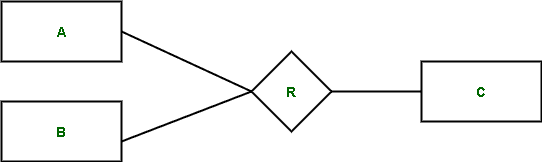

# ER 模型中的关系

> 原文:[https://www.geeksforgeeks.org/relationships-in-er-model/](https://www.geeksforgeeks.org/relationships-in-er-model/)

[实体关系模型(ER 模型)](https://www.geeksforgeeks.org/introduction-of-er-model/)包含实体和关系。ER 模型使我们能够知道这些实体是如何相互关联的。实体通过关联或关系与其他实体交互。让我们假设 Geeks 是一个学生的名字，Placement 100 是一门课程的名字。

例如，*学生*极客*报名参加*第 100 期*课程*。
这里，*报名*是关系的名称。

这只是关系的一个实例。可以有几个例子和几个其他人加入几个课程。关系注册将学生和课程作为参与实体集。

从数学上讲，我们把上面的表示为，注册是学生和课程的交叉积的一个子集。它有关于哪个学生注册了哪个课程的信息。如果(s，c)属于注册，则意味着学生 s 已注册课程 c。注册表中的元组称为关系实例，而注册称为关系类型或关系集。关系类型包含同类关联的集合。

**关系的程度:**
这是用来说明作为给定关系一部分的实体的数量。程度 2 被称为二元关系，它意味着两个实体参与到关系中。这是最常用的关系。3 度称为三元关系。度 n 称为 n 元关系。元组应该有相当于关系程度的成分。

**关系的图示符号:**
关系由菱形框表示。矩形代表参与实体。

实体的矩形通过一条线连接到关系的菱形。实体和关系的名称以它们指定的形状书写。这些线指定了实体之间的连接及其关系。

**注意–**
实体还有其他几个属性，图中没有提到。