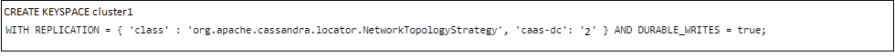
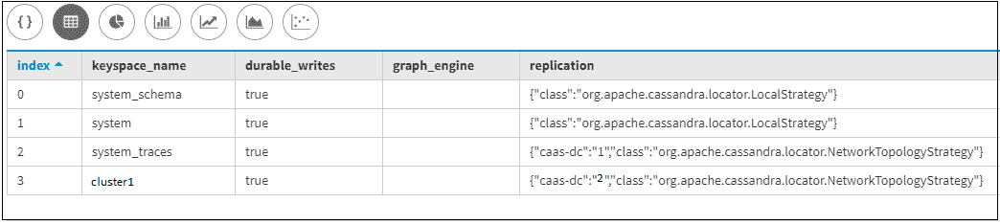
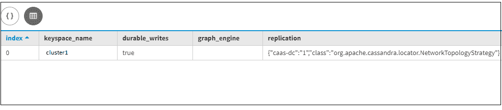
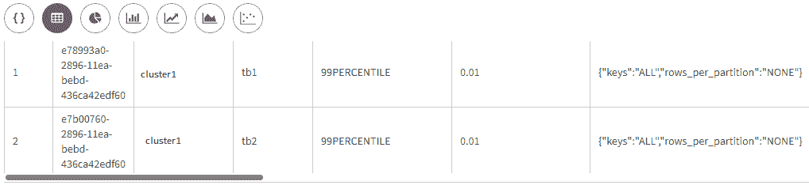
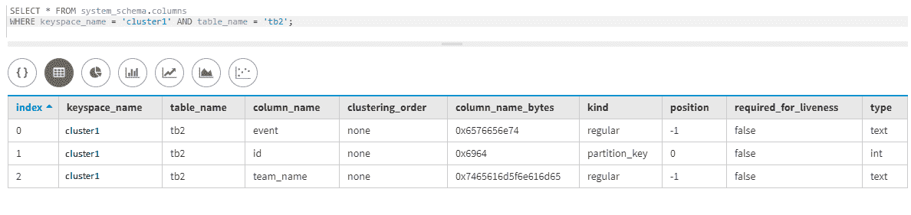

# 卡珊德拉的复制策略

> 原文:[https://www . geesforgeks . org/replication-strategy-in-Cassandra/](https://www.geeksforgeeks.org/replication-strategy-in-cassandra/)

在本文中，我们将讨论 [Cassandra](https://www.geeksforgeeks.org/apache-cassandra-nosql-database/) 支持的不同策略类选项，例如 SimpleStrategy、LocalStrategy、NetworkTopologyStrategy 是我们通常使用的三种复制策略:Simple 和 NetworkTopology Strategy，其中 LocalStrategy 仅用于系统。让我们一个一个来讨论。

卡珊德拉支持的不同类型的复制策略类选项如下:

```
1. SimpleStrategy
2. LocalStrategy
3. NetworkTopologyStrategy 
```

这些解释如下。

**1。简单策略:**
这是一个简单的策略，建议在单个**数据中心的多个机架上的多个节点使用。**

让我们考虑举一个例子，strategy_demo 是一个键空间名称，其中 class 是 SimpleStrategy，replication_factor 是 2，这仅仅意味着在单个数据中心中每行有两个冗余副本。让我们来看看。

**创建键空间:**

```
CREATE KEYSPACE cluster1 WITH 
replication = {'class': 'SimpleStrategy', 
               'replication_factor' : 2}; 
```

让我们验证密钥空间集群 1。

```
describe keyspace cluster1; 
```

**输出:**



**2。LocalStrategy:**
这是一种策略，在这种策略中，我们将为内部目的使用复制策略，例如用于 system 和 sys_auth 的密钥空间是内部密钥空间。在 Cassandra 中，内部密钥空间由 Cassandra 的存储体系结构隐式处理，用于管理授权和身份验证。

用 LocalStrategy 类创建键空间是不允许的，如果我们试图创建这样的键空间，那么就会出现类似“LocalStrategy 仅供 Cassandra 内部使用”的错误。

**3。网络拓扑策略:**
我们可以根据需要在不同的数据中心存储多个数据副本。当多个副本节点需要放置在不同的数据中心时，这是使用网络拓扑策略的一个重要原因。

让我们考虑一个例子，集群 1 是一个关键空间名称，其中网络拓扑系统策略是一种复制策略，有两个数据中心一个是东数据中心，射频(复制因子)= 2，第二个是西数据中心，射频(复制因子)= 3。

让我们看看。

```
CREATE KEYSPACE cluster1 WITH 
replication = {'class': 'NetworkTopologyStrategy', 
               'east' : 2, 'west' : 3}; 
```

要验证所有内部现有的键空间，请使用下面给出的 CQL 查询。

```
select * 
from system_schema.keyspaces; 
```

**输出:**



```
select * 
from system_schema.keyspaces 
where keyspace_name = 'cluster1'; 
```

**输出:**



要验证特定现有键空间的所有表，请使用下面给出的 CQL 查询。

首先，我们将在 cluster1 键空间下创建一些表。让我们来看看。

```
create table tb1
 (
  Id int primary key,
  name text,
  city text
 ); 
```

**表-2:**

```
create table tb2
 (
  Id int primary key,
  event text,
  team_name text
 ); 
```

让我们使用下面的 CQL 查询来验证 cluster1 的键空间模式。

```
SELECT * 
FROM system_schema.tables 
WHERE keyspace_name = 'cluster1'; 
```

**输出:**



要找出具有特定键空间的特定表的所有列，请使用下面给出的 CQL 查询。

```
SELECT * 
FROM system_schema.columns 
WHERE keyspace_name = 'cluster1' 
               AND table_name = 'tb2'; 
```

**输出:**



**系统和 system_auth 键空间:**
系统键空间包含有关可用的柱族、柱和簇的信息。system_auth 密钥空间主要包含身份验证信息、用户凭据和权限。