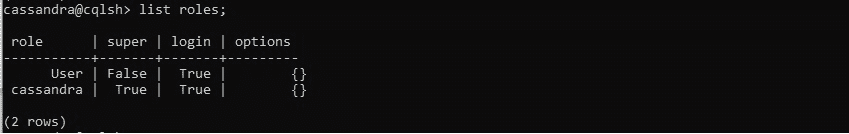
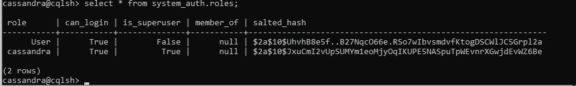
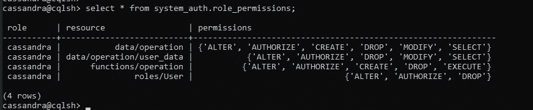

# 保护卡珊德拉

> 原文:[https://www.geeksforgeeks.org/securing-cassandra/](https://www.geeksforgeeks.org/securing-cassandra/)

在本文中，我们将讨论如何保护一个 [Cassandra](https://www.geeksforgeeks.org/introduction-to-apache-cassandra/) 集群，它涉及到身份验证、授权等任务。让我们一个一个来讨论。

*   **身份验证:**
    在此，我们将检查我们如何允许应用程序和用户登录集群。

    *   **授权:**
    在这里，我们处理权限的授予，使得用户想要创建、读取和写入数据等。访问数据库或数据库对象，如表和实体化视图。*   **加密:**
    在这里，我们指的是[安全套接字层(SSL)](https://www.geeksforgeeks.org/secure-socket-layer-ssl/) 的使用，它是保护客户端和 Cassandra 数据库之间以及集群节点之间通信的安全层。*   **Firewalls:**
    In this, we managing firewall port such that 9042 is a Client port for Cassandra (client) access involves knowing which ports you must keep open.

    现在，我们将使用具有管理员权限的 cqlsh。卡珊德拉自带内置角色卡珊德拉，密码也是卡珊德拉。用于访问内置角色的 cqlsh 查询如下。

    ```
    cqlsh 127.0.0.1 -u cassandra -p cassandra  
    ```

    **输出:**

    

    现在，如果我们试图创建一个新的角色，改变角色，删除角色，等等。我们会收到如下错误

    ```
    InvalidRequest: Error from server: 
    code=2200 [Invalid query]message="org.apache.cassandra.auth.CassandraRoleManager 
                                       doesn't support PASSWORD.   
    ```

    **配置身份验证:**
    所有授权和身份验证都是通过数据库角色进行的。请改用 CREATE ROLE、ALTER ROLE、DROP ROLE、LIST ROLES 和 LIST_PERMISSIONS 命令。

    要解决以下错误，请更改 cassandra.yaml 文件中的默认身份验证值。

    ```
    //default value 
    #authenticator: AllowAllAuthenticator  

    // set the authenticator value
    authenticator: org.apache.cassandra.auth.PasswordAuthenticator  

     //default value 
    #authorizer: AllowAllAuthorizer    

    //set the authorizer value   
    authorizer: org.apache.cassandra.auth.CassandraAuthorizer      
    ```

    在对 Cassandra.yaml 文件进行任何更改后，保存该文件，然后重新启动数据库，并使用默认超级用户 Cassandra 的凭据再次登录到 cqlsh。

    ```
    cqlsh -u cassandra -p cassandra 
    ```

    现在，我们将创建一个新角色，列表角色，删除角色等。

    **创建新角色:**
    要创建新角色使用了以下 CQL 查询。

    ```
    cassandra@cqlsh> create user 'User' with password 'User';  
    ```

    通过使用“列出角色”命令，我们可以看到以下查询的输出。

    **输出:**

    

    在 Cassandra 中，默认情况下，CREATE ROLE 语句中的 LOGIN 属性的值为 False。创建登录角色时，必须将此属性设置为“真”。我们可以通过查询 **system_auth.roles** 表来查看数据库中的角色，如下所示:

    ```
    //system_auth.roles: Stores roles and role members.

    select * from system_auth.roles; 
    ```

    **输出:**

    

    **角色权限:**
    通过使用，角色权限 cql 查询我们可以像查看角色一样查看权限可以创建、读取、删除等。超级用户创建的特定数据库和角色上的数据操作。

    ```
    cassandra@cqlsh> select * from system_auth.role_permissions; 
    ```

    **输出:**

    