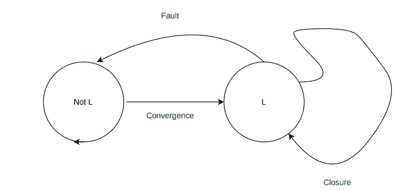

# 分布式系统中的自稳定

> 原文:[https://www . geeksforgeeks . org/分布式系统中的自稳定/](https://www.geeksforgeeks.org/self-stabilization-in-distributed-systems/)

**概述:**
1974 年，迪杰斯特拉首次提出了“自我稳定”的概念。这是非屏蔽[分布式系统](https://www.geeksforgeeks.org/comparison-centralized-decentralized-and-distributed-systems/)的通用技术。这是一种持续治疗的技术，保证了一系列失败后的最终安全。你一定是在学校做物理实验时碰到了阻尼摆。所以在开始时，钟摆是稳定的，当一些外力施加到钟摆上时，它会进入某个任意位置。你知道，在一段有限的时间后，它会再次回到最初的稳定位置或平衡。所以在这里我们将看到这个类比在分布式系统中是如何工作的。

**分布式系统中的类比:**
考虑以下几点:

*   您有一些处理器 P 0 ，P 1、………………………… P n +通信通道。
*   每个处理器 P i 具有状态 x i ，例如，该状态可以是处理器存储器中的变量值或处理器 PI中的寄存器值
*   配置只是系统中每个处理器状态向量的集合序列。
*   设计自稳定分布式系统的主要复杂之处在于，节点没有可以即时访问的全局内存。每个节点必须基于其可用的本地知识做出决策，并且所有节点的动作必须实现全局目标。

通常，当您设计系统时，您有一个通常稳定的合法配置。如果您可以启动一个合法的配置，并且可以在有限的步骤中达到另一个配置，那么只要进程没有进一步损坏，这个新配置也是合法的。但是，您的分布式系统是一个物理系统，因此很容易出现各种故障。特别是可能会出现短暂故障。

**短暂故障:**
是不可预知的故障，随时可能发生。它们经常发生。由于电源或电池不足，可能是过载造成的。当软件组件出现故障时，它们也会捕获状态损坏。所以通常系统从一个合法的配置开始，然后在一段有限的时间内，你会面临扰动。在这个扰动结束时，你的系统达到一个任意的配置。

在一些可能比合法配置集更长的配置集中。从任何初始状态自动恢复的能力意味着不需要任何初始化。当不再有扰动时，你的系统被称为处于自稳定模式，如果在一段有限的时间后，你达到一个合法的配置并停留在那里，那么这种从任意配置开始并收敛到合法配置并停留在那里的特性被称为自稳定。自稳定系统表现出两种特性:收敛和闭合。

自我稳定

**分布式系统中自稳定的优势:**
这里，我们将讨论分布式系统中自稳定的优势如下。

*   它使分布式系统能够自动从瞬时故障中恢复，而无需任何人工干预，只要不再发生故障。
*   自稳定算法不需要初始化，因为不管系统的初始状态如何，它最终都会开始正确运行。
*   这种特性对于分布式系统来说是非常健壮的，这使得它成为分布式计算的一个非常有吸引力的模型。

**分布式系统中自稳定的缺点:**
这里，我们将讨论分布式系统中自稳定的缺点如下。

*   这很难实现，尤其是当系统在不正确的状态下启动或被入侵者破坏时。
*   这很复杂。