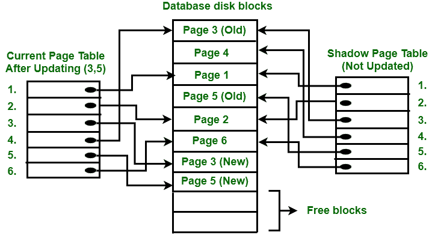

# 影子分页介绍

> 原文:[https://www.geeksforgeeks.org/shadow-paging-dbms/](https://www.geeksforgeeks.org/shadow-paging-dbms/)

**影子分页**是用来恢复[数据库](https://www.geeksforgeeks.org/what-is-database/)的恢复技术。在这种恢复技术中，数据库被认为是由固定大小的逻辑存储单元组成的，这些逻辑存储单元被称为**页。**页在**页表**的帮助下被映射到物理存储块中，该页表允许数据库的每个逻辑页有一个条目。该方法使用两个页表，分别为**当前页表**和**影子页表**。

当前页表中的条目用于指向磁盘上最近的数据库页。当复制当前页表的事务开始时，使用另一个表，即影子页表。此后，影子页表保存在磁盘上，当前页表将用于事务。当前页表中存在的条目在执行过程中可能会被更改，但在影子页表中它永远不会被更改。事务处理后，两个表变得相同。

这种技术也被称为**位置切割更新。**

要理解概念，请考虑上图。在这 2 页中，写操作在第 3 页和第 5 页执行。在第 3 页开始写操作之前，当前页表指向旧的第 3 页。当写操作开始时，执行以下步骤:

1.  首先，在磁盘块中搜索可用的空闲块。
2.  在找到空闲块后，它将第 3 页复制到由第 3 页(新)表示的空闲块。
3.  现在，当前页表指向磁盘上的第 3 页(新页)，但是影子页表指向旧的第 3 页，因为它没有被修改。
4.  更改现在传播到当前页表指向的第 3 页(新)。

**提交操作:**
要提交事务，应执行以下步骤:

1.  存在于缓冲区中的由事务完成的所有修改都被传送到物理数据库。
2.  将当前页表输出到磁盘。
3.  当前页表的磁盘地址输出到包含影子页表地址的稳定存储器中的固定位置。此操作会覆盖旧影子页表的地址。这样，当前页表与影子页表相同，事务被提交。

**失败:**
如果系统在事务执行过程中但在提交操作之前崩溃，那么只需要释放修改后的数据库页并丢弃当前页表就足够了。在执行事务之前，通过重新安装影子页表来恢复数据库的状态。

如果系统崩溃发生在最后一次写操作之后，那么它不会影响事务所做更改的传播。这些更改将被保留，无需执行重做操作。

**优势:**

*   这种方法需要较少磁盘访问来执行操作。
*   在这种方法中，从崩溃中恢复既便宜又相当快。
*   不需要像撤销和重做这样的操作。

**缺点:**

*   由于更新数据库导致磁盘上的位置改变，很难将数据库中的相关页面保持在磁盘上更近的位置。
*   在提交操作期间，更改的块将被影子页表指向，影子页表必须返回到空闲块的集合，否则它们将变得可访问。
*   单个事务的提交需要多个块，这降低了执行速度。
*   要允许这种技术同时处理多个事务是很困难的。