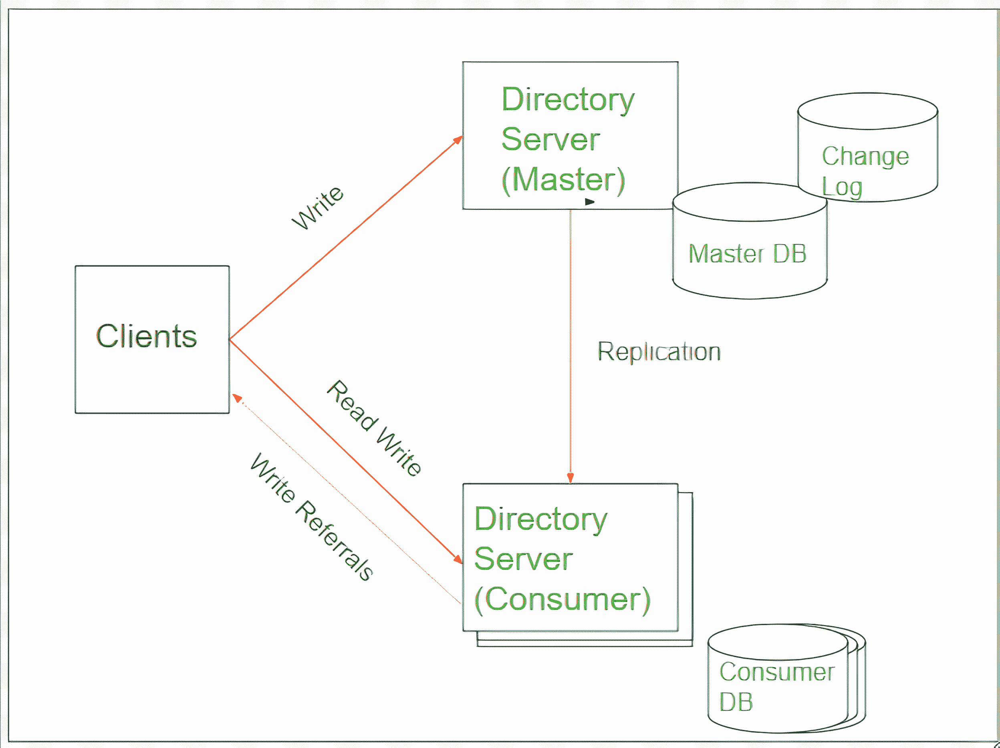
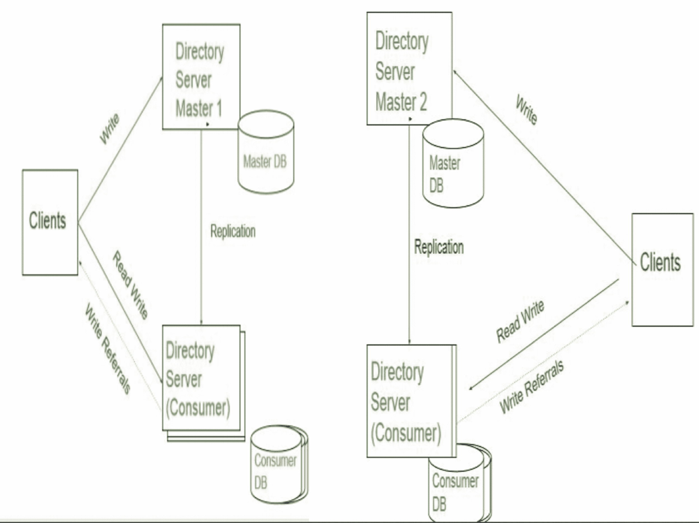

# DBMS 中的单主和多主复制

> 原文:[https://www . geesforgeks . org/单主多主数据库复制/](https://www.geeksforgeeks.org/single-master-and-multi-master-replication-in-dbms/)

先决条件–[数据复制](https://www.geeksforgeeks.org/data-replication-in-dbms/)
**数据复制**只是将数据从一个数据库服务器复制到另一个数据库服务器的过程，这样所有用户都可以共享相同的数据，没有任何不一致。在理解复制数据的各种模型之前，知道我们为什么需要复制数据是非常重要的。

**例–**
假设你有 Rs。你的银行账户里有 5000 卢比，今天你去了自动取款机，取了 5000 卢比。100.现在你的账户余额是卢比。4900.现在，如果你去任何其他银行分行，账户上的相同金额将是卢比。只有 4900，这意味着它在所有分支都是更新的。在今天的场景中，无论您从特定银行的哪个分支机构取款，它仍然会在所有银行中更新，其背后的原因是数据复制。

**不存在数据复制的场景:**
让我们考虑上面提到的同一个例子。现在，如果数据复制不存在，那么您提取的自动柜员机分支将只有您当前的余额为卢比。4900.银行的所有其他分支机构都将获得您当前银行余额仍为卢比的信息。5000.然而，在现实世界中，数据被复制到所有的分支机构，所有的银行都在他们的数据库中得到一个更新，一个人 X 的账户余额现在是 Rs。4900.

总之，为了数据的一致性和提高系统可用性，数据复制起着非常重要的作用。了解了复制概念背后的基本思想后，我们将了解两种类型的数据复制方法:单主复制和多主复制。

**1。单主复制:**
单主复制是以这样一种方式进行数据复制，即只有一台服务器管理主表，并根据需要进行更新和更改。主表的副本被复制到被授权查看、读取、搜索数据的从属服务器或客户。消费者指示的任何写操作都被传输到主服务器，并根据需要进行更改。因此，我们可以推断，这些应用程序为从机提供了只读功能，并且其中的写操作仅由主机完成。

**图–**单主复制

**单主复制的用例–**

*   **Offloading Information and Monitoring Questions :** 
    Every organization has its own [On Line transaction Processing (OLTP)](https://www.geeksforgeeks.org/on-line-transaction-processing-oltp-system-in-dbms/) that manages transaction-oriented applications. In this case of usage, either whole data or subset of data from OLTP system is transferred to another database. The purpose behind transfer of data from master to slave database is to support queries in reporting. 

    这种用法的优点是–

    1.  它提高了转换处理效率，因为从 OLTP 框架中消除了报告负载。
    2.  它通过升级用户体验来提高查询性能。

*   **使用热备用服务器:**
    当公司希望提高数据可用性时，通常首选使用热备用服务器。换句话说，warm 待机是一个备份数据库系统与主数据库系统并行运行的过程。在这种情况下，通过复制概念，数据库服务器可以与在线网络保持同步，并且在生产系统出现故障时可以轻松恢复。它们还可以用于定期维护，方法是优雅地切换到备用服务器，使生产服务器离线进行定期维护。

**2。多主复制:**
多主复制是以这样一种方式完成数据复制，即数据被复制到一组称为主系统的计算机上，任何人都可以更新数据库，任何人完成的更新也被复制到其他系统上。在这里，所有成员都平等地处理客户端，就像任何系统都可以进行写入一样。

**示例–**
如果一家银行在 X 市和 y 市的两个城市都有分行，如果系统在 X 市不可用一段时间，客户查询和交易可以由 y 市管理。一旦 X 市的系统再次可用，或者我们可以说它上线，则立即对其进行复制。这种安排具有单主复制的优点，其中客户端写请求被传送到可用的主系统。除此之外，它还有助于多个主机的负载平衡，其中写入由任何可用的系统完成。

**图–**多主复制

**多主复制的用例–**

*   **写入的可用性–**
    正如我们所知，单主复制系统允许对主数据库进行写入操作，所有其他从数据库都被应用程序读取。因此，如果我们希望复制的数据也可以用于写访问，那么可以使用多主复制，因为它为从数据库提供了额外的写访问权限。

*   **Writing 的可伸缩性–**
    write 应用程序中的多主复制允许使用不同主机上的几个数据库服务器在它们自己的主数据库上相互独立地处理写操作。所做的更改可以在以后进行协调。