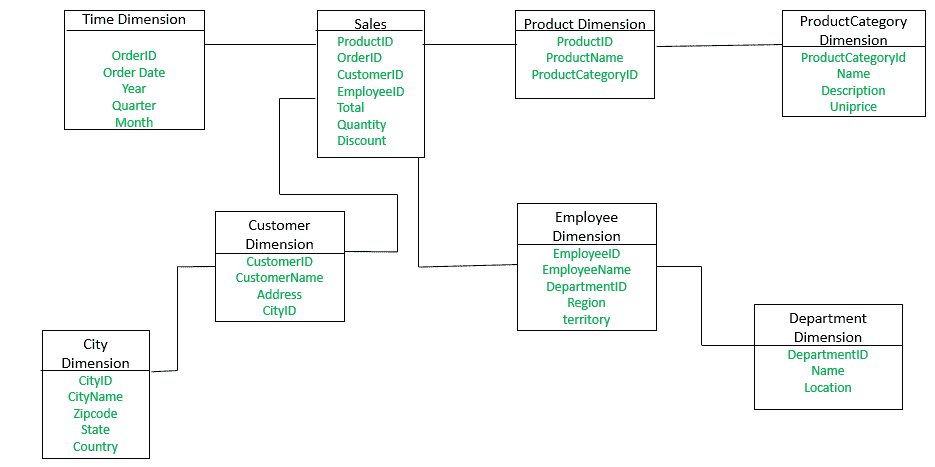

# 数据仓库模型中的雪花模式

> 原文:[https://www . geesforgeks . org/雪花-数据仓库中的模式-模型/](https://www.geeksforgeeks.org/snowflake-schema-in-data-warehouse-model/)

**简介:**雪花图式是星形图式的变体。这里，集中式事实表连接到多个维度。在雪花模式中，维度以规范化的形式出现在多个相关表中。当星型模式的维度详细且高度结构化，具有几个层次的关系，并且子表具有多个父表时，雪花结构就会具体化。雪花效应只影响维度表，不影响事实表。

**例:**

**员工**维度表现在包含属性:员工标识、员工姓名、部门标识、地区、地区。部门标识属性将**员工**表链接到**部门**维度表。**部门**维度用于提供每个部门的详细信息，如部门的名称和位置。**客户**维度表现在包含属性:客户标识、客户名称、地址、城市标识。城市标识属性将**客户**维度表与**城市**维度表链接起来。**城市**维度表包含每个城市的详细信息，如城市名称、邮政编码、州和国家。

星型模式和雪花模式的主要区别在于雪花模式的维度表以规范化的形式维护，以减少冗余。这里的优点是这种表(规范化的)易于维护并节省存储空间。但是，这也意味着需要更多的连接来执行查询。这将对系统性能产生不利影响。

**什么是雪剥落？**
雪花设计是维度表进一步扩展和归一化的结果。换句话说，如果维度的低基数属性被划分为独立的规范化表，那么维度表就被认为是雪片。然后，这些表通过引用约束(外键约束)连接到原始维度表。
一般来说，不建议在维度表中使用雪花，因为它会妨碍维度模型的可理解性和性能，因为需要连接更多的表来满足查询。

**雪花模式的特征:**雪花在以下条件下的维度模型:

*   雪花模式使用较小的磁盘空间。
*   实现添加到模式中的维度很容易。
*   有多个表，因此性能降低。
*   维度表由两组或多组定义不同粒度信息的属性组成。
*   同一维度表的属性集由不同的源系统填充。

**优势:**雪花模式主要有两个优势，如下所示:

*   它提供结构化数据，减少了数据完整性的问题。
*   它使用较小的磁盘空间，因为数据是高度结构化的。

**缺点:**

*   雪花化减少了维度表占用的空间，但与整个数据仓库相比，节省的空间通常微不足道。
*   除非必要且适当，否则避免维度表的雪花化或标准化。
*   不要将一个维度表的层次结构分散到单独的表中。层次结构应该只属于维度表，而不应该是雪花。
*   可以属于同一维度的多个层次结构已经在尽可能低的细节上进行了设计。