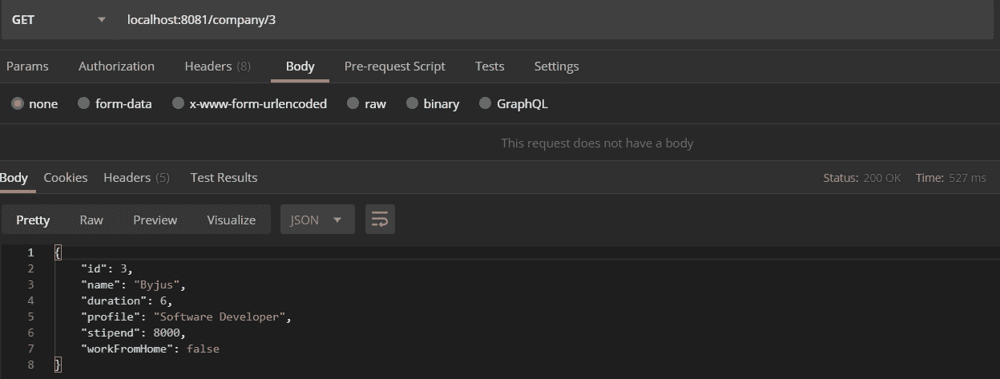

# Spring Boot |如何使用 Spring Data JPA

访问数据库

> 原文:[https://www . geesforgeks . org/spring-boot-如何访问-数据库-使用-spring-data-jpa/](https://www.geeksforgeeks.org/spring-boot-how-to-access-database-using-spring-data-jpa/)

**Spring Data JPA** 是实现 JPA 存储库的一种方法，方便在应用中添加数据访问层。CRUD 代表创建、检索、更新、删除，这些都是可以在数据库中执行的操作。在本文中，我们将看到一个示例，说明如何在使用 spring data JPA 的 spring boot 应用程序中从数据库([)访问数据。](https://www.geeksforgeeks.org/sql-tutorial/)

为了学习如何创建一个弹簧靴项目，参考[这篇文章](https://www.geeksforgeeks.org/how-to-create-a-basic-application-in-java-spring-boot/?ref=rp)。

数据库是相互关联的数据的集合，有助于从数据库中高效地检索、插入和删除数据，并以表、视图、模式、报告等形式组织数据。因此，对于任何应用程序来说，数据库都是最重要的模块之一，需要有一种与之通信的方式。因此，要使用 Spring Data JPA 访问数据库，需要遵循以下步骤:

1.  转到 [spring initializr](https://start.spring.io/) 并创建一个具有以下依赖关系的新项目:
    *   弹簧网
    *   春季数据
    *   MySQL 驱动程序
2.  下载入门项目并将其导入到 IDE 中。
3.  项目同步后，我们将创建一个模型类 *Company* ，注释 *@Entity* ，这意味着这个类被映射到数据库中的表。添加数据类型与数据库中的列相同的数据成员，并生成构造函数和 getters。将注释 *@Id* 添加到数据成员中，该数据成员将作为表中的主键属性，并将*@ generated value(strategy = generationtype . auto)*添加到数据成员中，以便自动增加主键属性。下面是这个类的实现:

    ```
    @Entity
    public class Company {

        // Primary ID which increments
        // automatically when new entry
        // is added into the database
        @Id
        @GeneratedValue(strategy
                        = GenerationType.AUTO)
        int id;

        String name;

        // In months
        int duration;
        String profile;

        // Can be 0
        int stipend;
        boolean workFromHome;

        public Company()
        {
        }

        // Parameterized constructor
        public Company(String name, int duration,
                       String profile,
                       int stipend,
                       boolean workFromHome)
        {
            this.name = name;
            this.duration = duration;
            this.profile = profile;
            this.stipend = stipend;
            this.workFromHome = workFromHome;
        }

        // Getters and setters of
        // the variables
        public int getId()
        {
            return id;
        }

        public String getName()
        {
            return name;
        }

        public int getDuration()
        {
            return duration;
        }

        public String getProfile()
        {
            return profile;
        }

        public int getStipend()
        {
            return stipend;
        }

        public void setId(int id)
        {
            this.id = id;
        }

        public boolean isWorkFromHome()
        {
            return workFromHome;
        }
    ```

4.  Now, create an [interface](https://www.geeksforgeeks.org/interfaces-in-java/) *CompanyRepository* with the annotation *@Repository* which will implement the *CrudRepository*. The functions to perform the CRUD operations will be defined in the interface as shown below:

    ```
    @Repository
    public interface CompanyRepository
        extends CrudRepository<Company,
                               Integer> {

        Company findById(int id);
        List<Company> findAll();
        void deleteById(int id);
    }
    ```

    **注意:**功能不会实现，因为它们已经在*原油储备库*中实现。

5.  现在，我们将创建 REST API(GET、POST、PUT、DELETE)，如下所示:

    ```
    @RestController
    public class CompanyController {
        @Autowired
        private CompanyRepository repo;

        // Home Page
        @GetMapping("/")
        public String welcome()
        {
            return "<html><body>"
                + "<h1>WELCOME</h1>"
                + "</body></html>";
        }

        // Get All Notes
        @GetMapping("/company")
        public List<Company> getAllNotes()
        {
            return repo.findAll();
        }

        // Get the company details by
        // ID
        @GetMapping("/company/{id}")
        public Company getCompanyById(
            @PathVariable(value = "id") int id)
        {
            return repo.findById(id);
        }

        @PostMapping("/company")
        @ResponseStatus(HttpStatus.CREATED)
        public Company addCompany(
            @RequestBody Company company)
        {
            return repo.save(company);
        }

        @DeleteMapping("/delete/{id}")
        public void deleteStudent(
            @PathVariable(value = "id") int id)
        {
            repo.deleteById(id);
        }

        @PutMapping("/company/{id}")
        public ResponseEntity<Object> updateStudent(
            @RequestBody Company company,
            @PathVariable int id)
        {

            Optional<Company> companyRepo
                = Optional.ofNullable(
                    repo.findById(id));

            if (!companyRepo.isPresent())
                return ResponseEntity
                    .notFound()
                    .build();

            company.setId(id);

            repo.save(company);

            return ResponseEntity
                .noContent()
                .build();
        }
    ```

6.  现在，打开 application.properties 文件并添加以下代码。将 *database_name* 替换为包含表 *Company* 、 *username* 替换为 mysql 服务器的用户名(默认为 root)并将*密码*替换为 mysql 密码。

    > 立春。数据源。网址= JDBC:MySQL://localhost:3306/database _ name
    > spring。数据源。用户名=用户名
    > spring。数据源。密码=密码
    > 弹簧。JPA。冬眠。DDL-自动=更新

7.  This completes the process of establishing a connection with the database. Now, we build and run the project and call the different APIs.

    **注意:**波兹曼通常更倾向于测试调用 API，因此我们使用了波兹曼工具来测试项目。

**输出:**

*   The database:

    [](https://media.geeksforgeeks.org/wp-content/uploads/20200607222333/table8.jpg)

*   Testing with the [POSTMAN collection](https://www.geeksforgeeks.org/introduction-postman-api-development/):

    [](https://media.geeksforgeeks.org/wp-content/uploads/20200607222535/get.jpg)