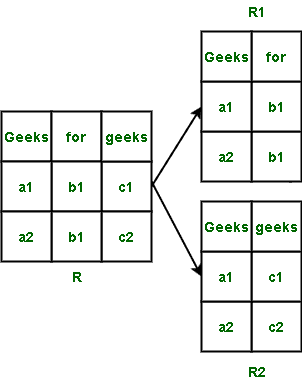
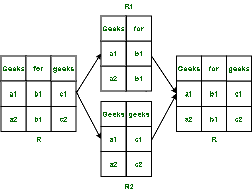
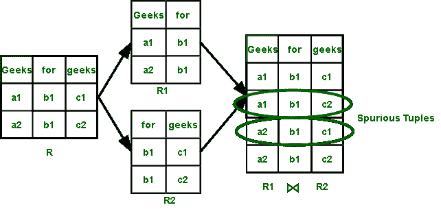

# 数据库管理系统中的伪元组

> 原文:[https://www.geeksforgeeks.org/spurious-tuples-in-dbms/](https://www.geeksforgeeks.org/spurious-tuples-in-dbms/)

在数据库管理系统(DBMS)中，数据通过属性和元组(即列和行)以表格形式表示。
有各种操作(插入、删除、更新、修改等。)我们可以在桌子上表演。一个这样的操作是连接。当我们将两个表合并成一个时，我们称之为连接，用⨝.表示

**伪元组:**
伪元组是表中的那些行，它们是以错误的方式连接两个表的结果。它们是可能不需要的额外元组(行)。

如果关系用 R 表示，它的分解关系用 R1、R2、R3 表示。那么，没有得到任何伪元组的条件由下式表示:

```
R1 ⨝ R2 ⨝ R3 .... ⨝ Rn = R
```

而获得伪元组的条件由表示，

```
R ⊂ R1 ⨝ R2 ⨝ R3 .... ⨝ Rn
```

**示例-1:**
检查给定关系是否包含虚假元组的示例。
设 R 为关系，R1 和 R2 为分解 R 后得到的关系



在执行关系 R1 和 R2 (R1 ⨝ R2)的连接操作后，我们得到原始关系 r。



满足无虚假元组的条件，R1 ⨝ R2 = R。因此，我们没有得到任何伪元组。

**结论–**不存在虚假元组。

**示例-2:**
检查给定关系是否包含虚假元组的示例。
设 R 为关系，R1 和 R2 为分解 R 后得到的关系


在执行关系 R1 和 R2 (R1 ⨝ R2)的连接操作之后，我们没有得到原始关系 r。



满足伪元组 R ⊂ R1 ⨝ R2 的条件。因此，我们得到伪元组。

**结论–**伪元组存在。

**注意–**
DBMS 中的行称为元组。然而，数据库管理系统中的列被称为属性。伪元组可以作为表中的额外行被记住。导致伪元组的自然连接称为**有损连接**。不产生伪元组的[自然连接](https://www.geeksforgeeks.org/difference-between-natural-join-and-inner-join-in-sql/)称为[无损连接](https://www.geeksforgeeks.org/lossless-join-and-dependency-preserving-decomposition/)。